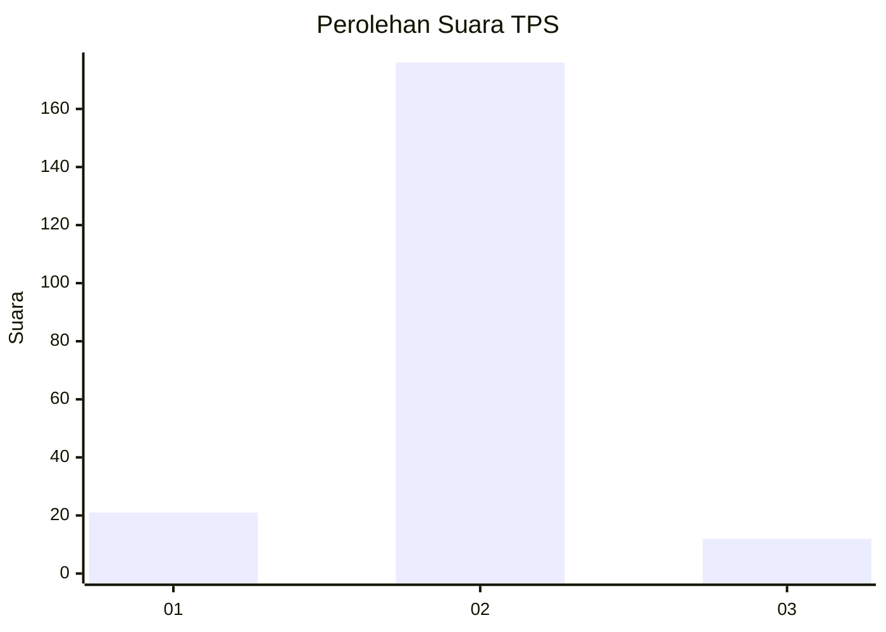
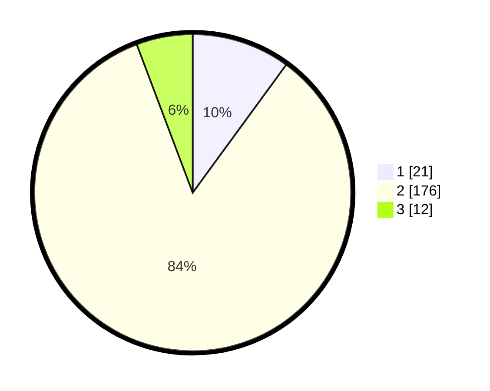

# Hasil

## Grafik

## Tabel

| No. | Nama Paslon    | Suara | Suara (raw) | Persentase |
|:--- |:-------------- | -----:| -----------:| ----------:|
| 1   | ANIES MUHAIMIN | 21    | [21][p-1]   | 10,05      |
| 2   | PRABOWO GIBRAN | 176   | [176][p-2]  | 84,21      |
| 3   | GANJAR MAHFUD  | 12    | [12][p-3]   | 5,74       |

[p-1]: https://github.com/gigit-pemilu/pemilu-2024/blob/main/pilpres/hitung-suara/sub/35-jawa-timur/sub/13-probolinggo/sub/08-krucil/sub/2006-krucil/sub/008-tps/sub/paslon-1.txt
[p-2]: https://github.com/gigit-pemilu/pemilu-2024/blob/main/pilpres/hitung-suara/sub/35-jawa-timur/sub/13-probolinggo/sub/08-krucil/sub/2006-krucil/sub/008-tps/sub/paslon-2.txt
[p-3]: https://github.com/gigit-pemilu/pemilu-2024/blob/main/pilpres/hitung-suara/sub/35-jawa-timur/sub/13-probolinggo/sub/08-krucil/sub/2006-krucil/sub/008-tps/sub/paslon-3.txt

## Foto C Plano

https://sirekap-obj-formc.kpu.go.id/247e/pemilu/ppwp/35/13/08/20/06/3513082006008-20240215-020728--4ee9358f-b2a3-4dd4-9ed6-8a42f7a12ca0.jpg

https://sirekap-obj-formc.kpu.go.id/247e/pemilu/ppwp/35/13/08/20/06/3513082006008-20240215-020857--8d5502aa-2602-4b19-9b6a-35260649d07d.jpg

https://sirekap-obj-formc.kpu.go.id/247e/pemilu/ppwp/35/13/08/20/06/3513082006008-20240215-021028--8e3b083e-8468-4106-af6d-64d9e95acf58.jpg

## Metadata

| Key        | Value               |
| ---------- | ------------------- |
| Time Stamp | 2024-02-25 22:00:00 |

