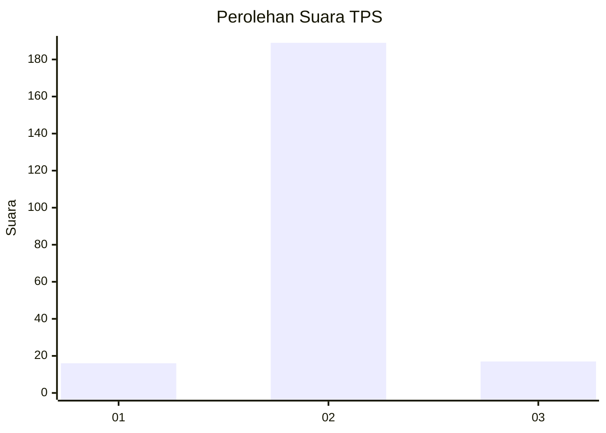
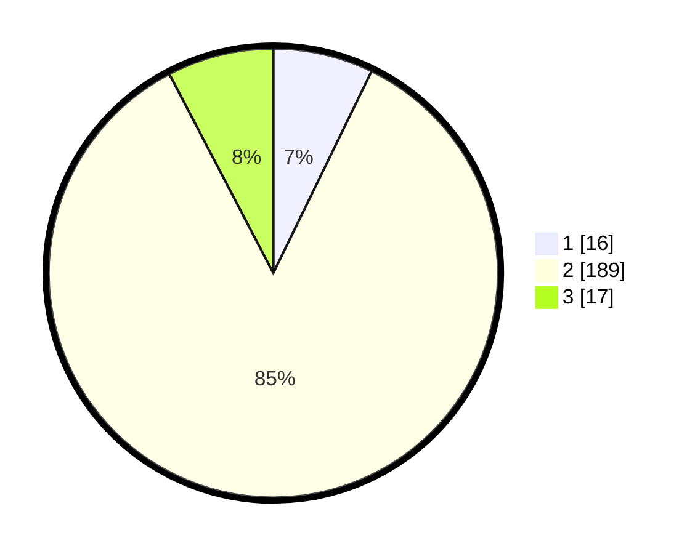

# Hasil

## Grafik

## Tabel

| No. | Nama Paslon    | Suara | Suara (raw) | Persentase |
|:--- |:-------------- | -----:| -----------:| ----------:|
| 1   | ANIES MUHAIMIN | 16    | [16][p-1]   | 7,21       |
| 2   | PRABOWO GIBRAN | 189   | [189][p-2]  | 85,14      |
| 3   | GANJAR MAHFUD  | 17    | [17][p-3]   | 7,66       |

[p-1]: https://github.com/gigit-pemilu/pemilu-2024-35-jawa-timur/blob/main/pilpres/hitung-suara/sub/35-jawa-timur/sub/13-probolinggo/sub/08-krucil/sub/2006-krucil/sub/011-tps/sub/paslon-1.txt
[p-2]: https://github.com/gigit-pemilu/pemilu-2024-35-jawa-timur/blob/main/pilpres/hitung-suara/sub/35-jawa-timur/sub/13-probolinggo/sub/08-krucil/sub/2006-krucil/sub/011-tps/sub/paslon-2.txt
[p-3]: https://github.com/gigit-pemilu/pemilu-2024-35-jawa-timur/blob/main/pilpres/hitung-suara/sub/35-jawa-timur/sub/13-probolinggo/sub/08-krucil/sub/2006-krucil/sub/011-tps/sub/paslon-3.txt

## Foto C Plano

https://sirekap-obj-formc.kpu.go.id/1ea8/pemilu/ppwp/35/13/08/20/06/3513082006011-20240215-012856--1129d850-c7b2-4afc-919b-be02420657d4.jpg

https://sirekap-obj-formc.kpu.go.id/1ea8/pemilu/ppwp/35/13/08/20/06/3513082006011-20240215-012204--31bfb1d4-e324-4a1e-8ba7-c672cd4ac16f.jpg

https://sirekap-obj-formc.kpu.go.id/1ea8/pemilu/ppwp/35/13/08/20/06/3513082006011-20240215-012421--1b00e2b2-ea52-4e83-be8d-808ad455d9f5.jpg

## Metadata

| Key        | Value               |
| ---------- | ------------------- |
| Time Stamp | 2024-02-15 21:01:18 |

