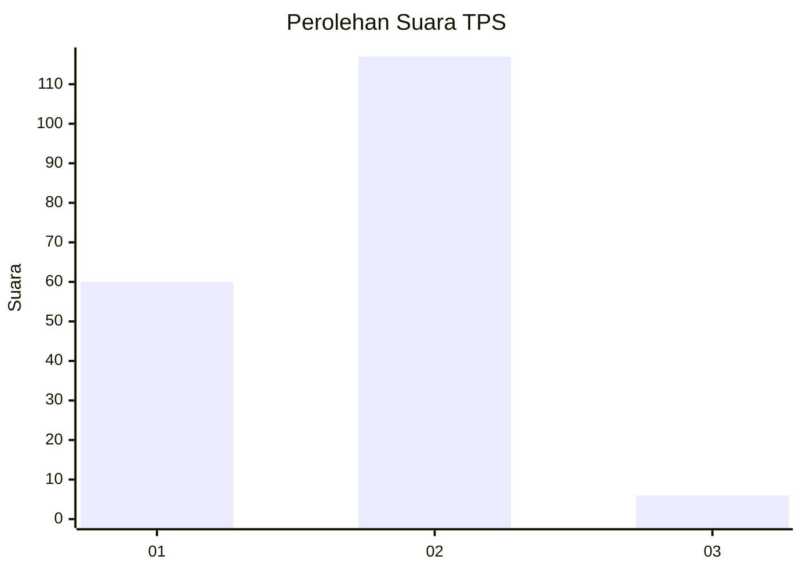
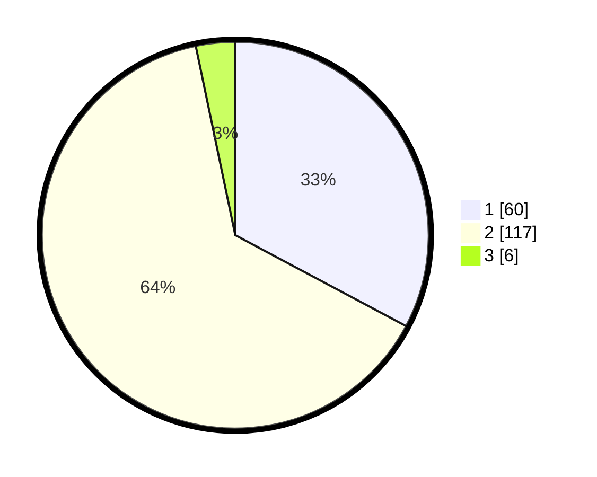

# Hasil

## Grafik

## Tabel

| No. | Nama Paslon    | Suara | Suara (raw) | Persentase |
|:--- |:-------------- | -----:| -----------:| ----------:|
| 1   | ANIES MUHAIMIN | 60    | [60][p-1]   | 32,79      |
| 2   | PRABOWO GIBRAN | 117   | [117][p-2]  | 63,93      |
| 3   | GANJAR MAHFUD  | 6     | [6][p-3]    | 3,28       |

[p-1]: https://github.com/gigit-pemilu/pemilu-2024-35-jawa-timur/blob/main/pilpres/hitung-suara/sub/35-jawa-timur/sub/13-probolinggo/sub/08-krucil/sub/2008-watupanjang/sub/005-tps/sub/paslon-1.txt
[p-2]: https://github.com/gigit-pemilu/pemilu-2024-35-jawa-timur/blob/main/pilpres/hitung-suara/sub/35-jawa-timur/sub/13-probolinggo/sub/08-krucil/sub/2008-watupanjang/sub/005-tps/sub/paslon-2.txt
[p-3]: https://github.com/gigit-pemilu/pemilu-2024-35-jawa-timur/blob/main/pilpres/hitung-suara/sub/35-jawa-timur/sub/13-probolinggo/sub/08-krucil/sub/2008-watupanjang/sub/005-tps/sub/paslon-3.txt

## Foto C Plano

https://sirekap-obj-formc.kpu.go.id/96d8/pemilu/ppwp/35/13/08/20/08/3513082008005-20240215-045234--60140963-cbfa-4e2d-ab89-3e18bfeb1458.jpg

https://sirekap-obj-formc.kpu.go.id/96d8/pemilu/ppwp/35/13/08/20/08/3513082008005-20240215-045942--9281d6bb-1c5e-45b2-9cb5-f52856bf0c91.jpg

https://sirekap-obj-formc.kpu.go.id/96d8/pemilu/ppwp/35/13/08/20/08/3513082008005-20240215-050120--937f11af-eed3-4723-9caa-22f1d03fc237.jpg

## Metadata

| Key        | Value               |
| ---------- | ------------------- |
| Time Stamp | 2024-02-15 23:29:50 |

