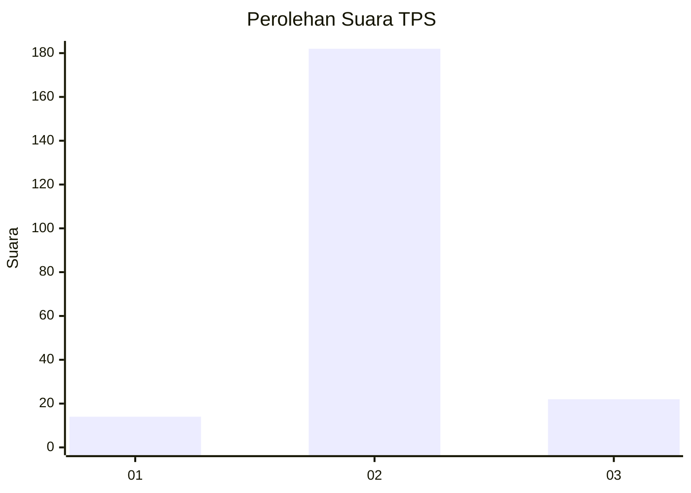
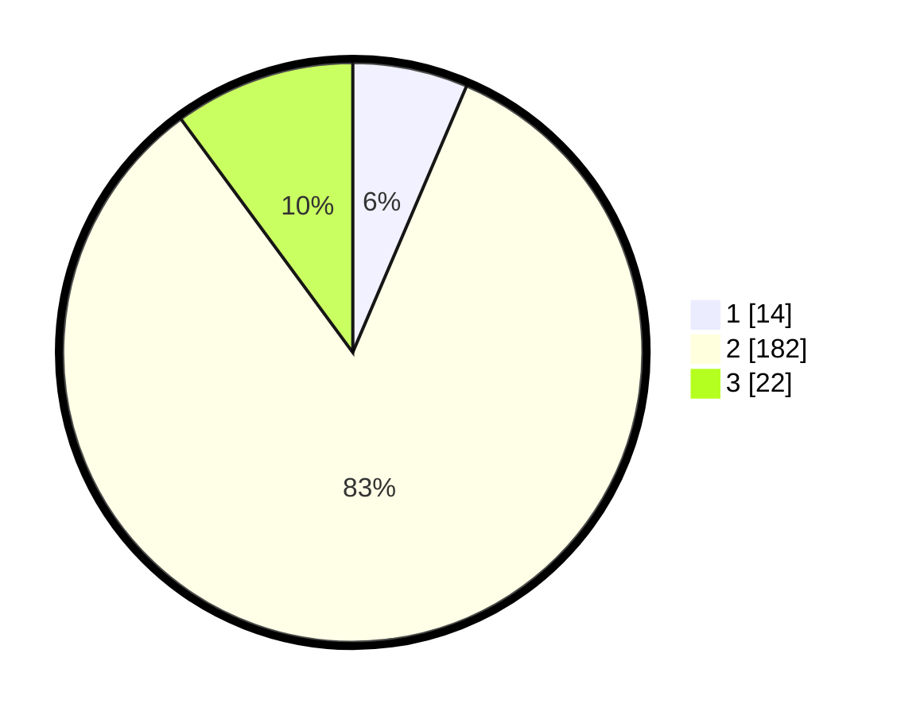

# Hasil

## Grafik

## Tabel

| No. | Nama Paslon    | Suara | Suara (raw) | Persentase |
|:--- |:-------------- | -----:| -----------:| ----------:|
| 1   | ANIES MUHAIMIN | 14    | [14][p-1]   | 6,42       |
| 2   | PRABOWO GIBRAN | 182   | [182][p-2]  | 83,49      |
| 3   | GANJAR MAHFUD  | 22    | [22][p-3]   | 10,09      |

[p-1]: https://github.com/gigit-pemilu/pemilu-2024/blob/main/pilpres/hitung-suara/sub/35-jawa-timur/sub/13-probolinggo/sub/08-krucil/sub/2009-bermi/sub/002-tps/sub/paslon-1.txt
[p-2]: https://github.com/gigit-pemilu/pemilu-2024/blob/main/pilpres/hitung-suara/sub/35-jawa-timur/sub/13-probolinggo/sub/08-krucil/sub/2009-bermi/sub/002-tps/sub/paslon-2.txt
[p-3]: https://github.com/gigit-pemilu/pemilu-2024/blob/main/pilpres/hitung-suara/sub/35-jawa-timur/sub/13-probolinggo/sub/08-krucil/sub/2009-bermi/sub/002-tps/sub/paslon-3.txt

## Foto C Plano

https://sirekap-obj-formc.kpu.go.id/ef9b/pemilu/ppwp/35/13/08/20/09/3513082009002-20240216-145743--8b463153-d16b-411f-9ecd-a7e7818ff27e.jpg

https://sirekap-obj-formc.kpu.go.id/ef9b/pemilu/ppwp/35/13/08/20/09/3513082009002-20240216-145839--256adfd3-cc9d-4cb7-9b00-eebaa73d8673.jpg

https://sirekap-obj-formc.kpu.go.id/ef9b/pemilu/ppwp/35/13/08/20/09/3513082009002-20240216-145913--f063d98e-57ea-4d43-b7fa-d94a1e59f974.jpg

## Metadata

| Key        | Value               |
| ---------- | ------------------- |
| Time Stamp | 2024-02-16 21:01:00 |

