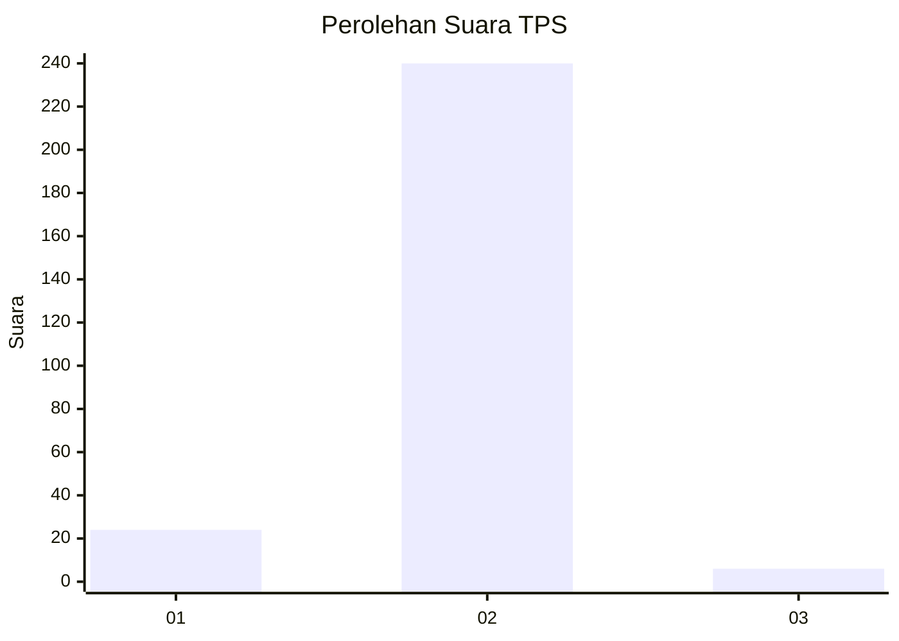
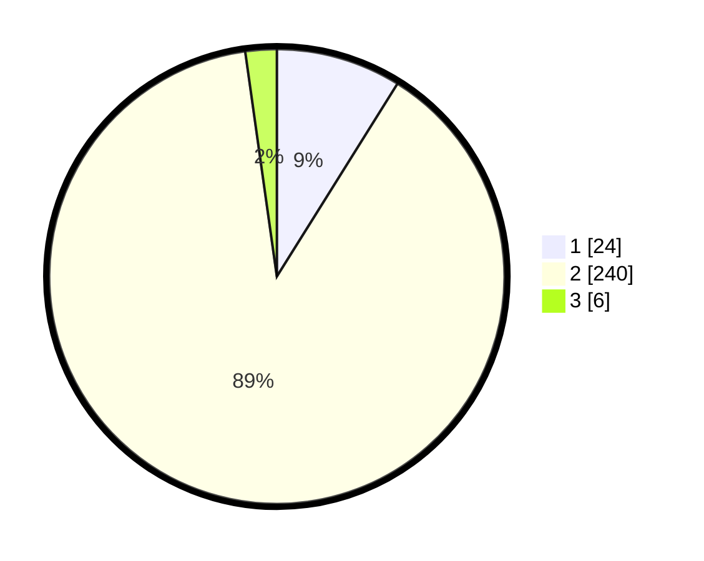

# Hasil

## Grafik

## Tabel

| No. | Nama Paslon    | Suara | Suara (raw) | Persentase |
|:--- |:-------------- | -----:| -----------:| ----------:|
| 1   | ANIES MUHAIMIN | 24    | [24][p-1]   | 8,89       |
| 2   | PRABOWO GIBRAN | 240   | [240][p-2]  | 88,89      |
| 3   | GANJAR MAHFUD  | 6     | [6][p-3]    | 2,22       |

[p-1]: https://github.com/gigit-pemilu/pemilu-2024-35-jawa-timur/blob/main/pilpres/hitung-suara/sub/35-jawa-timur/sub/13-probolinggo/sub/08-krucil/sub/2009-bermi/sub/008-tps/sub/paslon-1.txt
[p-2]: https://github.com/gigit-pemilu/pemilu-2024-35-jawa-timur/blob/main/pilpres/hitung-suara/sub/35-jawa-timur/sub/13-probolinggo/sub/08-krucil/sub/2009-bermi/sub/008-tps/sub/paslon-2.txt
[p-3]: https://github.com/gigit-pemilu/pemilu-2024-35-jawa-timur/blob/main/pilpres/hitung-suara/sub/35-jawa-timur/sub/13-probolinggo/sub/08-krucil/sub/2009-bermi/sub/008-tps/sub/paslon-3.txt

## Foto C Plano

https://sirekap-obj-formc.kpu.go.id/53a8/pemilu/ppwp/35/13/08/20/09/3513082009008-20240214-200013--908f1fa1-400d-4da4-9291-caabfbbd8bca.jpg

https://sirekap-obj-formc.kpu.go.id/53a8/pemilu/ppwp/35/13/08/20/09/3513082009008-20240214-200110--cfd18599-f2b1-435d-ac3a-0e62517360b3.jpg

https://sirekap-obj-formc.kpu.go.id/53a8/pemilu/ppwp/35/13/08/20/09/3513082009008-20240214-200652--65915ead-9f2a-46c7-b9d7-99404d01a5f1.jpg

## Metadata

| Key        | Value               |
| ---------- | ------------------- |
| Time Stamp | 2024-02-26 11:00:00 |

