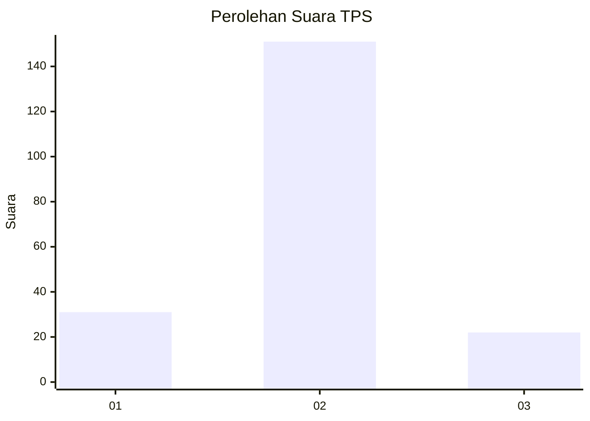
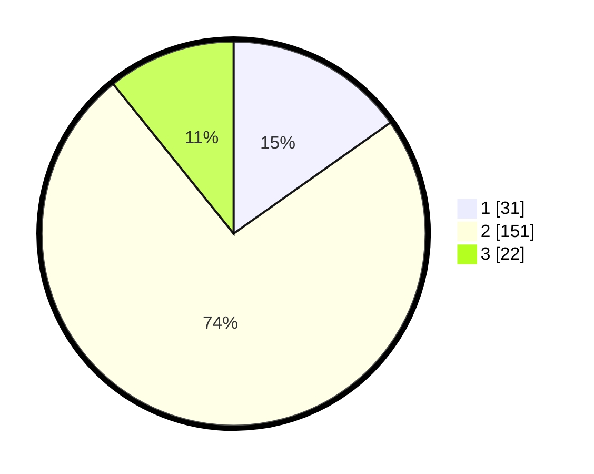

# Hasil

## Grafik

## Tabel

| No. | Nama Paslon    | Suara | Suara (raw) | Persentase |
|:--- |:-------------- | -----:| -----------:| ----------:|
| 1   | ANIES MUHAIMIN | 31    | [31][p-1]   | 15,20      |
| 2   | PRABOWO GIBRAN | 151   | [151][p-2]  | 74,02      |
| 3   | GANJAR MAHFUD  | 22    | [22][p-3]   | 10,78      |

[p-1]: https://github.com/gigit-pemilu/pemilu-2024-35-jawa-timur/blob/main/pilpres/hitung-suara/sub/35-jawa-timur/sub/13-probolinggo/sub/08-krucil/sub/2012-pandanaras/sub/003-tps/sub/paslon-1.txt
[p-2]: https://github.com/gigit-pemilu/pemilu-2024-35-jawa-timur/blob/main/pilpres/hitung-suara/sub/35-jawa-timur/sub/13-probolinggo/sub/08-krucil/sub/2012-pandanaras/sub/003-tps/sub/paslon-2.txt
[p-3]: https://github.com/gigit-pemilu/pemilu-2024-35-jawa-timur/blob/main/pilpres/hitung-suara/sub/35-jawa-timur/sub/13-probolinggo/sub/08-krucil/sub/2012-pandanaras/sub/003-tps/sub/paslon-3.txt

## Foto C Plano

https://sirekap-obj-formc.kpu.go.id/bd56/pemilu/ppwp/35/13/08/20/12/3513082012003-20240227-101642--e742db7c-4f93-4c41-98e6-5e0439ccee5d.jpg

https://sirekap-obj-formc.kpu.go.id/bd56/pemilu/ppwp/35/13/08/20/12/3513082012003-20240221-102635--d5d00733-d374-4a67-b642-20a2a76547a5.jpg

https://sirekap-obj-formc.kpu.go.id/bd56/pemilu/ppwp/35/13/08/20/12/3513082012003-20240221-102922--720eb102-4f9f-43dc-bdaf-2b53ccbc28d5.jpg

## Metadata

| Key        | Value               |
| ---------- | ------------------- |
| Time Stamp | 2024-02-27 11:00:00 |

