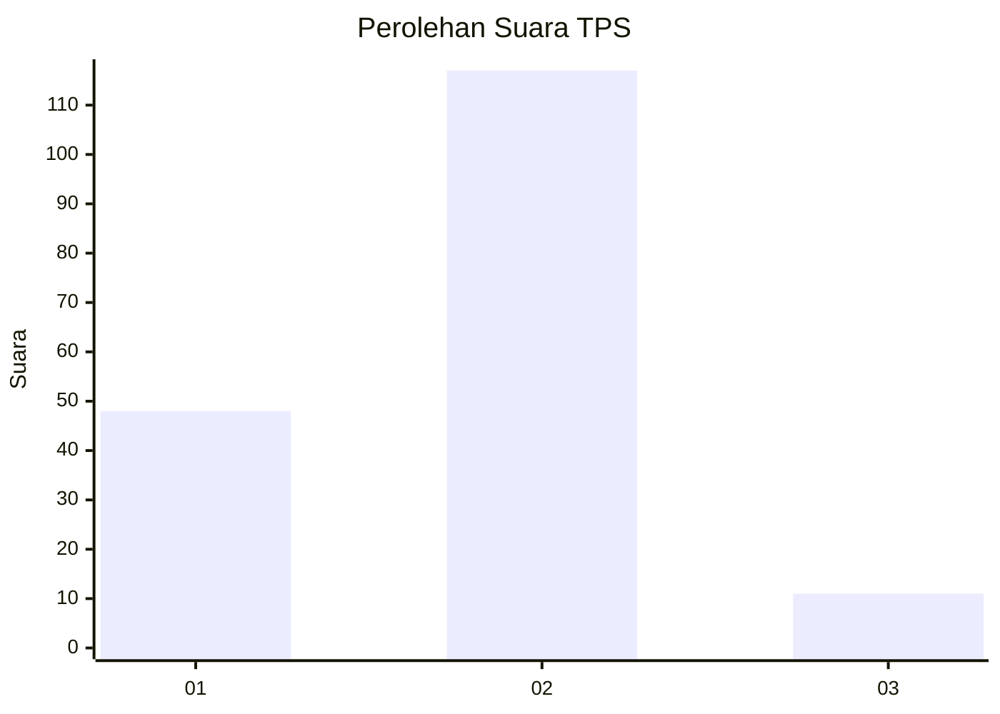
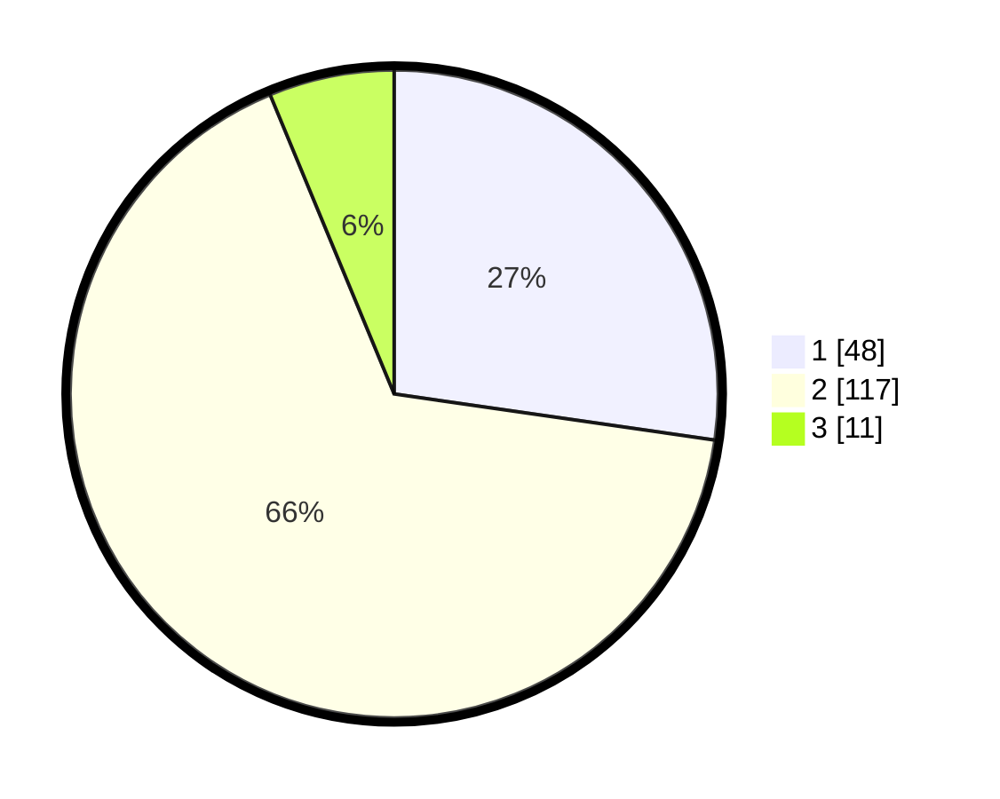

# Hasil

## Grafik

## Tabel

| No. | Nama Paslon    | Suara | Suara (raw) | Persentase |
|:--- |:-------------- | -----:| -----------:| ----------:|
| 1   | ANIES MUHAIMIN | 48    | [48][p-1]   | 27,27      |
| 2   | PRABOWO GIBRAN | 117   | [117][p-2]  | 66,48      |
| 3   | GANJAR MAHFUD  | 11    | [11][p-3]   | 6,25       |

[p-1]: https://github.com/gigit-pemilu/pemilu-2024-35-jawa-timur/blob/main/pilpres/hitung-suara/sub/35-jawa-timur/sub/13-probolinggo/sub/08-krucil/sub/2013-seneng/sub/003-tps/sub/paslon-1.txt
[p-2]: https://github.com/gigit-pemilu/pemilu-2024-35-jawa-timur/blob/main/pilpres/hitung-suara/sub/35-jawa-timur/sub/13-probolinggo/sub/08-krucil/sub/2013-seneng/sub/003-tps/sub/paslon-2.txt
[p-3]: https://github.com/gigit-pemilu/pemilu-2024-35-jawa-timur/blob/main/pilpres/hitung-suara/sub/35-jawa-timur/sub/13-probolinggo/sub/08-krucil/sub/2013-seneng/sub/003-tps/sub/paslon-3.txt

## Foto C Plano

https://sirekap-obj-formc.kpu.go.id/3443/pemilu/ppwp/35/13/08/20/13/3513082013003-20240215-025457--259c8a58-d72e-494e-80d2-46f9b8d072f6.jpg

https://sirekap-obj-formc.kpu.go.id/3443/pemilu/ppwp/35/13/08/20/13/3513082013003-20240215-053055--f28bbcc3-6faa-475d-b464-a5c61a46cf50.jpg

https://sirekap-obj-formc.kpu.go.id/3443/pemilu/ppwp/35/13/08/20/13/3513082013003-20240215-025921--01ac7da0-f43d-43cd-b1ad-0786c268dc1d.jpg

## Metadata

| Key        | Value               |
| ---------- | ------------------- |
| Time Stamp | 2024-02-25 23:00:00 |

