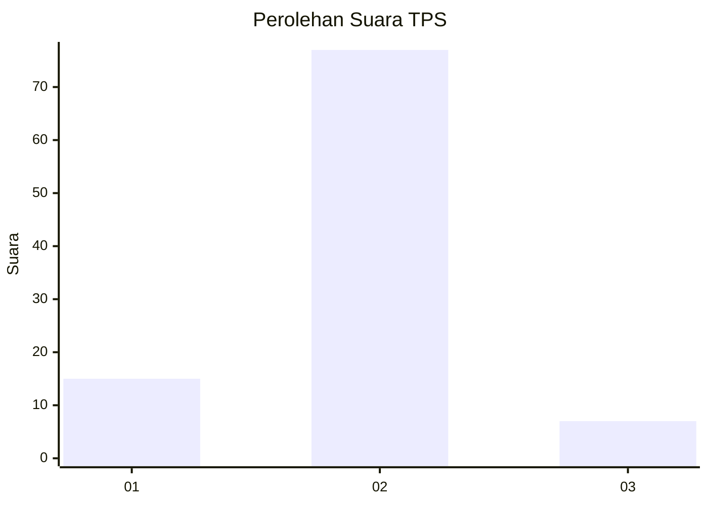
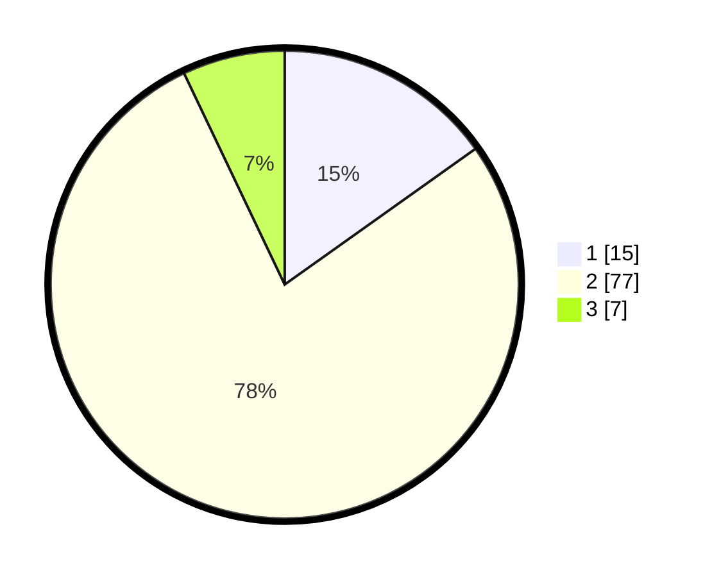

# Hasil

## Grafik

## Tabel

| No. | Nama Paslon    | Suara | Suara (raw) | Persentase |
|:--- |:-------------- | -----:| -----------:| ----------:|
| 1   | ANIES MUHAIMIN | 15    | [15][p-1]   | 15,15      |
| 2   | PRABOWO GIBRAN | 77    | [77][p-2]   | 77,78      |
| 3   | GANJAR MAHFUD  | 7     | [7][p-3]    | 7,07       |

[p-1]: https://github.com/gigit-pemilu/pemilu-2024/blob/main/pilpres/hitung-suara/sub/35-jawa-timur/sub/13-probolinggo/sub/08-krucil/sub/2013-seneng/sub/009-tps/sub/paslon-1.txt
[p-2]: https://github.com/gigit-pemilu/pemilu-2024/blob/main/pilpres/hitung-suara/sub/35-jawa-timur/sub/13-probolinggo/sub/08-krucil/sub/2013-seneng/sub/009-tps/sub/paslon-2.txt
[p-3]: https://github.com/gigit-pemilu/pemilu-2024/blob/main/pilpres/hitung-suara/sub/35-jawa-timur/sub/13-probolinggo/sub/08-krucil/sub/2013-seneng/sub/009-tps/sub/paslon-3.txt

## Foto C Plano

https://sirekap-obj-formc.kpu.go.id/ceaa/pemilu/ppwp/35/13/08/20/13/3513082013009-20240214-141923--bbd3a8b4-b1d3-4fbf-86e1-186096a77769.jpg

https://sirekap-obj-formc.kpu.go.id/ceaa/pemilu/ppwp/35/13/08/20/13/3513082013009-20240214-224015--394d3159-d8e2-4a6c-9d56-7f9acbd51b35.jpg

https://sirekap-obj-formc.kpu.go.id/ceaa/pemilu/ppwp/35/13/08/20/13/3513082013009-20240214-224028--d9d57344-e025-4191-af42-34682265dd9d.jpg

## Metadata

| Key        | Value               |
| ---------- | ------------------- |
| Time Stamp | 2024-02-25 12:00:00 |

