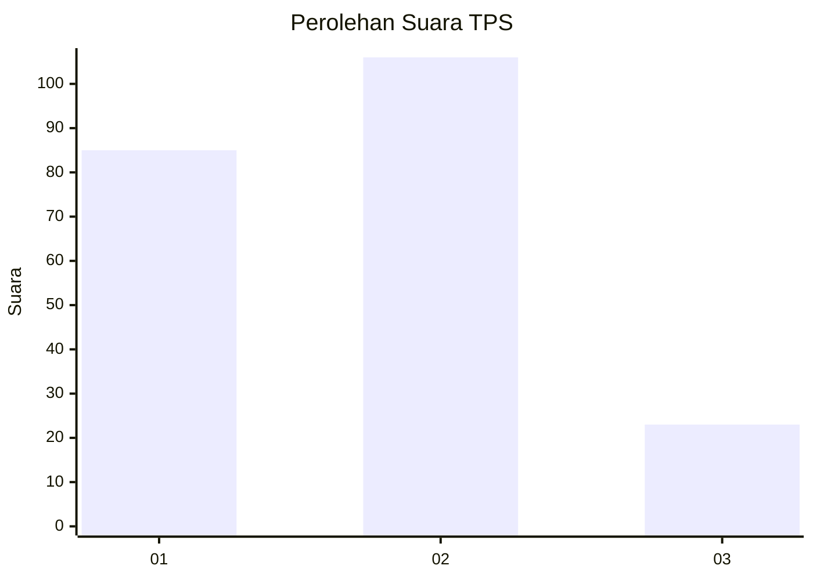
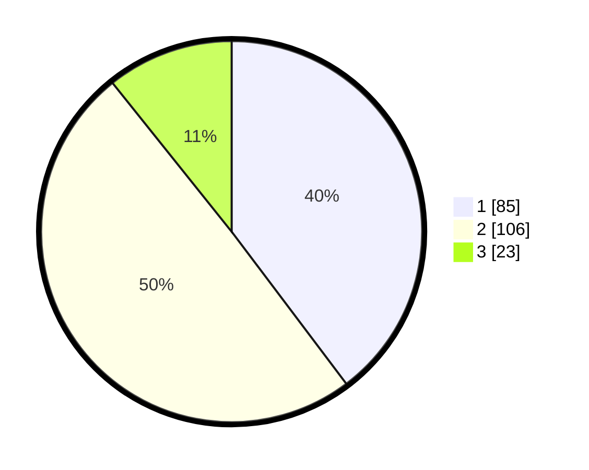

# Hasil

## Grafik

## Tabel

| No. | Nama Paslon    | Suara | Suara (raw) | Persentase |
|:--- |:-------------- | -----:| -----------:| ----------:|
| 1   | ANIES MUHAIMIN | 85    | [85][p-1]   | 39,72      |
| 2   | PRABOWO GIBRAN | 106   | [106][p-2]  | 49,53      |
| 3   | GANJAR MAHFUD  | 23    | [23][p-3]   | 10,75      |

[p-1]: https://github.com/gigit-pemilu/pemilu-2024/blob/main/pilpres/hitung-suara/sub/35-jawa-timur/sub/13-probolinggo/sub/08-krucil/sub/2014-krobungan/sub/007-tps/sub/paslon-1.txt
[p-2]: https://github.com/gigit-pemilu/pemilu-2024/blob/main/pilpres/hitung-suara/sub/35-jawa-timur/sub/13-probolinggo/sub/08-krucil/sub/2014-krobungan/sub/007-tps/sub/paslon-2.txt
[p-3]: https://github.com/gigit-pemilu/pemilu-2024/blob/main/pilpres/hitung-suara/sub/35-jawa-timur/sub/13-probolinggo/sub/08-krucil/sub/2014-krobungan/sub/007-tps/sub/paslon-3.txt

## Foto C Plano

https://sirekap-obj-formc.kpu.go.id/ef1c/pemilu/ppwp/35/13/08/20/14/3513082014007-20240218-104836--47643a4b-f44d-4724-a9d5-0b87ea6701e6.jpg

https://sirekap-obj-formc.kpu.go.id/ef1c/pemilu/ppwp/35/13/08/20/14/3513082014007-20240218-104906--c231dc78-8090-4da7-914d-1206aab3ae66.jpg

https://sirekap-obj-formc.kpu.go.id/ef1c/pemilu/ppwp/35/13/08/20/14/3513082014007-20240218-105150--2e334c11-5e00-42d5-9398-c3c232427e98.jpg

## Metadata

| Key        | Value               |
| ---------- | ------------------- |
| Time Stamp | 2024-02-25 11:00:00 |

