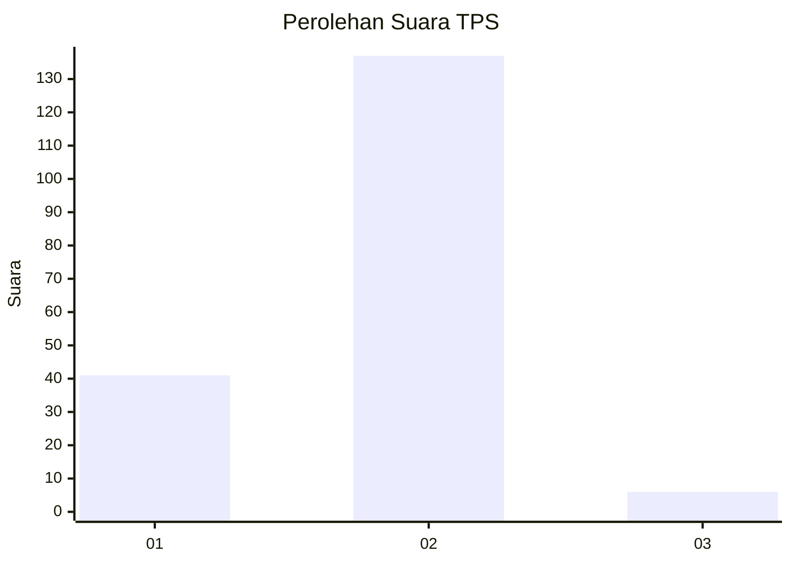

# Hasil

## Grafik

## Tabel

| No. | Nama Paslon    | Suara | Suara (raw) | Persentase |
|:--- |:-------------- | -----:| -----------:| ----------:|
| 1   | ANIES MUHAIMIN | 41    | [41][p-1]   | 22,28      |
| 2   | PRABOWO GIBRAN | 137   | [137][p-2]  | 74,46      |
| 3   | GANJAR MAHFUD  | 6     | [6][p-3]    | 3,26       |

[p-1]: https://github.com/gigit-pemilu/pemilu-2024/blob/main/pilpres/hitung-suara/sub/35-jawa-timur/sub/13-probolinggo/sub/09-gading/sub/2001-batur/sub/003-tps/sub/paslon-1.txt
[p-2]: https://github.com/gigit-pemilu/pemilu-2024/blob/main/pilpres/hitung-suara/sub/35-jawa-timur/sub/13-probolinggo/sub/09-gading/sub/2001-batur/sub/003-tps/sub/paslon-2.txt
[p-3]: https://github.com/gigit-pemilu/pemilu-2024/blob/main/pilpres/hitung-suara/sub/35-jawa-timur/sub/13-probolinggo/sub/09-gading/sub/2001-batur/sub/003-tps/sub/paslon-3.txt

## Foto C Plano

https://sirekap-obj-formc.kpu.go.id/3e60/pemilu/ppwp/35/13/09/20/01/3513092001003-20240223-111033--4ee0820b-4f4f-4866-8c9f-7342b73a0dda.jpg

https://sirekap-obj-formc.kpu.go.id/3e60/pemilu/ppwp/35/13/09/20/01/3513092001003-20240223-111051--493138b4-b132-461e-b5c5-fd5d18c7a955.jpg

https://sirekap-obj-formc.kpu.go.id/3e60/pemilu/ppwp/35/13/09/20/01/3513092001003-20240223-111112--0e3deaaa-3b96-426a-9191-0155c92ea54d.jpg

## Metadata

| Key        | Value               |
| ---------- | ------------------- |
| Time Stamp | 2024-02-24 22:31:28 |

