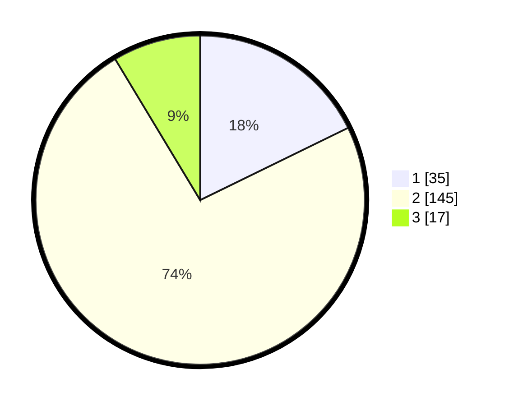

# Hasil

## Grafik

## Tabel

| No. | Nama Paslon    | Suara | Suara (raw) | Persentase |
|:--- |:-------------- | -----:| -----------:| ----------:|
| 1   | ANIES MUHAIMIN | 35    | [35][p-1]   | 17,77      |
| 2   | PRABOWO GIBRAN | 145   | [145][p-2]  | 73,60      |
| 3   | GANJAR MAHFUD  | 17    | [17][p-3]   | 8,63       |

[p-1]: https://github.com/gigit-pemilu/pemilu-2024-35-jawa-timur/blob/main/pilpres/hitung-suara/sub/35-jawa-timur/sub/13-probolinggo/sub/09-gading/sub/2013-nogosaren/sub/001-tps/sub/paslon-1.txt
[p-2]: https://github.com/gigit-pemilu/pemilu-2024-35-jawa-timur/blob/main/pilpres/hitung-suara/sub/35-jawa-timur/sub/13-probolinggo/sub/09-gading/sub/2013-nogosaren/sub/001-tps/sub/paslon-2.txt
[p-3]: https://github.com/gigit-pemilu/pemilu-2024-35-jawa-timur/blob/main/pilpres/hitung-suara/sub/35-jawa-timur/sub/13-probolinggo/sub/09-gading/sub/2013-nogosaren/sub/001-tps/sub/paslon-3.txt

## Foto C Plano

https://sirekap-obj-formc.kpu.go.id/4c1e/pemilu/ppwp/35/13/09/20/13/3513092013001-20240214-195947--10de3edb-91fd-4be7-aa19-ddf15d3d5829.jpg

https://sirekap-obj-formc.kpu.go.id/4c1e/pemilu/ppwp/35/13/09/20/13/3513092013001-20240214-200004--fd08dad2-4d5e-44fd-8099-4e039fc2ee1c.jpg

https://sirekap-obj-formc.kpu.go.id/4c1e/pemilu/ppwp/35/13/09/20/13/3513092013001-20240214-200023--40e36db4-a750-4300-ba1c-5ce8631b51c9.jpg

## Metadata

| Key        | Value               |
| ---------- | ------------------- |
| Time Stamp | 2024-02-19 06:16:00 |

