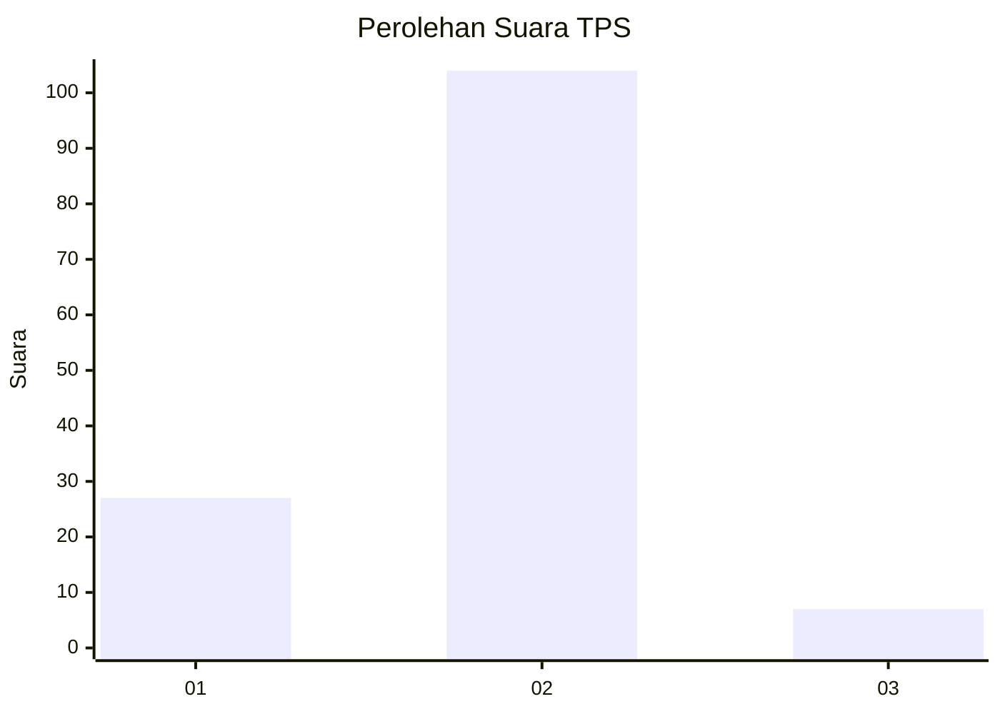
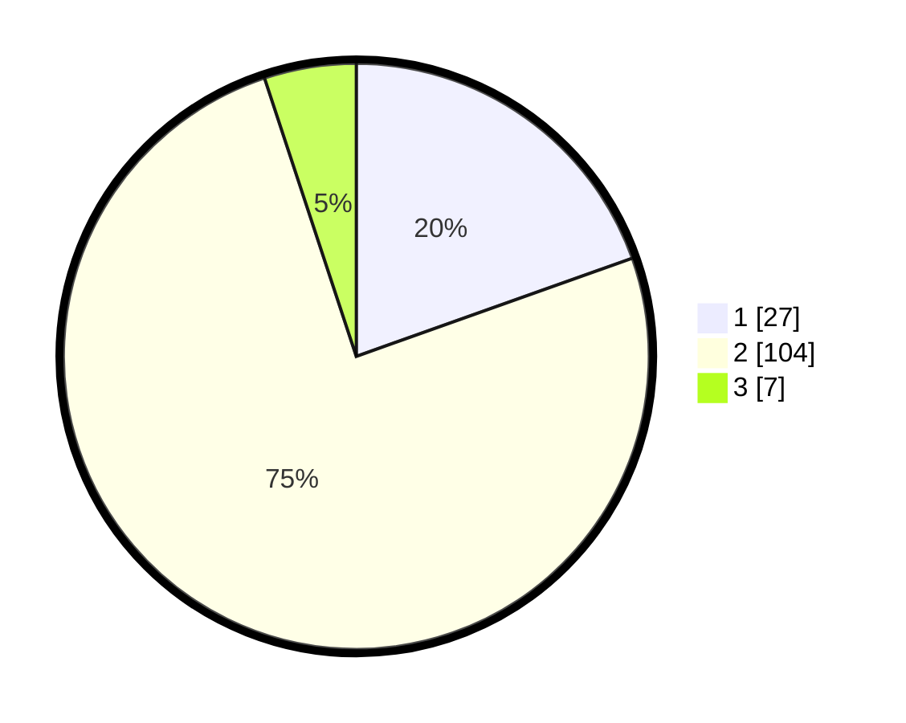

# Hasil

## Grafik

## Tabel

| No. | Nama Paslon    | Suara | Suara (raw) | Persentase |
|:--- |:-------------- | -----:| -----------:| ----------:|
| 1   | ANIES MUHAIMIN | 27    | [27][p-1]   | 19,57      |
| 2   | PRABOWO GIBRAN | 104   | [104][p-2]  | 75,36      |
| 3   | GANJAR MAHFUD  | 7     | [7][p-3]    | 5,07       |

[p-1]: https://github.com/gigit-pemilu/pemilu-2024/blob/main/pilpres/hitung-suara/sub/35-jawa-timur/sub/13-probolinggo/sub/09-gading/sub/2014-mojolegi/sub/008-tps/sub/paslon-1.txt
[p-2]: https://github.com/gigit-pemilu/pemilu-2024/blob/main/pilpres/hitung-suara/sub/35-jawa-timur/sub/13-probolinggo/sub/09-gading/sub/2014-mojolegi/sub/008-tps/sub/paslon-2.txt
[p-3]: https://github.com/gigit-pemilu/pemilu-2024/blob/main/pilpres/hitung-suara/sub/35-jawa-timur/sub/13-probolinggo/sub/09-gading/sub/2014-mojolegi/sub/008-tps/sub/paslon-3.txt

## Foto C Plano

https://sirekap-obj-formc.kpu.go.id/00f5/pemilu/ppwp/35/13/09/20/14/3513092014008-20240214-193112--e942ac1a-6902-4c2e-8773-d4dd588ffa79.jpg

https://sirekap-obj-formc.kpu.go.id/00f5/pemilu/ppwp/35/13/09/20/14/3513092014008-20240214-195012--c08a4b0a-e5a9-4158-9a18-e9bb3409248c.jpg

## Metadata

| Key        | Value               |
| ---------- | ------------------- |
| Time Stamp | 2024-02-15 07:00:44 |

