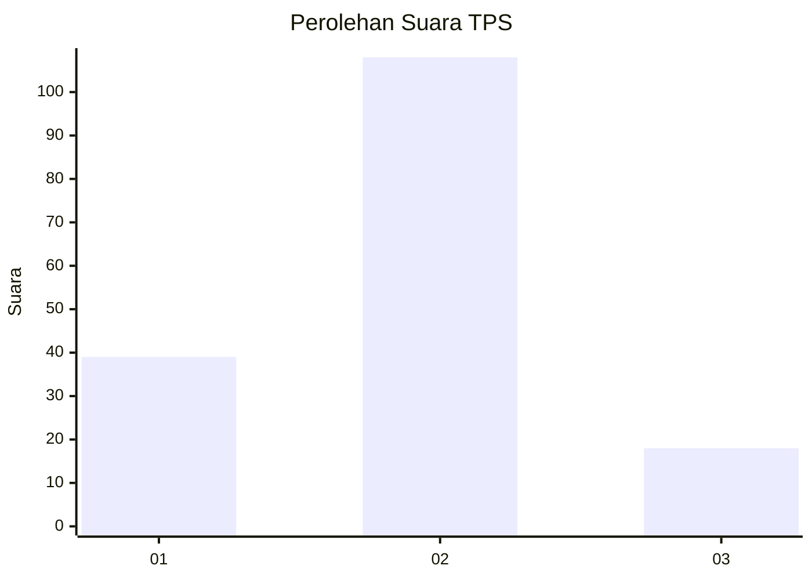
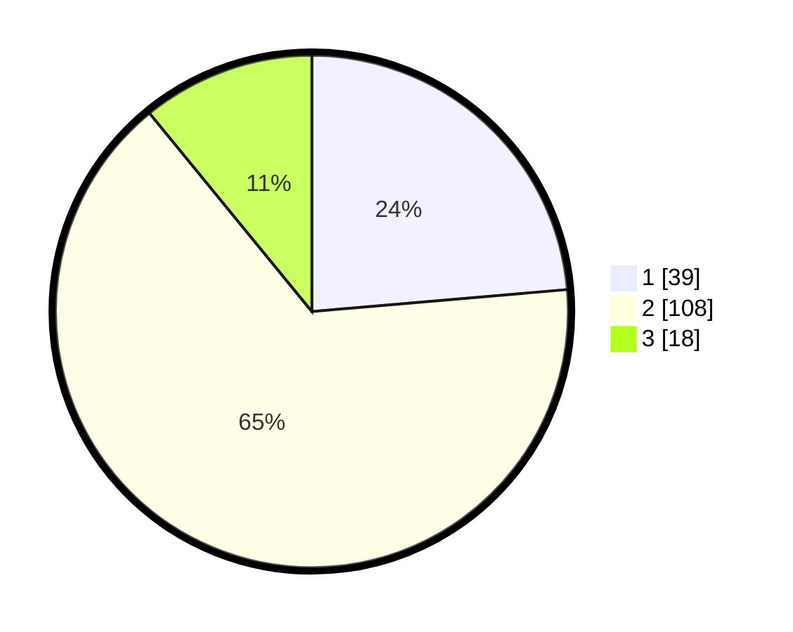

# Hasil

## Grafik

## Tabel

| No. | Nama Paslon    | Suara | Suara (raw) | Persentase |
|:--- |:-------------- | -----:| -----------:| ----------:|
| 1   | ANIES MUHAIMIN | 39    | [39][p-1]   | 23,64      |
| 2   | PRABOWO GIBRAN | 108   | [108][p-2]  | 65,45      |
| 3   | GANJAR MAHFUD  | 18    | [18][p-3]   | 10,91      |

[p-1]: https://github.com/gigit-pemilu/pemilu-2024-35-jawa-timur/blob/main/pilpres/hitung-suara/sub/35-jawa-timur/sub/13-probolinggo/sub/10-pakuniran/sub/2001-ranon/sub/002-tps/sub/paslon-1.txt
[p-2]: https://github.com/gigit-pemilu/pemilu-2024-35-jawa-timur/blob/main/pilpres/hitung-suara/sub/35-jawa-timur/sub/13-probolinggo/sub/10-pakuniran/sub/2001-ranon/sub/002-tps/sub/paslon-2.txt
[p-3]: https://github.com/gigit-pemilu/pemilu-2024-35-jawa-timur/blob/main/pilpres/hitung-suara/sub/35-jawa-timur/sub/13-probolinggo/sub/10-pakuniran/sub/2001-ranon/sub/002-tps/sub/paslon-3.txt

## Foto C Plano

https://sirekap-obj-formc.kpu.go.id/0e68/pemilu/ppwp/35/13/10/20/01/3513102001002-20240214-235100--890eaa03-4f8c-4654-8022-bc6445f6fda3.jpg

https://sirekap-obj-formc.kpu.go.id/0e68/pemilu/ppwp/35/13/10/20/01/3513102001002-20240214-235126--19824083-36c6-471f-a84f-dfca2cf99cf8.jpg

https://sirekap-obj-formc.kpu.go.id/0e68/pemilu/ppwp/35/13/10/20/01/3513102001002-20240214-235356--7bc48aff-36fe-4a8e-9d7b-10e4e700e1a2.jpg

## Metadata

| Key        | Value               |
| ---------- | ------------------- |
| Time Stamp | 2024-02-15 20:00:44 |

