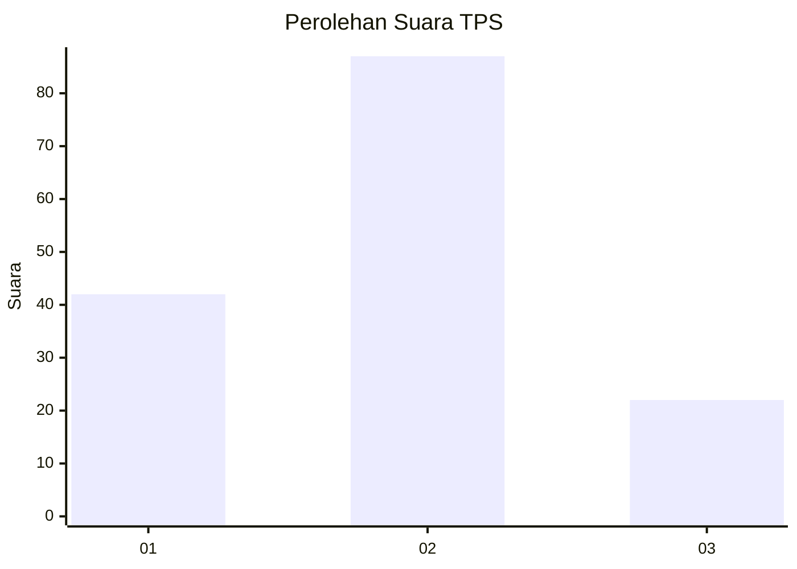
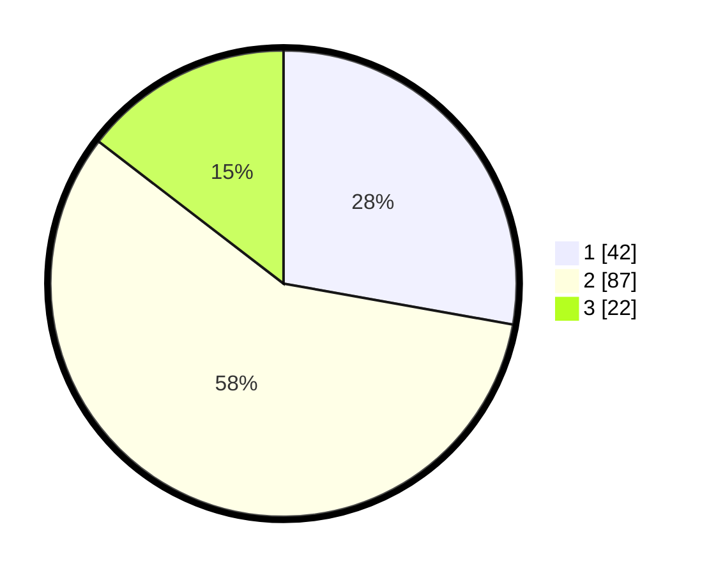

# Hasil

## Grafik

## Tabel

| No. | Nama Paslon    | Suara | Suara (raw) | Persentase |
|:--- |:-------------- | -----:| -----------:| ----------:|
| 1   | ANIES MUHAIMIN | 42    | [42][p-1]   | 27,81      |
| 2   | PRABOWO GIBRAN | 87    | [87][p-2]   | 57,62      |
| 3   | GANJAR MAHFUD  | 22    | [22][p-3]   | 14,57      |

[p-1]: https://github.com/gigit-pemilu/pemilu-2024-35-jawa-timur/blob/main/pilpres/hitung-suara/sub/35-jawa-timur/sub/13-probolinggo/sub/10-pakuniran/sub/2001-ranon/sub/010-tps/sub/paslon-1.txt
[p-2]: https://github.com/gigit-pemilu/pemilu-2024-35-jawa-timur/blob/main/pilpres/hitung-suara/sub/35-jawa-timur/sub/13-probolinggo/sub/10-pakuniran/sub/2001-ranon/sub/010-tps/sub/paslon-2.txt
[p-3]: https://github.com/gigit-pemilu/pemilu-2024-35-jawa-timur/blob/main/pilpres/hitung-suara/sub/35-jawa-timur/sub/13-probolinggo/sub/10-pakuniran/sub/2001-ranon/sub/010-tps/sub/paslon-3.txt

## Foto C Plano

https://sirekap-obj-formc.kpu.go.id/40b3/pemilu/ppwp/35/13/10/20/01/3513102001010-20240214-213352--c213ab3a-b68c-4c11-9bf8-a2e85fced512.jpg

https://sirekap-obj-formc.kpu.go.id/40b3/pemilu/ppwp/35/13/10/20/01/3513102001010-20240214-213400--3ab3cd9d-c1e8-48b7-8ccf-74a9c0acb59a.jpg

https://sirekap-obj-formc.kpu.go.id/40b3/pemilu/ppwp/35/13/10/20/01/3513102001010-20240214-213407--b63f20e1-59e2-44de-aba6-d08c8f0fc681.jpg

## Metadata

| Key        | Value               |
| ---------- | ------------------- |
| Time Stamp | 2024-02-15 15:00:29 |

