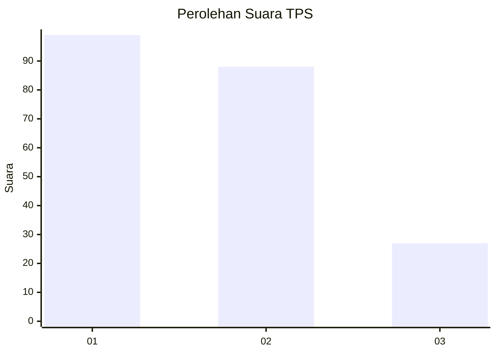
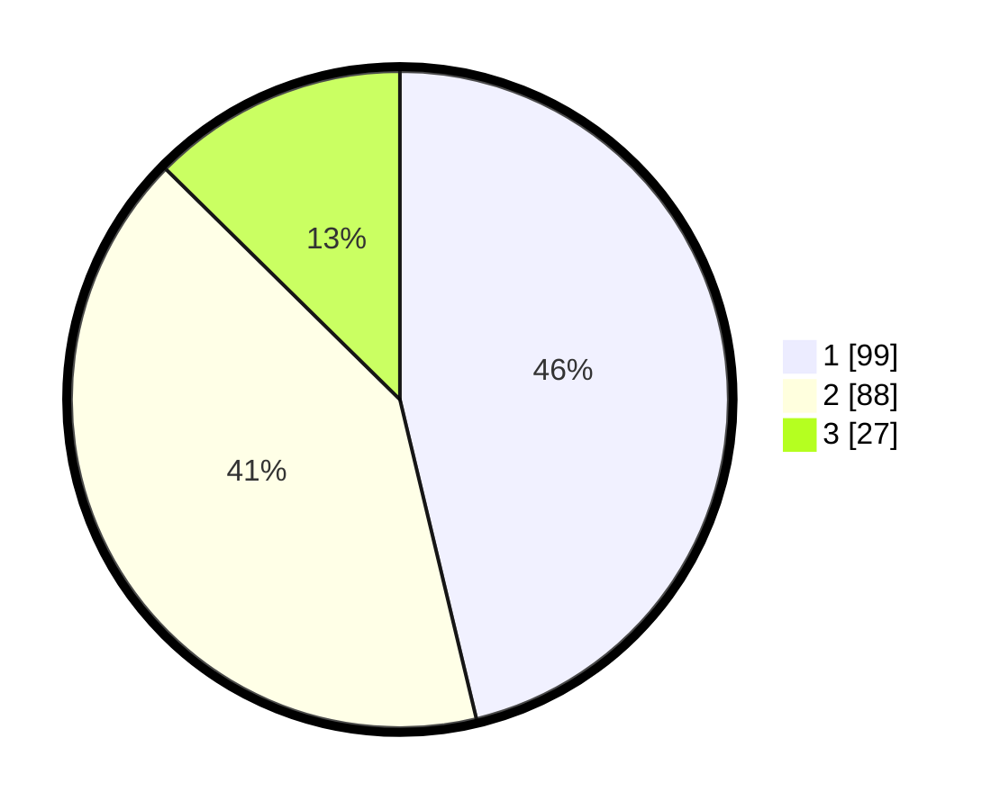

# Hasil

## Grafik

## Tabel

| No. | Nama Paslon    | Suara | Suara (raw) | Persentase |
|:--- |:-------------- | -----:| -----------:| ----------:|
| 1   | ANIES MUHAIMIN | 99    | [99][p-1]   | 46,26      |
| 2   | PRABOWO GIBRAN | 88    | [88][p-2]   | 41,12      |
| 3   | GANJAR MAHFUD  | 27    | [27][p-3]   | 12,62      |

[p-1]: https://github.com/gigit-pemilu/pemilu-2024-35-jawa-timur/blob/main/pilpres/hitung-suara/sub/35-jawa-timur/sub/13-probolinggo/sub/10-pakuniran/sub/2003-gunggungan-kidul/sub/009-tps/sub/paslon-1.txt
[p-2]: https://github.com/gigit-pemilu/pemilu-2024-35-jawa-timur/blob/main/pilpres/hitung-suara/sub/35-jawa-timur/sub/13-probolinggo/sub/10-pakuniran/sub/2003-gunggungan-kidul/sub/009-tps/sub/paslon-2.txt
[p-3]: https://github.com/gigit-pemilu/pemilu-2024-35-jawa-timur/blob/main/pilpres/hitung-suara/sub/35-jawa-timur/sub/13-probolinggo/sub/10-pakuniran/sub/2003-gunggungan-kidul/sub/009-tps/sub/paslon-3.txt

## Foto C Plano

https://sirekap-obj-formc.kpu.go.id/58a6/pemilu/ppwp/35/13/10/20/03/3513102003009-20240215-060514--8a08c644-5e2d-4c01-90bb-9114c387dc76.jpg

https://sirekap-obj-formc.kpu.go.id/58a6/pemilu/ppwp/35/13/10/20/03/3513102003009-20240215-060618--8138d3b6-1e1f-47c6-9ac8-61a4b9d4fc30.jpg

https://sirekap-obj-formc.kpu.go.id/58a6/pemilu/ppwp/35/13/10/20/03/3513102003009-20240215-060708--22b73c02-7fe7-45d1-9717-24ea29f498be.jpg

## Metadata

| Key        | Value               |
| ---------- | ------------------- |
| Time Stamp | 2024-02-25 14:00:00 |

