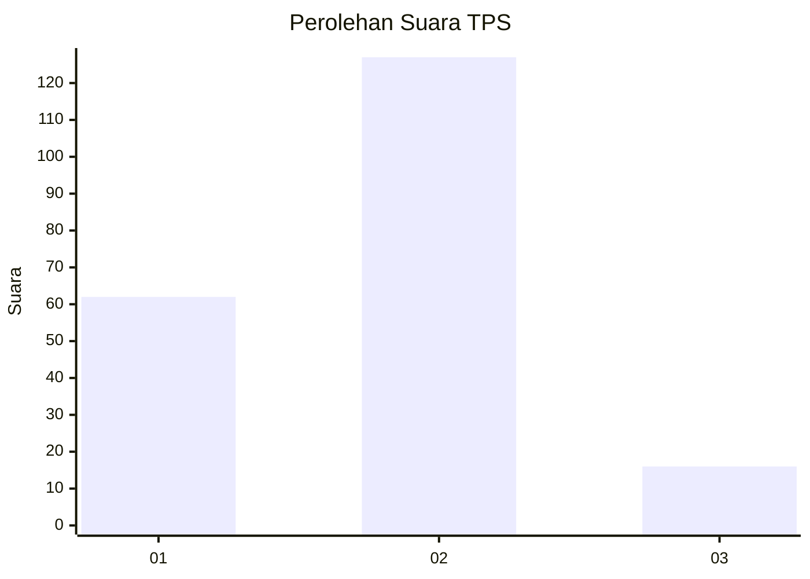
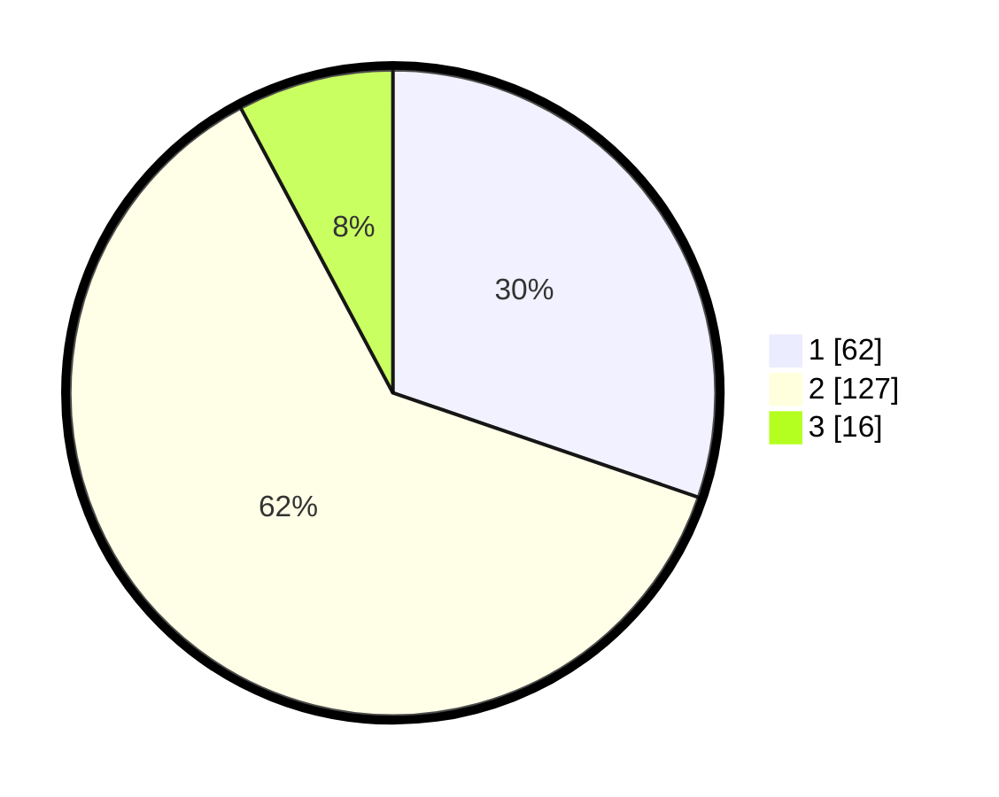

# Hasil

## Grafik

## Tabel

| No. | Nama Paslon    | Suara | Suara (raw) | Persentase |
|:--- |:-------------- | -----:| -----------:| ----------:|
| 1   | ANIES MUHAIMIN | 62    | [62][p-1]   | 30,24      |
| 2   | PRABOWO GIBRAN | 127   | [127][p-2]  | 61,95      |
| 3   | GANJAR MAHFUD  | 16    | [16][p-3]   | 7,80       |

[p-1]: https://github.com/gigit-pemilu/pemilu-2024/blob/main/pilpres/hitung-suara/sub/35-jawa-timur/sub/13-probolinggo/sub/10-pakuniran/sub/2004-gunggungan-lor/sub/004-tps/sub/paslon-1.txt
[p-2]: https://github.com/gigit-pemilu/pemilu-2024/blob/main/pilpres/hitung-suara/sub/35-jawa-timur/sub/13-probolinggo/sub/10-pakuniran/sub/2004-gunggungan-lor/sub/004-tps/sub/paslon-2.txt
[p-3]: https://github.com/gigit-pemilu/pemilu-2024/blob/main/pilpres/hitung-suara/sub/35-jawa-timur/sub/13-probolinggo/sub/10-pakuniran/sub/2004-gunggungan-lor/sub/004-tps/sub/paslon-3.txt

## Foto C Plano

https://sirekap-obj-formc.kpu.go.id/45d9/pemilu/ppwp/35/13/10/20/04/3513102004004-20240215-005237--21212438-4a04-4f94-bf7e-b3e54ae32c2a.jpg

https://sirekap-obj-formc.kpu.go.id/45d9/pemilu/ppwp/35/13/10/20/04/3513102004004-20240215-005326--23e9b876-d954-4676-bbf7-dae871037c2b.jpg

https://sirekap-obj-formc.kpu.go.id/45d9/pemilu/ppwp/35/13/10/20/04/3513102004004-20240215-005414--33f52795-fa04-418b-84b0-a41ed413990b.jpg

## Metadata

| Key        | Value               |
| ---------- | ------------------- |
| Time Stamp | 2024-02-15 21:01:18 |

