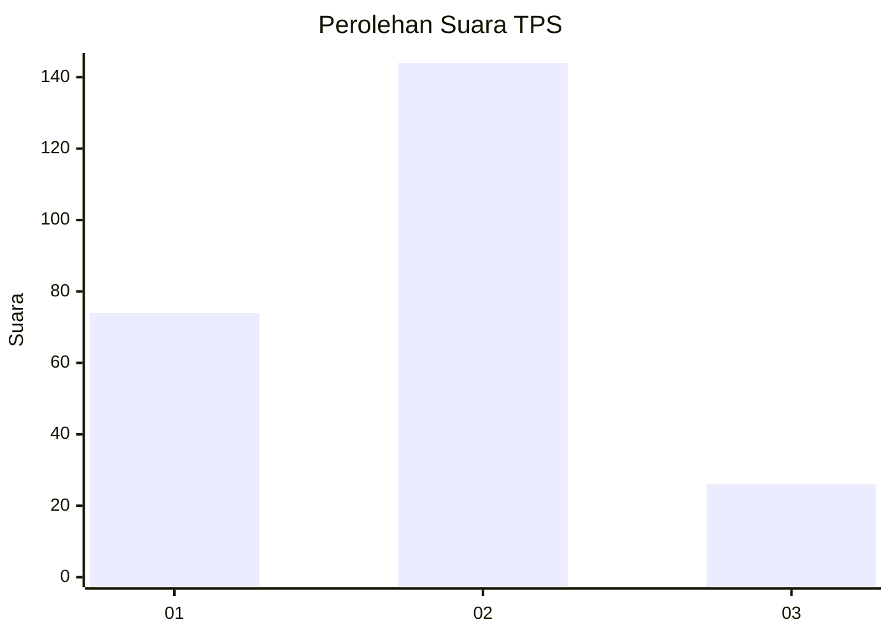
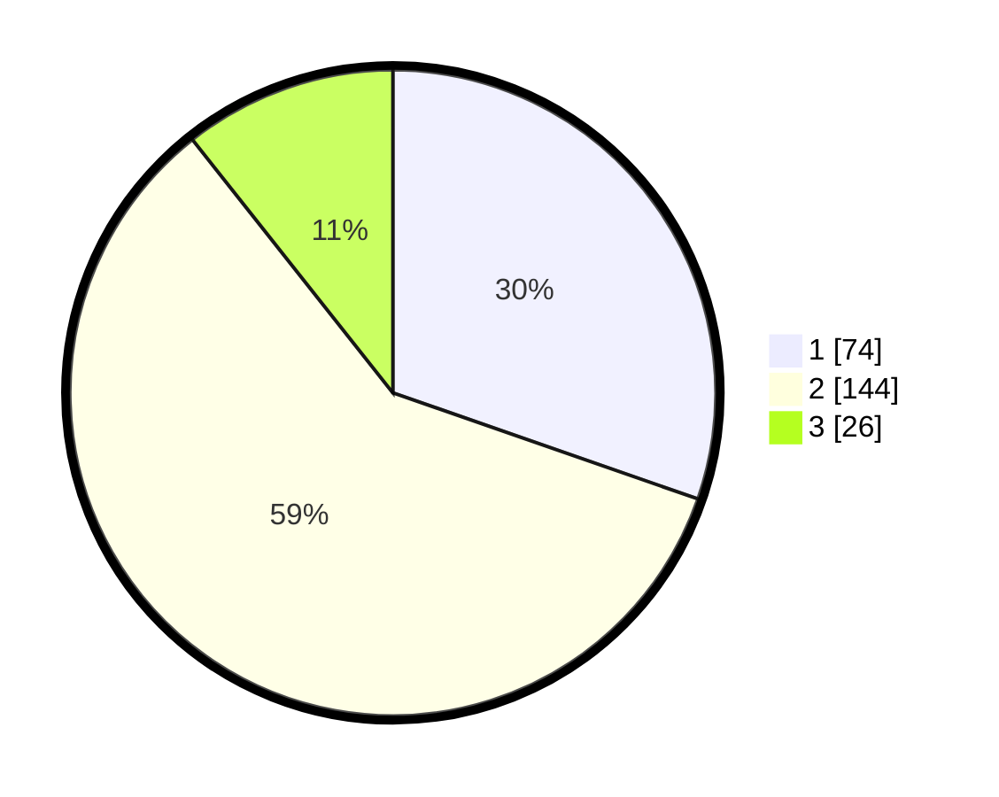

# Hasil

## Grafik

## Tabel

| No. | Nama Paslon    | Suara | Suara (raw) | Persentase |
|:--- |:-------------- | -----:| -----------:| ----------:|
| 1   | ANIES MUHAIMIN | 74    | [74][p-1]   | 30,33      |
| 2   | PRABOWO GIBRAN | 144   | [144][p-2]  | 59,02      |
| 3   | GANJAR MAHFUD  | 26    | [26][p-3]   | 10,66      |

[p-1]: https://github.com/gigit-pemilu/pemilu-2024/blob/main/pilpres/hitung-suara/sub/35-jawa-timur/sub/13-probolinggo/sub/10-pakuniran/sub/2004-gunggungan-lor/sub/005-tps/sub/paslon-1.txt
[p-2]: https://github.com/gigit-pemilu/pemilu-2024/blob/main/pilpres/hitung-suara/sub/35-jawa-timur/sub/13-probolinggo/sub/10-pakuniran/sub/2004-gunggungan-lor/sub/005-tps/sub/paslon-2.txt
[p-3]: https://github.com/gigit-pemilu/pemilu-2024/blob/main/pilpres/hitung-suara/sub/35-jawa-timur/sub/13-probolinggo/sub/10-pakuniran/sub/2004-gunggungan-lor/sub/005-tps/sub/paslon-3.txt

## Foto C Plano

https://sirekap-obj-formc.kpu.go.id/f765/pemilu/ppwp/35/13/10/20/04/3513102004005-20240215-031553--dd565282-edc7-4eba-be6b-5f154e3ef0e3.jpg

https://sirekap-obj-formc.kpu.go.id/f765/pemilu/ppwp/35/13/10/20/04/3513102004005-20240215-031629--71255869-33e9-40d9-9b6f-dca76cab6268.jpg

https://sirekap-obj-formc.kpu.go.id/f765/pemilu/ppwp/35/13/10/20/04/3513102004005-20240215-031647--122a62ca-4f6b-4ce0-b9c1-00e7ddb97a22.jpg

## Metadata

| Key        | Value               |
| ---------- | ------------------- |
| Time Stamp | 2024-02-15 21:01:18 |

