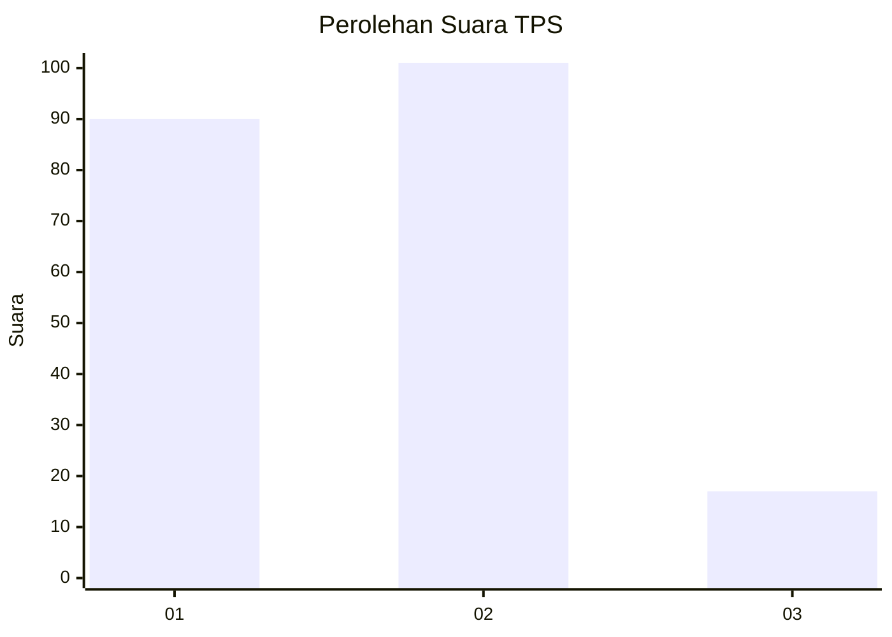
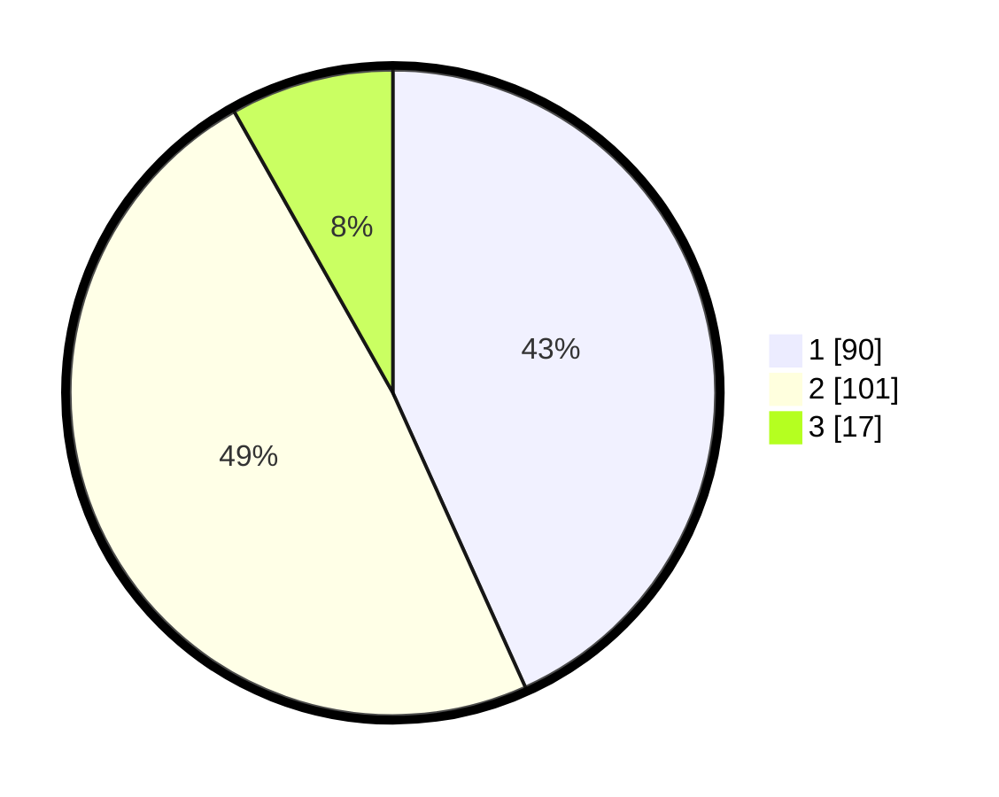

# Hasil

## Grafik

## Tabel

| No. | Nama Paslon    | Suara | Suara (raw) | Persentase |
|:--- |:-------------- | -----:| -----------:| ----------:|
| 1   | ANIES MUHAIMIN | 90    | [90][p-1]   | 43,27      |
| 2   | PRABOWO GIBRAN | 101   | [101][p-2]  | 48,56      |
| 3   | GANJAR MAHFUD  | 17    | [17][p-3]   | 8,17       |

[p-1]: https://github.com/gigit-pemilu/pemilu-2024/blob/main/pilpres/hitung-suara/sub/35-jawa-timur/sub/13-probolinggo/sub/10-pakuniran/sub/2009-sogaan/sub/001-tps/sub/paslon-1.txt
[p-2]: https://github.com/gigit-pemilu/pemilu-2024/blob/main/pilpres/hitung-suara/sub/35-jawa-timur/sub/13-probolinggo/sub/10-pakuniran/sub/2009-sogaan/sub/001-tps/sub/paslon-2.txt
[p-3]: https://github.com/gigit-pemilu/pemilu-2024/blob/main/pilpres/hitung-suara/sub/35-jawa-timur/sub/13-probolinggo/sub/10-pakuniran/sub/2009-sogaan/sub/001-tps/sub/paslon-3.txt

## Foto C Plano

https://sirekap-obj-formc.kpu.go.id/d250/pemilu/ppwp/35/13/10/20/09/3513102009001-20240215-015041--c50574bd-3628-4ce1-8345-9cd221e248ab.jpg

https://sirekap-obj-formc.kpu.go.id/d250/pemilu/ppwp/35/13/10/20/09/3513102009001-20240215-015215--c5aba6fe-6253-4218-b7c5-9f70d8ef3503.jpg

https://sirekap-obj-formc.kpu.go.id/d250/pemilu/ppwp/35/13/10/20/09/3513102009001-20240215-015323--7b0b56f9-8600-4f9d-845b-88091bbcb13c.jpg

## Metadata

| Key        | Value               |
| ---------- | ------------------- |
| Time Stamp | 2024-02-16 00:00:26 |

