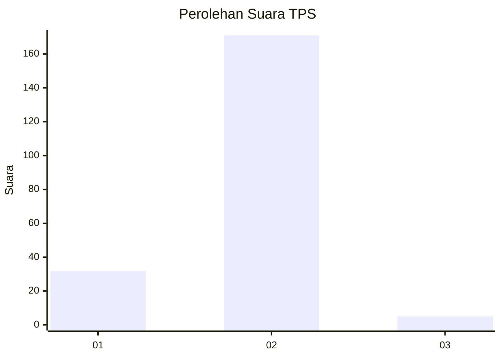
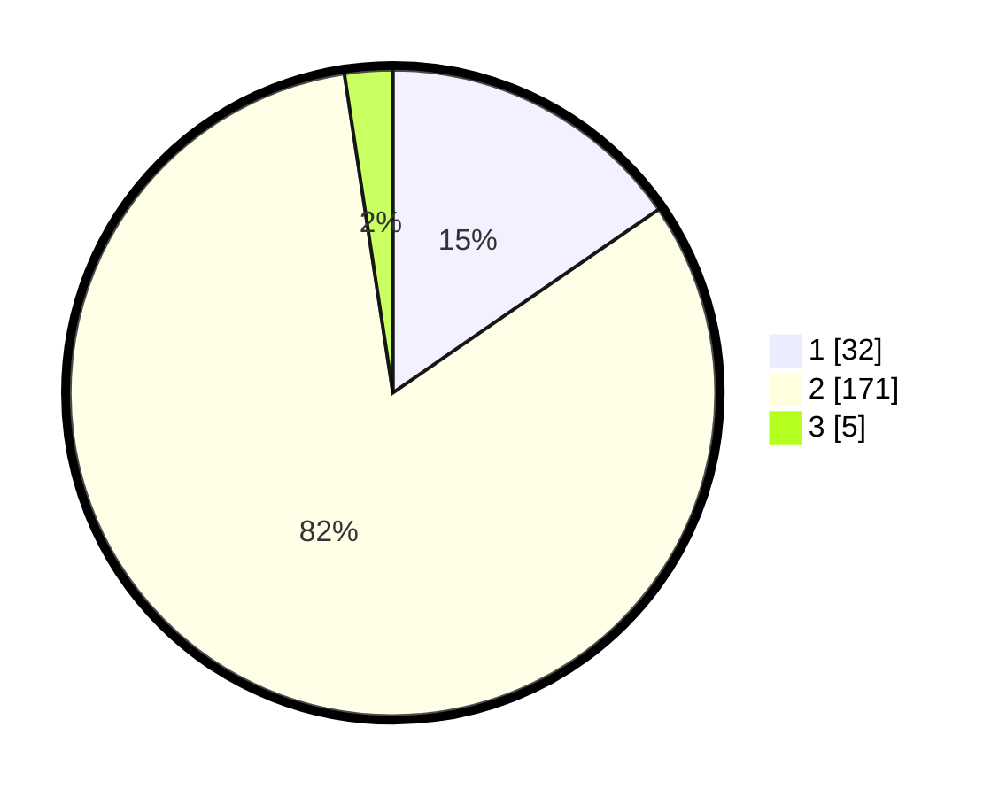

# Hasil

## Grafik

## Tabel

| No. | Nama Paslon    | Suara | Suara (raw) | Persentase |
|:--- |:-------------- | -----:| -----------:| ----------:|
| 1   | ANIES MUHAIMIN | 32    | [32][p-1]   | 15,38      |
| 2   | PRABOWO GIBRAN | 171   | [171][p-2]  | 82,21      |
| 3   | GANJAR MAHFUD  | 5     | [5][p-3]    | 2,40       |

[p-1]: https://github.com/gigit-pemilu/pemilu-2024-35-jawa-timur/blob/main/pilpres/hitung-suara/sub/35-jawa-timur/sub/13-probolinggo/sub/10-pakuniran/sub/2009-sogaan/sub/007-tps/sub/paslon-1.txt
[p-2]: https://github.com/gigit-pemilu/pemilu-2024-35-jawa-timur/blob/main/pilpres/hitung-suara/sub/35-jawa-timur/sub/13-probolinggo/sub/10-pakuniran/sub/2009-sogaan/sub/007-tps/sub/paslon-2.txt
[p-3]: https://github.com/gigit-pemilu/pemilu-2024-35-jawa-timur/blob/main/pilpres/hitung-suara/sub/35-jawa-timur/sub/13-probolinggo/sub/10-pakuniran/sub/2009-sogaan/sub/007-tps/sub/paslon-3.txt

## Foto C Plano

https://sirekap-obj-formc.kpu.go.id/1fcf/pemilu/ppwp/35/13/10/20/09/3513102009007-20240215-033007--b45a54aa-b678-4d67-95c9-ae49155e4a42.jpg

https://sirekap-obj-formc.kpu.go.id/1fcf/pemilu/ppwp/35/13/10/20/09/3513102009007-20240215-033051--4a12a247-cd38-48b8-98da-847097b88579.jpg

https://sirekap-obj-formc.kpu.go.id/1fcf/pemilu/ppwp/35/13/10/20/09/3513102009007-20240215-033123--1ea187ab-a217-4636-9d7f-98e5af93f279.jpg

## Metadata

| Key        | Value               |
| ---------- | ------------------- |
| Time Stamp | 2024-02-15 22:00:27 |

