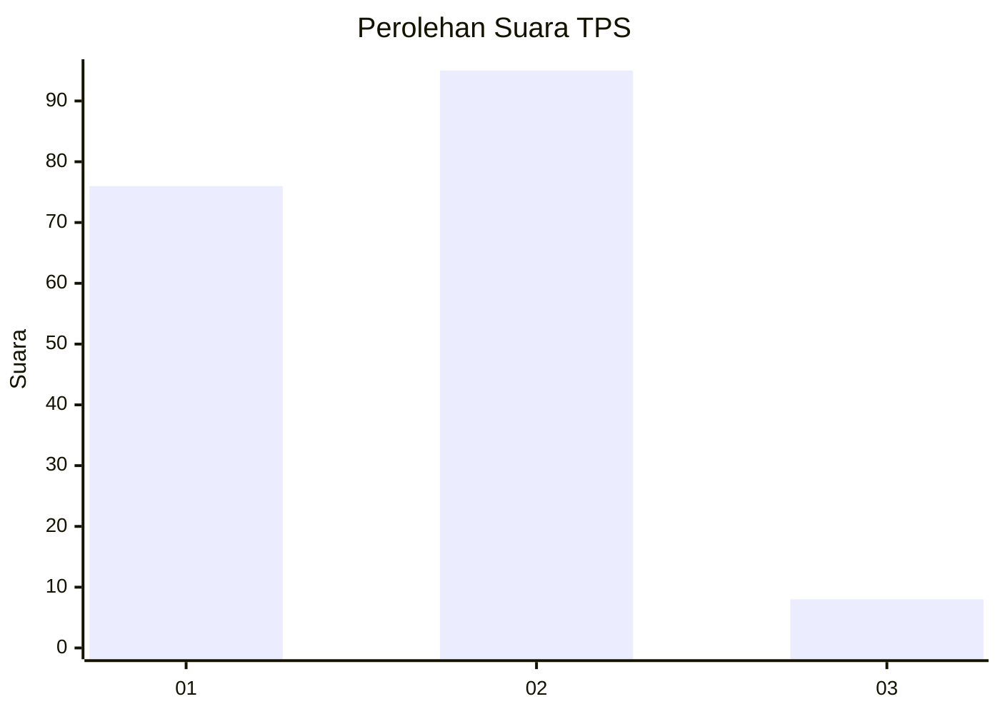
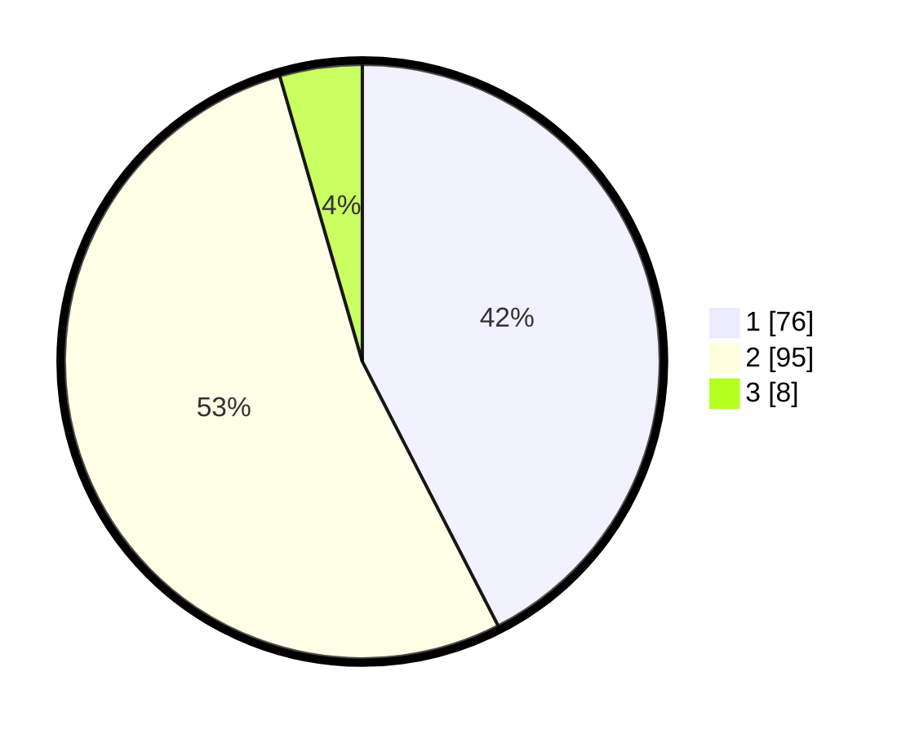

# Hasil

## Grafik

## Tabel

| No. | Nama Paslon    | Suara | Suara (raw) | Persentase |
|:--- |:-------------- | -----:| -----------:| ----------:|
| 1   | ANIES MUHAIMIN | 76    | [76][p-1]   | 42,46      |
| 2   | PRABOWO GIBRAN | 95    | [95][p-2]   | 53,07      |
| 3   | GANJAR MAHFUD  | 8     | [8][p-3]    | 4,47       |

[p-1]: https://github.com/gigit-pemilu/pemilu-2024/blob/main/pilpres/hitung-suara/sub/35-jawa-timur/sub/13-probolinggo/sub/10-pakuniran/sub/2009-sogaan/sub/009-tps/sub/paslon-1.txt
[p-2]: https://github.com/gigit-pemilu/pemilu-2024/blob/main/pilpres/hitung-suara/sub/35-jawa-timur/sub/13-probolinggo/sub/10-pakuniran/sub/2009-sogaan/sub/009-tps/sub/paslon-2.txt
[p-3]: https://github.com/gigit-pemilu/pemilu-2024/blob/main/pilpres/hitung-suara/sub/35-jawa-timur/sub/13-probolinggo/sub/10-pakuniran/sub/2009-sogaan/sub/009-tps/sub/paslon-3.txt

## Foto C Plano

https://sirekap-obj-formc.kpu.go.id/6776/pemilu/ppwp/35/13/10/20/09/3513102009009-20240215-010641--59df2a7a-f86c-4567-b521-82b8f0d47854.jpg

https://sirekap-obj-formc.kpu.go.id/6776/pemilu/ppwp/35/13/10/20/09/3513102009009-20240215-010758--c2399693-4dfa-4906-85d2-6b0b29494abd.jpg

https://sirekap-obj-formc.kpu.go.id/6776/pemilu/ppwp/35/13/10/20/09/3513102009009-20240215-005636--ded0e2c1-328d-429f-87a5-e4f4935ccc08.jpg

## Metadata

| Key        | Value               |
| ---------- | ------------------- |
| Time Stamp | 2024-02-15 22:00:27 |

