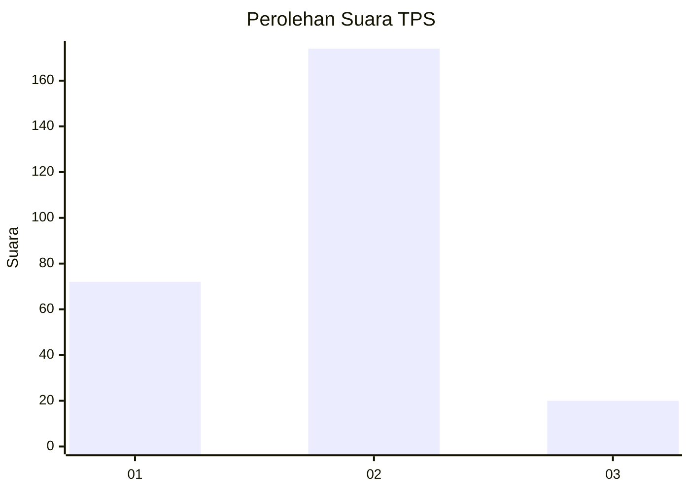
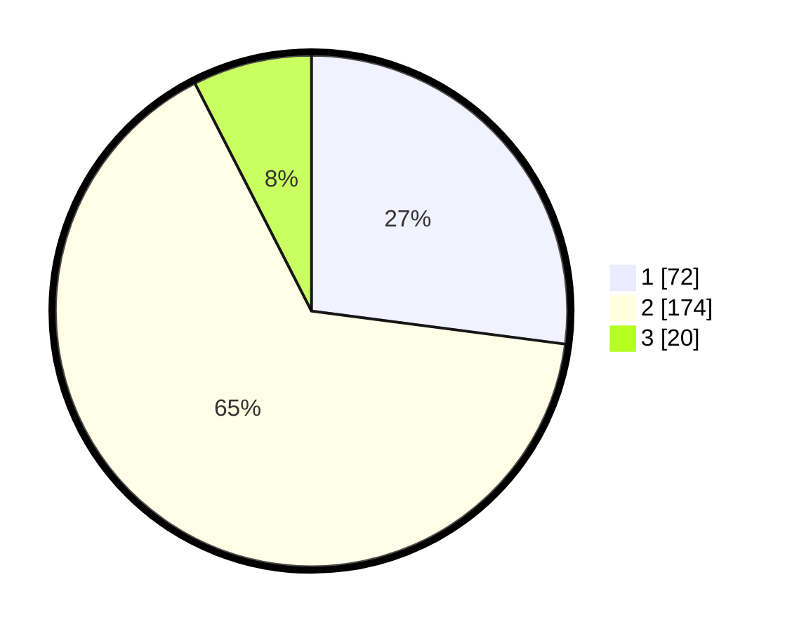

# Hasil

## Grafik

## Tabel

| No. | Nama Paslon    | Suara | Suara (raw) | Persentase |
|:--- |:-------------- | -----:| -----------:| ----------:|
| 1   | ANIES MUHAIMIN | 72    | [72][p-1]   | 27,07      |
| 2   | PRABOWO GIBRAN | 174   | [174][p-2]  | 65,41      |
| 3   | GANJAR MAHFUD  | 20    | [20][p-3]   | 7,52       |

[p-1]: https://github.com/gigit-pemilu/pemilu-2024/blob/main/pilpres/hitung-suara/sub/35-jawa-timur/sub/13-probolinggo/sub/10-pakuniran/sub/2010-glagah/sub/009-tps/sub/paslon-1.txt
[p-2]: https://github.com/gigit-pemilu/pemilu-2024/blob/main/pilpres/hitung-suara/sub/35-jawa-timur/sub/13-probolinggo/sub/10-pakuniran/sub/2010-glagah/sub/009-tps/sub/paslon-2.txt
[p-3]: https://github.com/gigit-pemilu/pemilu-2024/blob/main/pilpres/hitung-suara/sub/35-jawa-timur/sub/13-probolinggo/sub/10-pakuniran/sub/2010-glagah/sub/009-tps/sub/paslon-3.txt

## Foto C Plano

https://sirekap-obj-formc.kpu.go.id/ad29/pemilu/ppwp/35/13/10/20/10/3513102010009-20240215-024628--8086d10a-1139-4853-981f-4c4d1ea90262.jpg

https://sirekap-obj-formc.kpu.go.id/ad29/pemilu/ppwp/35/13/10/20/10/3513102010009-20240215-024723--d30f753c-ce63-438d-84da-8c522892f0a9.jpg

https://sirekap-obj-formc.kpu.go.id/ad29/pemilu/ppwp/35/13/10/20/10/3513102010009-20240215-024809--d045304d-307b-4987-b155-fa3807c7b76d.jpg

## Metadata

| Key        | Value               |
| ---------- | ------------------- |
| Time Stamp | 2024-02-15 23:29:50 |

