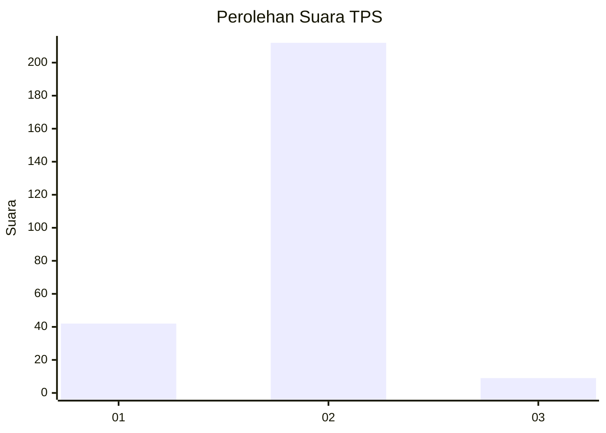
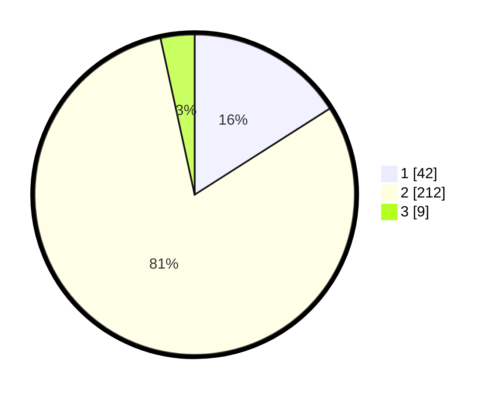

# Hasil

## Grafik

## Tabel

| No. | Nama Paslon    | Suara | Suara (raw) | Persentase |
|:--- |:-------------- | -----:| -----------:| ----------:|
| 1   | ANIES MUHAIMIN | 42    | [42][p-1]   | 15,97      |
| 2   | PRABOWO GIBRAN | 212   | [212][p-2]  | 80,61      |
| 3   | GANJAR MAHFUD  | 9     | [9][p-3]    | 3,42       |

[p-1]: https://github.com/gigit-pemilu/pemilu-2024-35-jawa-timur/blob/main/pilpres/hitung-suara/sub/35-jawa-timur/sub/13-probolinggo/sub/10-pakuniran/sub/2014-kertonegoro/sub/002-tps/sub/paslon-1.txt
[p-2]: https://github.com/gigit-pemilu/pemilu-2024-35-jawa-timur/blob/main/pilpres/hitung-suara/sub/35-jawa-timur/sub/13-probolinggo/sub/10-pakuniran/sub/2014-kertonegoro/sub/002-tps/sub/paslon-2.txt
[p-3]: https://github.com/gigit-pemilu/pemilu-2024-35-jawa-timur/blob/main/pilpres/hitung-suara/sub/35-jawa-timur/sub/13-probolinggo/sub/10-pakuniran/sub/2014-kertonegoro/sub/002-tps/sub/paslon-3.txt

## Foto C Plano

https://sirekap-obj-formc.kpu.go.id/926b/pemilu/ppwp/35/13/10/20/14/3513102014002-20240215-033005--0cceb0ec-6ab5-492b-90c0-2cc54e2e514d.jpg

https://sirekap-obj-formc.kpu.go.id/926b/pemilu/ppwp/35/13/10/20/14/3513102014002-20240215-033429--866939bf-90af-4a6b-a2ce-70626d8ef24f.jpg

https://sirekap-obj-formc.kpu.go.id/926b/pemilu/ppwp/35/13/10/20/14/3513102014002-20240215-000424--b9919790-4e94-40f7-b985-9391c3be5586.jpg

## Metadata

| Key        | Value               |
| ---------- | ------------------- |
| Time Stamp | 2024-02-25 18:00:00 |

