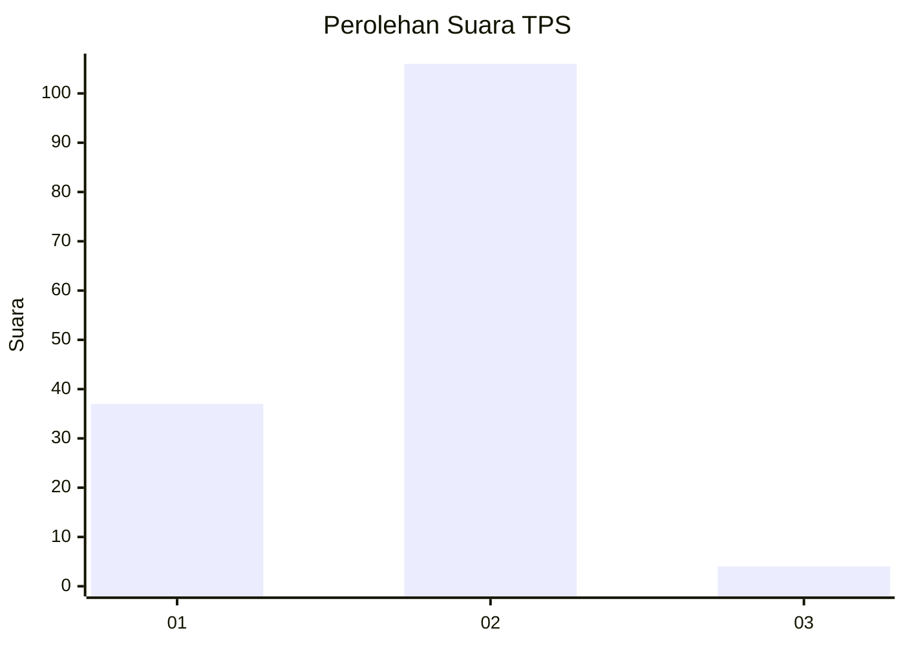
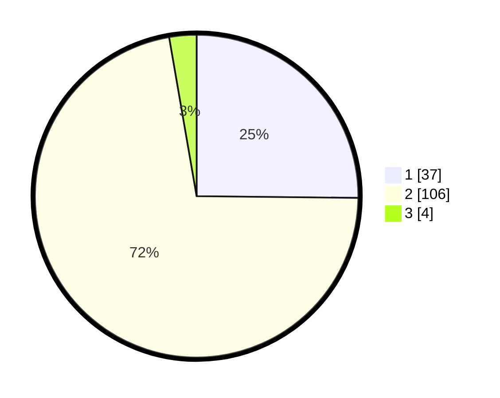

# Hasil

## Grafik

## Tabel

| No. | Nama Paslon    | Suara | Suara (raw) | Persentase |
|:--- |:-------------- | -----:| -----------:| ----------:|
| 1   | ANIES MUHAIMIN | 37    | [37][p-1]   | 25,17      |
| 2   | PRABOWO GIBRAN | 106   | [106][p-2]  | 72,11      |
| 3   | GANJAR MAHFUD  | 4     | [4][p-3]    | 2,72       |

[p-1]: https://github.com/gigit-pemilu/pemilu-2024-35-jawa-timur/blob/main/pilpres/hitung-suara/sub/35-jawa-timur/sub/13-probolinggo/sub/10-pakuniran/sub/2014-kertonegoro/sub/004-tps/sub/paslon-1.txt
[p-2]: https://github.com/gigit-pemilu/pemilu-2024-35-jawa-timur/blob/main/pilpres/hitung-suara/sub/35-jawa-timur/sub/13-probolinggo/sub/10-pakuniran/sub/2014-kertonegoro/sub/004-tps/sub/paslon-2.txt
[p-3]: https://github.com/gigit-pemilu/pemilu-2024-35-jawa-timur/blob/main/pilpres/hitung-suara/sub/35-jawa-timur/sub/13-probolinggo/sub/10-pakuniran/sub/2014-kertonegoro/sub/004-tps/sub/paslon-3.txt

## Foto C Plano

https://sirekap-obj-formc.kpu.go.id/ee2b/pemilu/ppwp/35/13/10/20/14/3513102014004-20240215-004348--ace2463c-5e7c-4688-8578-05ff5232becd.jpg

https://sirekap-obj-formc.kpu.go.id/ee2b/pemilu/ppwp/35/13/10/20/14/3513102014004-20240215-004737--8fdadc8c-1ebc-491c-84ac-ed5e716ad750.jpg

https://sirekap-obj-formc.kpu.go.id/ee2b/pemilu/ppwp/35/13/10/20/14/3513102014004-20240215-004846--41db48e6-2149-4082-bdca-3608841384a8.jpg

## Metadata

| Key        | Value               |
| ---------- | ------------------- |
| Time Stamp | 2024-02-25 22:00:00 |

