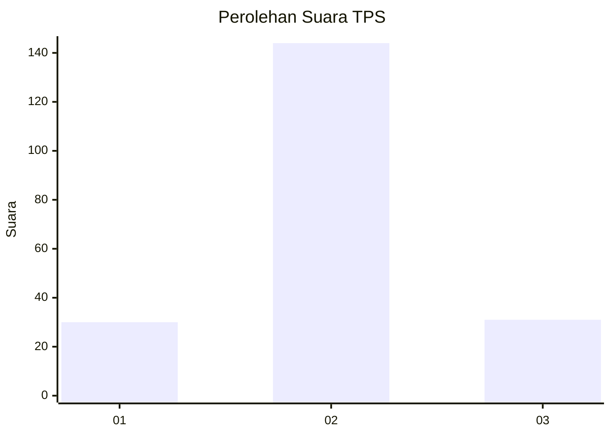

# Hasil

## Grafik

## Tabel

| No. | Nama Paslon    | Suara | Suara (raw) | Persentase |
|:--- |:-------------- | -----:| -----------:| ----------:|
| 1   | ANIES MUHAIMIN | 30    | [30][p-1]   | 14,63      |
| 2   | PRABOWO GIBRAN | 144   | [144][p-2]  | 70,24      |
| 3   | GANJAR MAHFUD  | 31    | [31][p-3]   | 15,12      |

[p-1]: https://github.com/gigit-pemilu/pemilu-2024/blob/main/pilpres/hitung-suara/sub/35-jawa-timur/sub/13-probolinggo/sub/10-pakuniran/sub/2015-gondosuli/sub/007-tps/sub/paslon-1.txt
[p-2]: https://github.com/gigit-pemilu/pemilu-2024/blob/main/pilpres/hitung-suara/sub/35-jawa-timur/sub/13-probolinggo/sub/10-pakuniran/sub/2015-gondosuli/sub/007-tps/sub/paslon-2.txt
[p-3]: https://github.com/gigit-pemilu/pemilu-2024/blob/main/pilpres/hitung-suara/sub/35-jawa-timur/sub/13-probolinggo/sub/10-pakuniran/sub/2015-gondosuli/sub/007-tps/sub/paslon-3.txt

## Foto C Plano

https://sirekap-obj-formc.kpu.go.id/b4cb/pemilu/ppwp/35/13/10/20/15/3513102015007-20240215-043948--058badd3-4980-4fa6-8dfc-ea831e60a724.jpg

https://sirekap-obj-formc.kpu.go.id/b4cb/pemilu/ppwp/35/13/10/20/15/3513102015007-20240215-044042--d54ca1c2-49f7-414d-9eef-5bc790740eb1.jpg

https://sirekap-obj-formc.kpu.go.id/b4cb/pemilu/ppwp/35/13/10/20/15/3513102015007-20240215-044117--01e68f14-5411-4e4b-9c75-e2856ea3739a.jpg

## Metadata

| Key        | Value               |
| ---------- | ------------------- |
| Time Stamp | 2024-02-24 22:31:28 |

