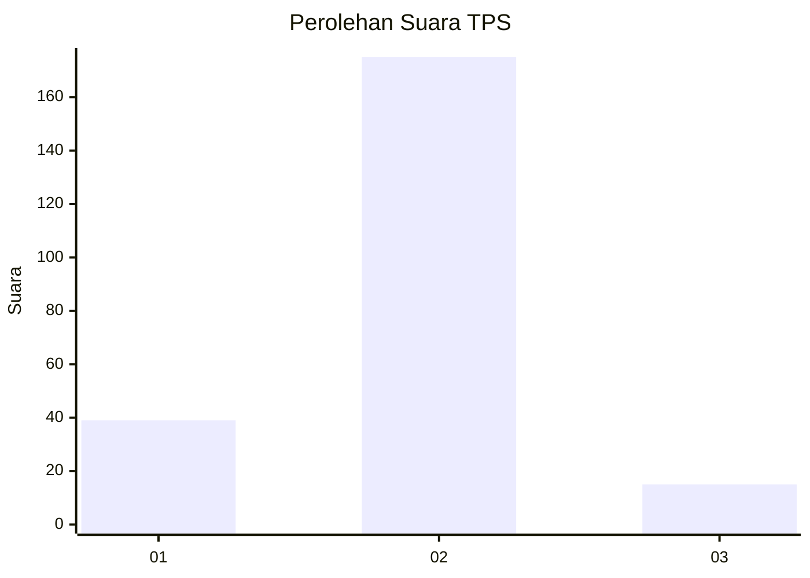
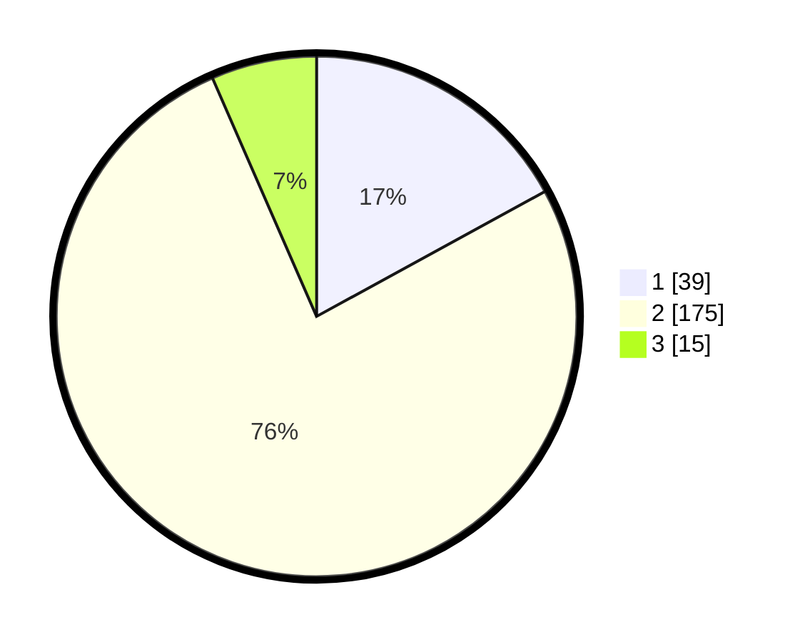

# Hasil

## Grafik

## Tabel

| No. | Nama Paslon    | Suara | Suara (raw) | Persentase |
|:--- |:-------------- | -----:| -----------:| ----------:|
| 1   | ANIES MUHAIMIN | 39    | [39][p-1]   | 17,03      |
| 2   | PRABOWO GIBRAN | 175   | [175][p-2]  | 76,42      |
| 3   | GANJAR MAHFUD  | 15    | [15][p-3]   | 6,55       |

[p-1]: https://github.com/gigit-pemilu/pemilu-2024/blob/main/pilpres/hitung-suara/sub/35-jawa-timur/sub/13-probolinggo/sub/10-pakuniran/sub/2015-gondosuli/sub/011-tps/sub/paslon-1.txt
[p-2]: https://github.com/gigit-pemilu/pemilu-2024/blob/main/pilpres/hitung-suara/sub/35-jawa-timur/sub/13-probolinggo/sub/10-pakuniran/sub/2015-gondosuli/sub/011-tps/sub/paslon-2.txt
[p-3]: https://github.com/gigit-pemilu/pemilu-2024/blob/main/pilpres/hitung-suara/sub/35-jawa-timur/sub/13-probolinggo/sub/10-pakuniran/sub/2015-gondosuli/sub/011-tps/sub/paslon-3.txt

## Foto C Plano

https://sirekap-obj-formc.kpu.go.id/344f/pemilu/ppwp/35/13/10/20/15/3513102015011-20240215-011359--e50d0d23-5b89-42cd-9a67-7dbd2ad18ea7.jpg

https://sirekap-obj-formc.kpu.go.id/344f/pemilu/ppwp/35/13/10/20/15/3513102015011-20240215-011517--db29a506-39ce-4c68-a769-26b7c16c31e6.jpg

https://sirekap-obj-formc.kpu.go.id/344f/pemilu/ppwp/35/13/10/20/15/3513102015011-20240218-101921--e633c227-ae38-4361-8082-fe94c13e3b8a.jpg

## Metadata

| Key        | Value               |
| ---------- | ------------------- |
| Time Stamp | 2024-02-19 06:16:00 |

