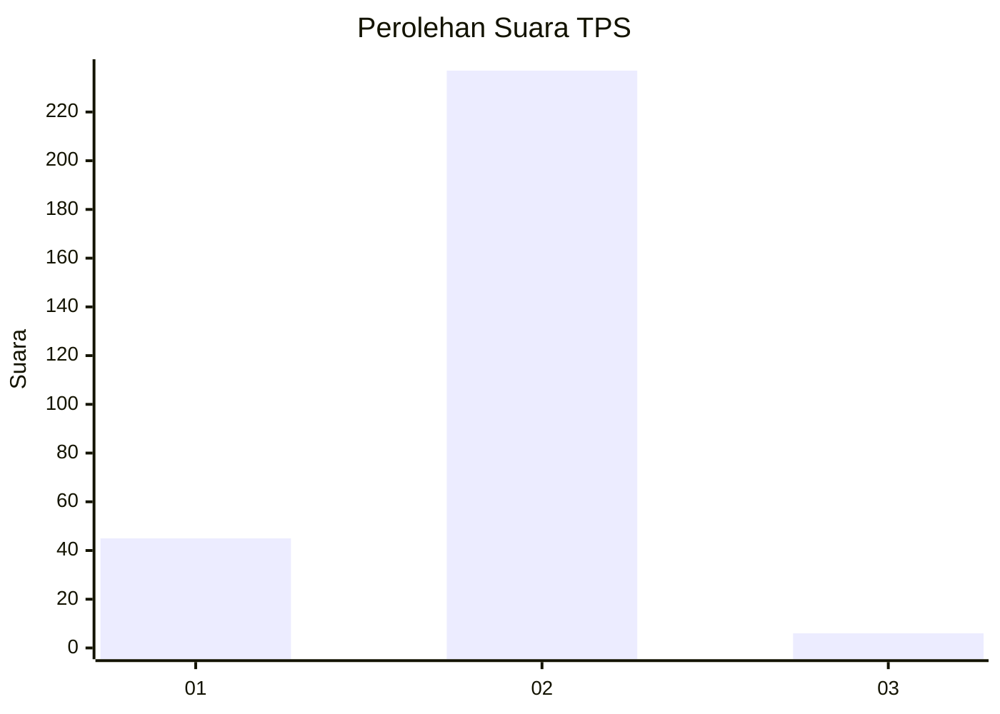
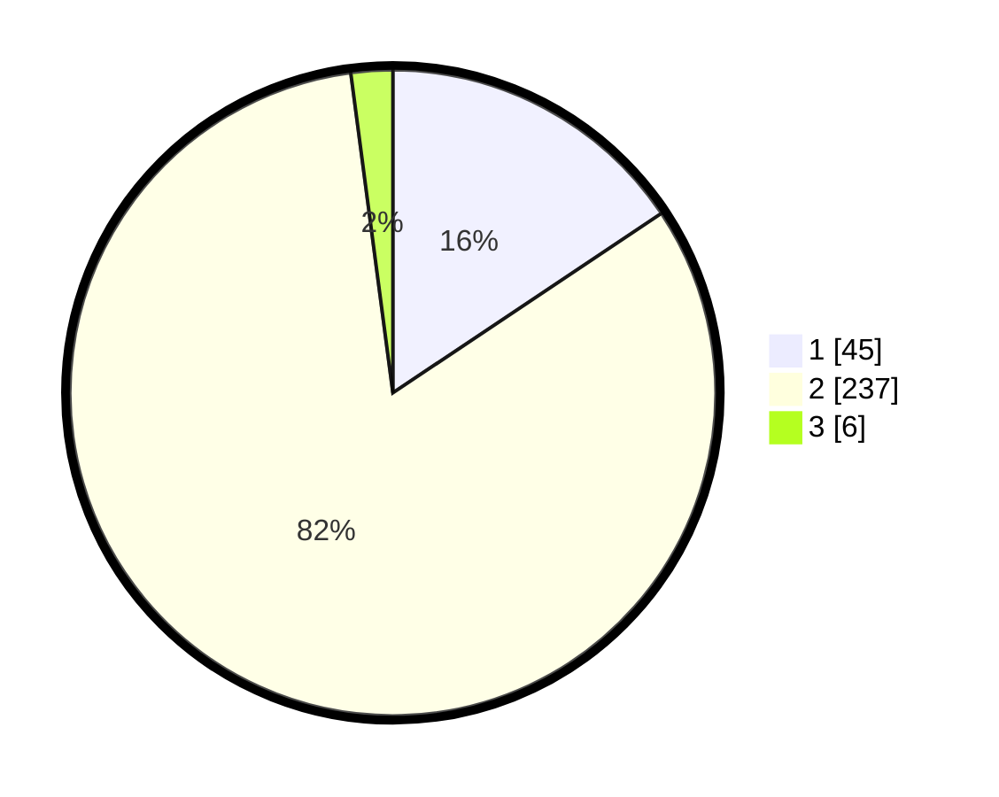

# Hasil

## Grafik

## Tabel

| No. | Nama Paslon    | Suara | Suara (raw) | Persentase |
|:--- |:-------------- | -----:| -----------:| ----------:|
| 1   | ANIES MUHAIMIN | 45    | [45][p-1]   | 15,63      |
| 2   | PRABOWO GIBRAN | 237   | [237][p-2]  | 82,29      |
| 3   | GANJAR MAHFUD  | 6     | [6][p-3]    | 2,08       |

[p-1]: https://github.com/gigit-pemilu/pemilu-2024-35-jawa-timur/blob/main/pilpres/hitung-suara/sub/35-jawa-timur/sub/13-probolinggo/sub/10-pakuniran/sub/2016-kalidandan/sub/003-tps/sub/paslon-1.txt
[p-2]: https://github.com/gigit-pemilu/pemilu-2024-35-jawa-timur/blob/main/pilpres/hitung-suara/sub/35-jawa-timur/sub/13-probolinggo/sub/10-pakuniran/sub/2016-kalidandan/sub/003-tps/sub/paslon-2.txt
[p-3]: https://github.com/gigit-pemilu/pemilu-2024-35-jawa-timur/blob/main/pilpres/hitung-suara/sub/35-jawa-timur/sub/13-probolinggo/sub/10-pakuniran/sub/2016-kalidandan/sub/003-tps/sub/paslon-3.txt

## Foto C Plano

https://sirekap-obj-formc.kpu.go.id/058c/pemilu/ppwp/35/13/10/20/16/3513102016003-20240214-232713--1eb63ee8-2de7-4864-ab7f-15fc0113a1c6.jpg

https://sirekap-obj-formc.kpu.go.id/058c/pemilu/ppwp/35/13/10/20/16/3513102016003-20240214-233432--81954dc0-9156-44fc-bf75-c80463ebbc3b.jpg

https://sirekap-obj-formc.kpu.go.id/058c/pemilu/ppwp/35/13/10/20/16/3513102016003-20240214-233804--d9998b34-9c30-4b62-a730-f54d2d90c8c7.jpg

## Metadata

| Key        | Value               |
| ---------- | ------------------- |
| Time Stamp | 2024-02-26 21:00:00 |

