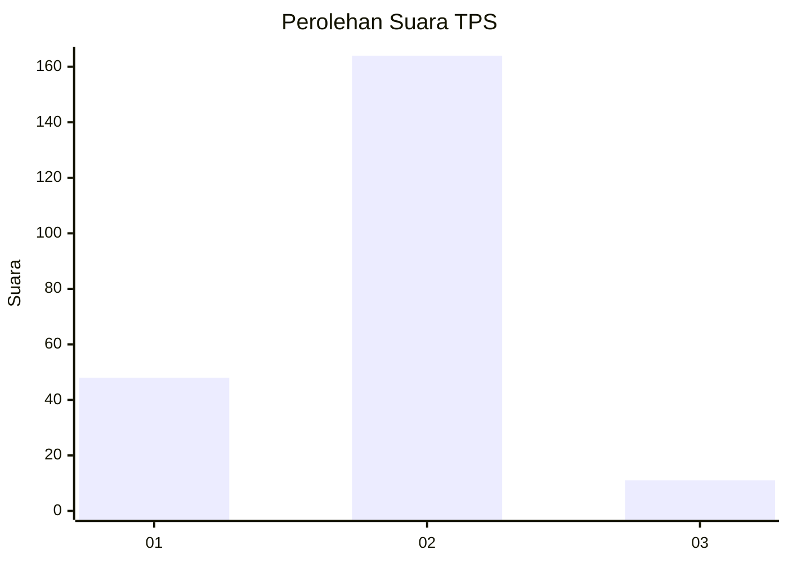
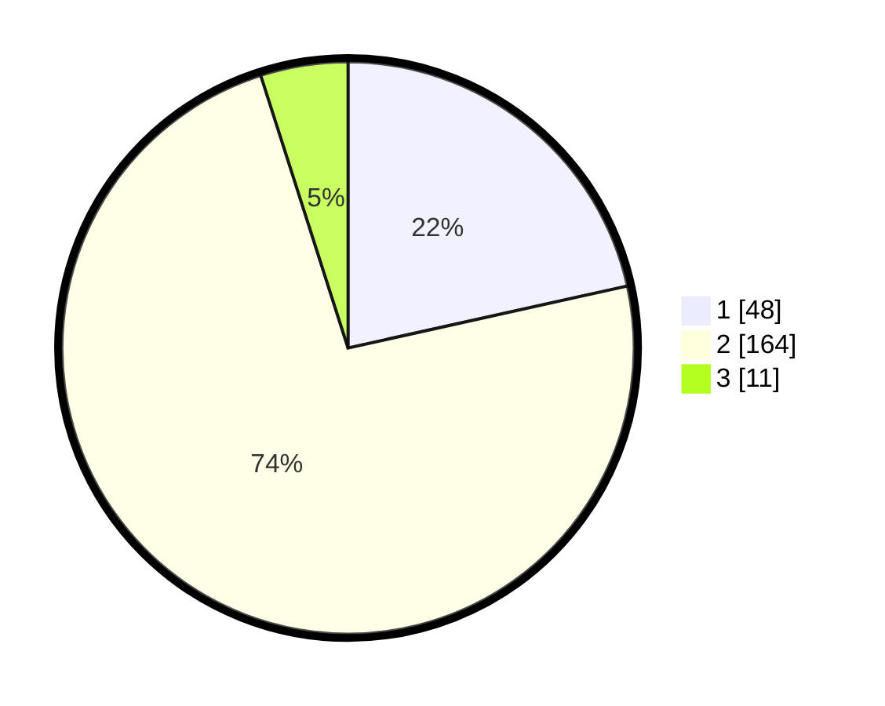

# Hasil

## Grafik

## Tabel

| No. | Nama Paslon    | Suara | Suara (raw) | Persentase |
|:--- |:-------------- | -----:| -----------:| ----------:|
| 1   | ANIES MUHAIMIN | 48    | [48][p-1]   | 21,52      |
| 2   | PRABOWO GIBRAN | 164   | [164][p-2]  | 73,54      |
| 3   | GANJAR MAHFUD  | 11    | [11][p-3]   | 4,93       |

[p-1]: https://github.com/gigit-pemilu/pemilu-2024/blob/main/pilpres/hitung-suara/sub/35-jawa-timur/sub/13-probolinggo/sub/11-kotaanyar/sub/2001-sumber-centeng/sub/004-tps/sub/paslon-1.txt
[p-2]: https://github.com/gigit-pemilu/pemilu-2024/blob/main/pilpres/hitung-suara/sub/35-jawa-timur/sub/13-probolinggo/sub/11-kotaanyar/sub/2001-sumber-centeng/sub/004-tps/sub/paslon-2.txt
[p-3]: https://github.com/gigit-pemilu/pemilu-2024/blob/main/pilpres/hitung-suara/sub/35-jawa-timur/sub/13-probolinggo/sub/11-kotaanyar/sub/2001-sumber-centeng/sub/004-tps/sub/paslon-3.txt

## Foto C Plano

https://sirekap-obj-formc.kpu.go.id/e241/pemilu/ppwp/35/13/11/20/01/3513112001004-20240214-221919--399eaf28-504e-4205-98ce-dbb19e0e04f8.jpg

https://sirekap-obj-formc.kpu.go.id/e241/pemilu/ppwp/35/13/11/20/01/3513112001004-20240215-074216--b3871bb4-9e55-41ba-8cc1-69699ba22a2e.jpg

https://sirekap-obj-formc.kpu.go.id/e241/pemilu/ppwp/35/13/11/20/01/3513112001004-20240215-104126--321b0a0c-2025-42af-a6d6-661719e6a313.jpg

## Metadata

| Key        | Value               |
| ---------- | ------------------- |
| Time Stamp | 2024-02-22 22:00:00 |

