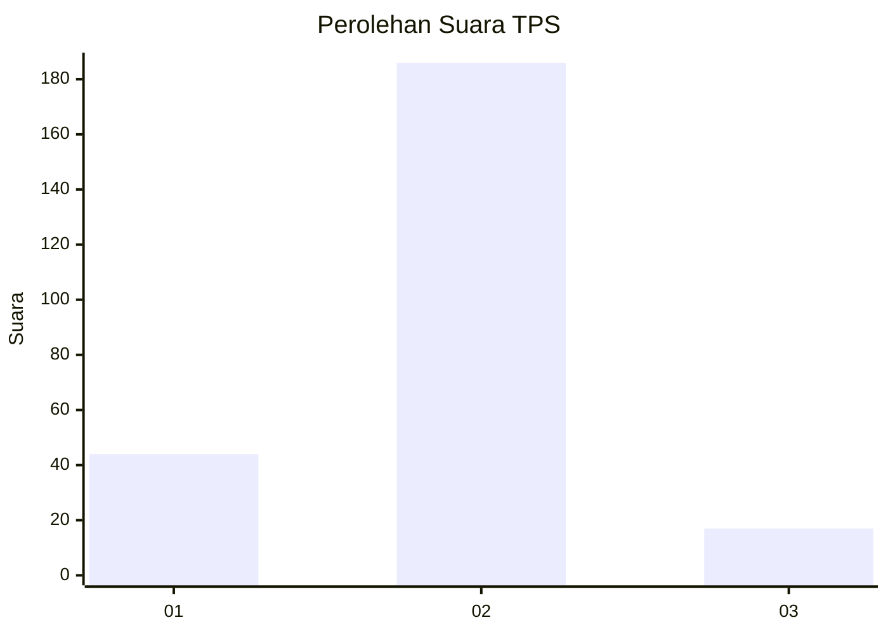
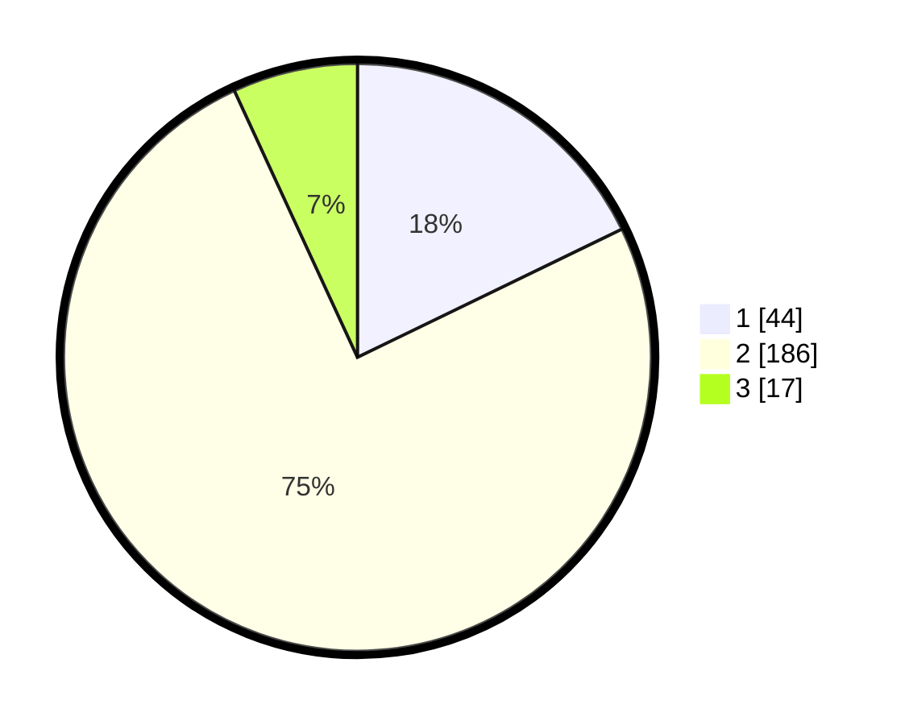

# Hasil

## Grafik

## Tabel

| No. | Nama Paslon    | Suara | Suara (raw) | Persentase |
|:--- |:-------------- | -----:| -----------:| ----------:|
| 1   | ANIES MUHAIMIN | 44    | [44][p-1]   | 17,81      |
| 2   | PRABOWO GIBRAN | 186   | [186][p-2]  | 75,30      |
| 3   | GANJAR MAHFUD  | 17    | [17][p-3]   | 6,88       |

[p-1]: https://github.com/gigit-pemilu/pemilu-2024/blob/main/pilpres/hitung-suara/sub/35-jawa-timur/sub/13-probolinggo/sub/11-kotaanyar/sub/2003-sidomulyo/sub/003-tps/sub/paslon-1.txt
[p-2]: https://github.com/gigit-pemilu/pemilu-2024/blob/main/pilpres/hitung-suara/sub/35-jawa-timur/sub/13-probolinggo/sub/11-kotaanyar/sub/2003-sidomulyo/sub/003-tps/sub/paslon-2.txt
[p-3]: https://github.com/gigit-pemilu/pemilu-2024/blob/main/pilpres/hitung-suara/sub/35-jawa-timur/sub/13-probolinggo/sub/11-kotaanyar/sub/2003-sidomulyo/sub/003-tps/sub/paslon-3.txt

## Foto C Plano

https://sirekap-obj-formc.kpu.go.id/d5fc/pemilu/ppwp/35/13/11/20/03/3513112003003-20240215-062408--d40189c3-e92e-4f52-87a2-e17c4c4daebe.jpg

https://sirekap-obj-formc.kpu.go.id/d5fc/pemilu/ppwp/35/13/11/20/03/3513112003003-20240215-062536--426ca2a2-fc66-4551-af2e-091e4457c1cc.jpg

https://sirekap-obj-formc.kpu.go.id/d5fc/pemilu/ppwp/35/13/11/20/03/3513112003003-20240215-062638--ebf4baea-dc86-493f-b32a-ce94345226b3.jpg

## Metadata

| Key        | Value               |
| ---------- | ------------------- |
| Time Stamp | 2024-02-22 22:00:00 |

