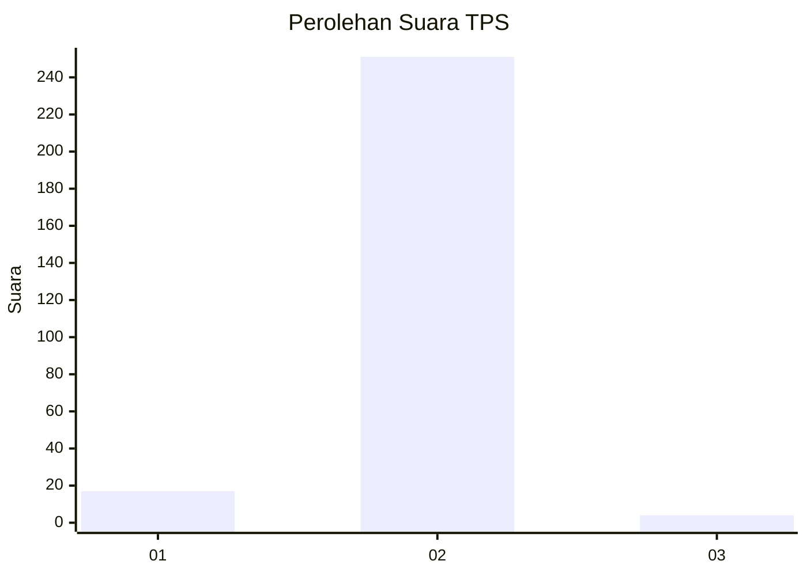
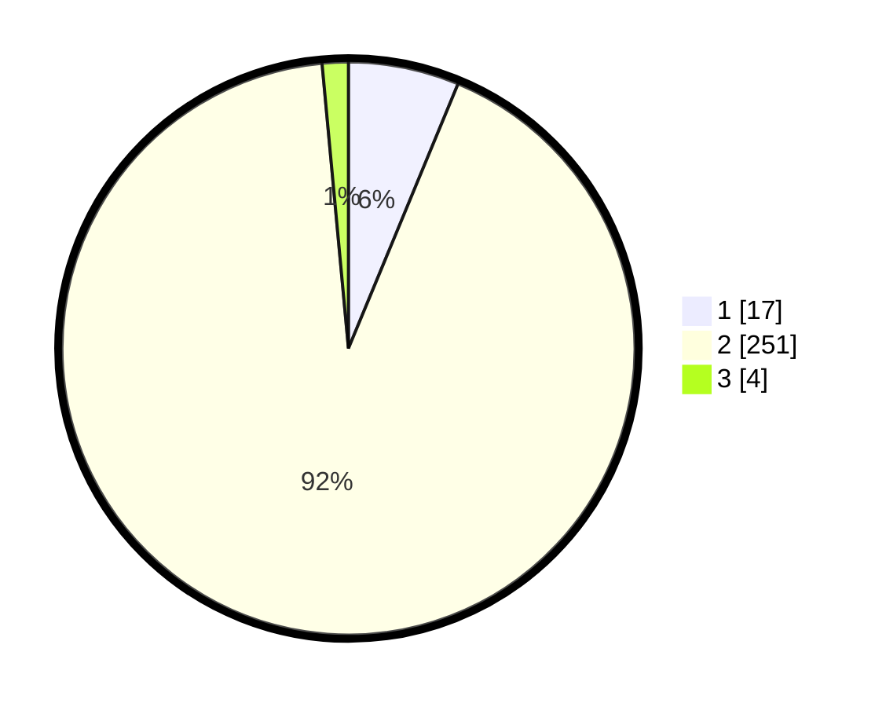

# Hasil

## Grafik

## Tabel

| No. | Nama Paslon    | Suara | Suara (raw) | Persentase |
|:--- |:-------------- | -----:| -----------:| ----------:|
| 1   | ANIES MUHAIMIN | 17    | [17][p-1]   | 6,25       |
| 2   | PRABOWO GIBRAN | 251   | [251][p-2]  | 92,28      |
| 3   | GANJAR MAHFUD  | 4     | [4][p-3]    | 1,47       |

[p-1]: https://github.com/gigit-pemilu/pemilu-2024-35-jawa-timur/blob/main/pilpres/hitung-suara/sub/35-jawa-timur/sub/13-probolinggo/sub/11-kotaanyar/sub/2004-tambakukir/sub/001-tps/sub/paslon-1.txt
[p-2]: https://github.com/gigit-pemilu/pemilu-2024-35-jawa-timur/blob/main/pilpres/hitung-suara/sub/35-jawa-timur/sub/13-probolinggo/sub/11-kotaanyar/sub/2004-tambakukir/sub/001-tps/sub/paslon-2.txt
[p-3]: https://github.com/gigit-pemilu/pemilu-2024-35-jawa-timur/blob/main/pilpres/hitung-suara/sub/35-jawa-timur/sub/13-probolinggo/sub/11-kotaanyar/sub/2004-tambakukir/sub/001-tps/sub/paslon-3.txt

## Foto C Plano

https://sirekap-obj-formc.kpu.go.id/fea1/pemilu/ppwp/35/13/11/20/04/3513112004001-20240218-120844--7d706142-2f9b-4cf3-b38a-35fec0cdaff2.jpg

https://sirekap-obj-formc.kpu.go.id/fea1/pemilu/ppwp/35/13/11/20/04/3513112004001-20240214-211241--61d185ba-08ad-4892-aef3-7d121303b349.jpg

https://sirekap-obj-formc.kpu.go.id/fea1/pemilu/ppwp/35/13/11/20/04/3513112004001-20240218-120936--f9136bb1-eade-4382-88c1-e468583d0fe3.jpg

## Metadata

| Key        | Value               |
| ---------- | ------------------- |
| Time Stamp | 2024-02-21 11:00:00 |

