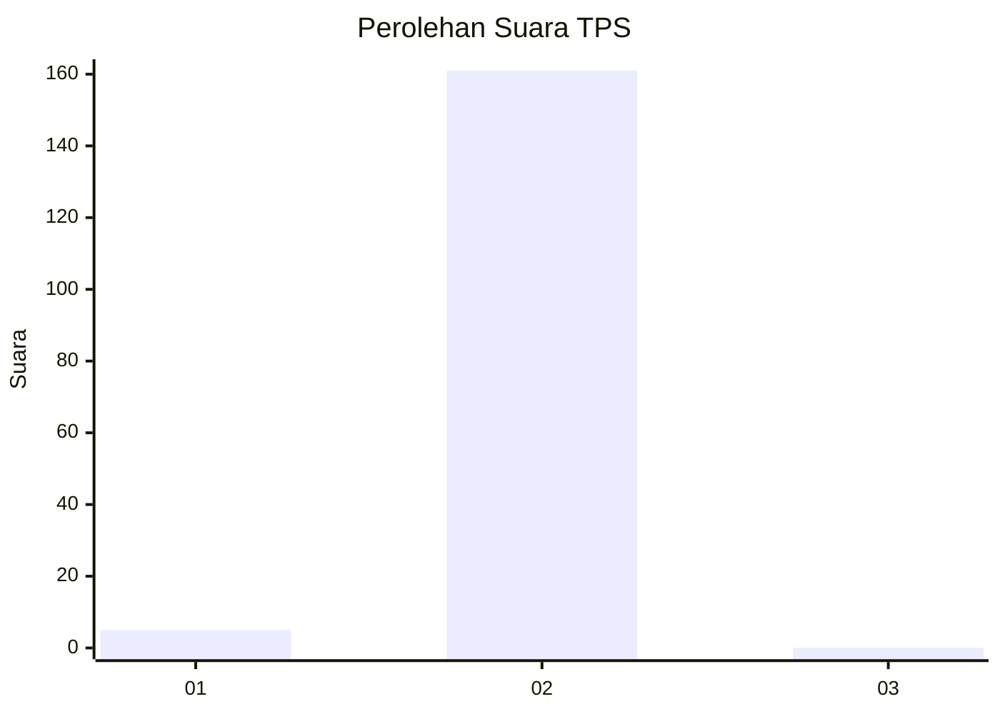
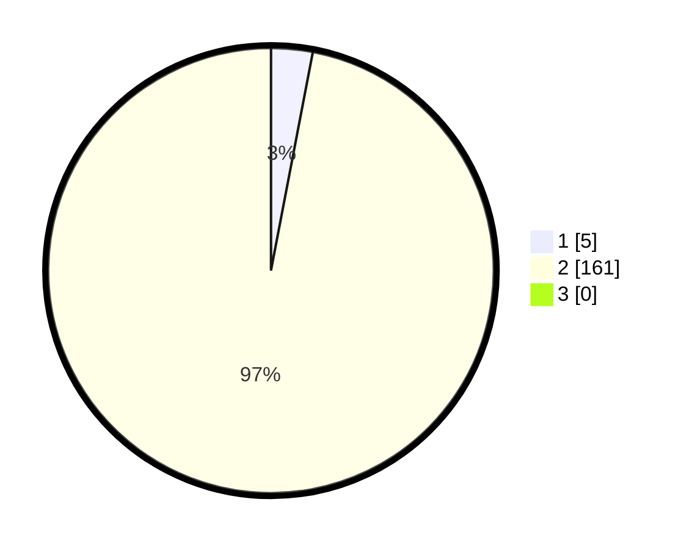

# Hasil

## Grafik

## Tabel

| No. | Nama Paslon    | Suara | Suara (raw) | Persentase |
|:--- |:-------------- | -----:| -----------:| ----------:|
| 1   | ANIES MUHAIMIN | 5     | [5][p-1]    | 3,01       |
| 2   | PRABOWO GIBRAN | 161   | [161][p-2]  | 96,99      |
| 3   | GANJAR MAHFUD  | 0     | [0][p-3]    | 0,00       |

[p-1]: https://github.com/gigit-pemilu/pemilu-2024-35-jawa-timur/blob/main/pilpres/hitung-suara/sub/35-jawa-timur/sub/13-probolinggo/sub/11-kotaanyar/sub/2004-tambakukir/sub/003-tps/sub/paslon-1.txt
[p-2]: https://github.com/gigit-pemilu/pemilu-2024-35-jawa-timur/blob/main/pilpres/hitung-suara/sub/35-jawa-timur/sub/13-probolinggo/sub/11-kotaanyar/sub/2004-tambakukir/sub/003-tps/sub/paslon-2.txt
[p-3]: https://github.com/gigit-pemilu/pemilu-2024-35-jawa-timur/blob/main/pilpres/hitung-suara/sub/35-jawa-timur/sub/13-probolinggo/sub/11-kotaanyar/sub/2004-tambakukir/sub/003-tps/sub/paslon-3.txt

## Foto C Plano

https://sirekap-obj-formc.kpu.go.id/d106/pemilu/ppwp/35/13/11/20/04/3513112004003-20240214-224227--3d9eccf8-7dac-4771-8fbc-4c2a4df7e451.jpg

https://sirekap-obj-formc.kpu.go.id/d106/pemilu/ppwp/35/13/11/20/04/3513112004003-20240214-224246--7069a1d7-b0ee-407a-9e0c-7efcfff189ca.jpg

https://sirekap-obj-formc.kpu.go.id/d106/pemilu/ppwp/35/13/11/20/04/3513112004003-20240214-224254--01c62b39-e4e5-4bef-8eb2-f4c29950b03c.jpg

## Metadata

| Key        | Value               |
| ---------- | ------------------- |
| Time Stamp | 2024-02-15 19:30:26 |

