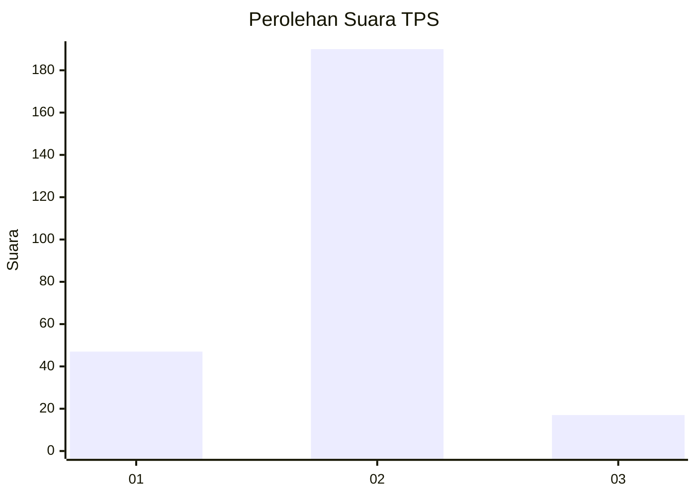
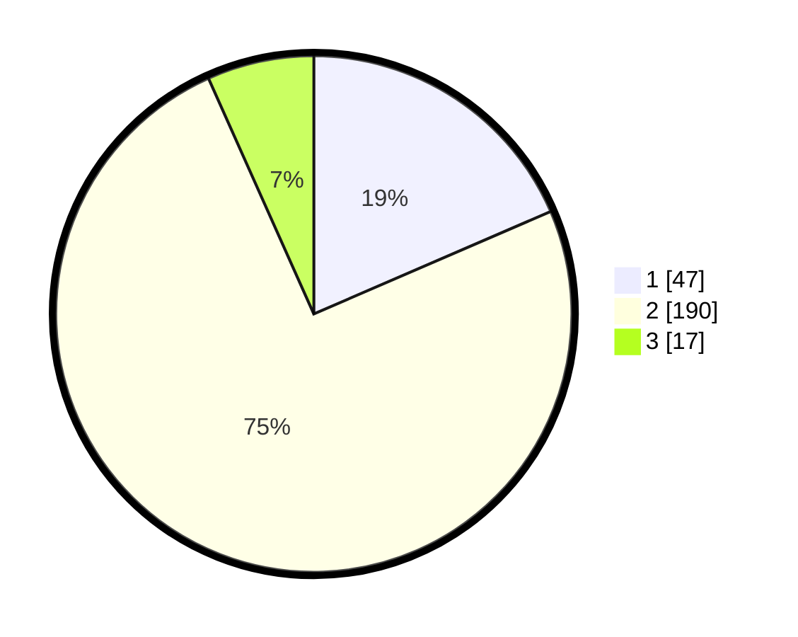

# Hasil

## Grafik

## Tabel

| No. | Nama Paslon    | Suara | Suara (raw) | Persentase |
|:--- |:-------------- | -----:| -----------:| ----------:|
| 1   | ANIES MUHAIMIN | 47    | [47][p-1]   | 18,50      |
| 2   | PRABOWO GIBRAN | 190   | [190][p-2]  | 74,80      |
| 3   | GANJAR MAHFUD  | 17    | [17][p-3]   | 6,69       |

[p-1]: https://github.com/gigit-pemilu/pemilu-2024-35-jawa-timur/blob/main/pilpres/hitung-suara/sub/35-jawa-timur/sub/13-probolinggo/sub/11-kotaanyar/sub/2004-tambakukir/sub/006-tps/sub/paslon-1.txt
[p-2]: https://github.com/gigit-pemilu/pemilu-2024-35-jawa-timur/blob/main/pilpres/hitung-suara/sub/35-jawa-timur/sub/13-probolinggo/sub/11-kotaanyar/sub/2004-tambakukir/sub/006-tps/sub/paslon-2.txt
[p-3]: https://github.com/gigit-pemilu/pemilu-2024-35-jawa-timur/blob/main/pilpres/hitung-suara/sub/35-jawa-timur/sub/13-probolinggo/sub/11-kotaanyar/sub/2004-tambakukir/sub/006-tps/sub/paslon-3.txt

## Foto C Plano

https://sirekap-obj-formc.kpu.go.id/a2d5/pemilu/ppwp/35/13/11/20/04/3513112004006-20240215-002735--0ecfc62b-3d23-4da0-b54b-2325990111cb.jpg

https://sirekap-obj-formc.kpu.go.id/a2d5/pemilu/ppwp/35/13/11/20/04/3513112004006-20240215-003207--bc334129-a204-448b-8017-07a9fa5bf5ec.jpg

## Metadata

| Key        | Value               |
| ---------- | ------------------- |
| Time Stamp | 2024-02-25 12:00:00 |

