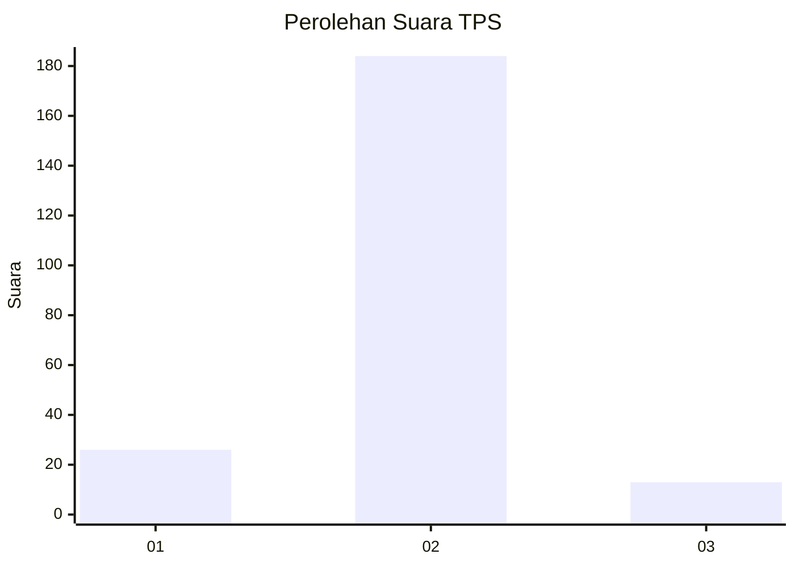
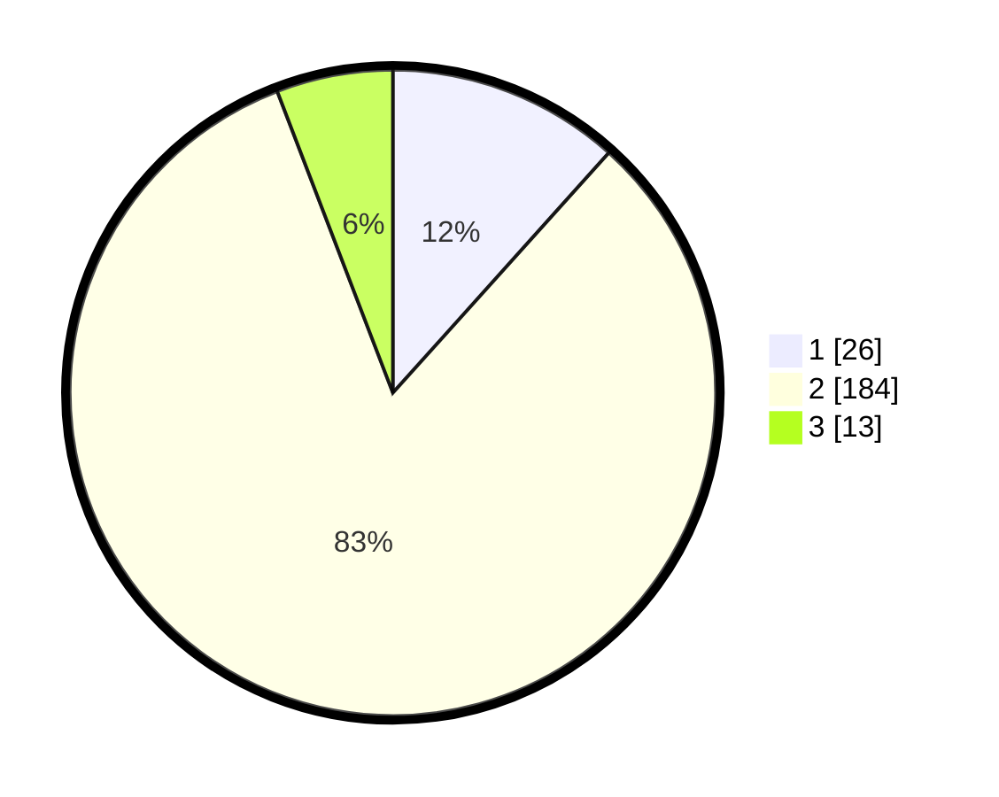

# Hasil

## Grafik

## Tabel

| No. | Nama Paslon    | Suara | Suara (raw) | Persentase |
|:--- |:-------------- | -----:| -----------:| ----------:|
| 1   | ANIES MUHAIMIN | 26    | [26][p-1]   | 11,66      |
| 2   | PRABOWO GIBRAN | 184   | [184][p-2]  | 82,51      |
| 3   | GANJAR MAHFUD  | 13    | [13][p-3]   | 5,83       |

[p-1]: https://github.com/gigit-pemilu/pemilu-2024/blob/main/pilpres/hitung-suara/sub/35-jawa-timur/sub/13-probolinggo/sub/11-kotaanyar/sub/2008-kedungrejoso/sub/002-tps/sub/paslon-1.txt
[p-2]: https://github.com/gigit-pemilu/pemilu-2024/blob/main/pilpres/hitung-suara/sub/35-jawa-timur/sub/13-probolinggo/sub/11-kotaanyar/sub/2008-kedungrejoso/sub/002-tps/sub/paslon-2.txt
[p-3]: https://github.com/gigit-pemilu/pemilu-2024/blob/main/pilpres/hitung-suara/sub/35-jawa-timur/sub/13-probolinggo/sub/11-kotaanyar/sub/2008-kedungrejoso/sub/002-tps/sub/paslon-3.txt

## Foto C Plano

https://sirekap-obj-formc.kpu.go.id/ea68/pemilu/ppwp/35/13/11/20/08/3513112008002-20240215-012348--dc61f52c-3460-4cd9-89d1-e75c4139308d.jpg

https://sirekap-obj-formc.kpu.go.id/ea68/pemilu/ppwp/35/13/11/20/08/3513112008002-20240215-012727--dd9623ac-0644-4c67-bb5d-09ea75fd43de.jpg

https://sirekap-obj-formc.kpu.go.id/ea68/pemilu/ppwp/35/13/11/20/08/3513112008002-20240215-012856--5d1d58e2-1b98-48b0-a559-e4bad9ebea1e.jpg

## Metadata

| Key        | Value               |
| ---------- | ------------------- |
| Time Stamp | 2024-02-22 11:00:00 |

