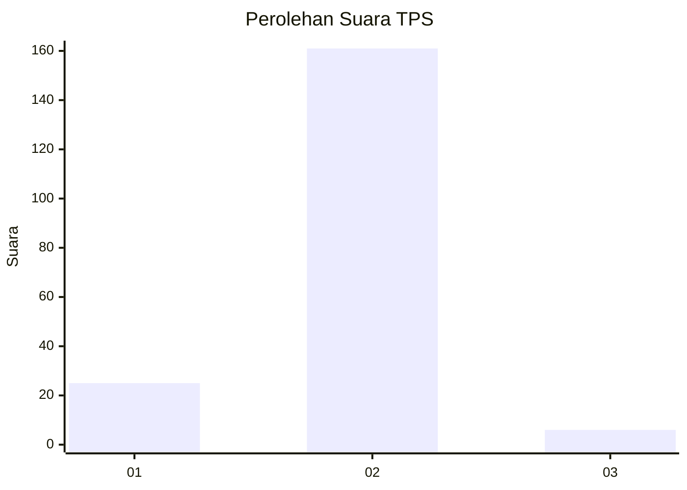
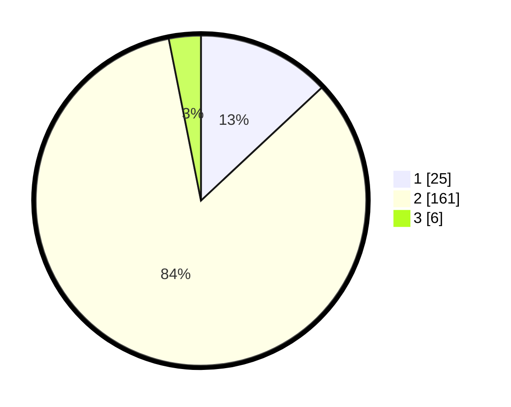

# Hasil

## Grafik

## Tabel

| No. | Nama Paslon    | Suara | Suara (raw) | Persentase |
|:--- |:-------------- | -----:| -----------:| ----------:|
| 1   | ANIES MUHAIMIN | 25    | [25][p-1]   | 13,02      |
| 2   | PRABOWO GIBRAN | 161   | [161][p-2]  | 83,85      |
| 3   | GANJAR MAHFUD  | 6     | [6][p-3]    | 3,13       |

[p-1]: https://github.com/gigit-pemilu/pemilu-2024/blob/main/pilpres/hitung-suara/sub/35-jawa-timur/sub/13-probolinggo/sub/11-kotaanyar/sub/2008-kedungrejoso/sub/006-tps/sub/paslon-1.txt
[p-2]: https://github.com/gigit-pemilu/pemilu-2024/blob/main/pilpres/hitung-suara/sub/35-jawa-timur/sub/13-probolinggo/sub/11-kotaanyar/sub/2008-kedungrejoso/sub/006-tps/sub/paslon-2.txt
[p-3]: https://github.com/gigit-pemilu/pemilu-2024/blob/main/pilpres/hitung-suara/sub/35-jawa-timur/sub/13-probolinggo/sub/11-kotaanyar/sub/2008-kedungrejoso/sub/006-tps/sub/paslon-3.txt

## Foto C Plano

https://sirekap-obj-formc.kpu.go.id/d37d/pemilu/ppwp/35/13/11/20/08/3513112008006-20240215-000144--6aa538c7-c5f4-48c6-b8bc-bcfa7fd89748.jpg

https://sirekap-obj-formc.kpu.go.id/d37d/pemilu/ppwp/35/13/11/20/08/3513112008006-20240215-000534--b3e32b6a-9486-4a93-883d-f313e70d7778.jpg

https://sirekap-obj-formc.kpu.go.id/d37d/pemilu/ppwp/35/13/11/20/08/3513112008006-20240215-005212--b27d1ca3-c28a-457b-bc3a-9734e9b2cad7.jpg

## Metadata

| Key        | Value               |
| ---------- | ------------------- |
| Time Stamp | 2024-02-22 22:00:00 |

