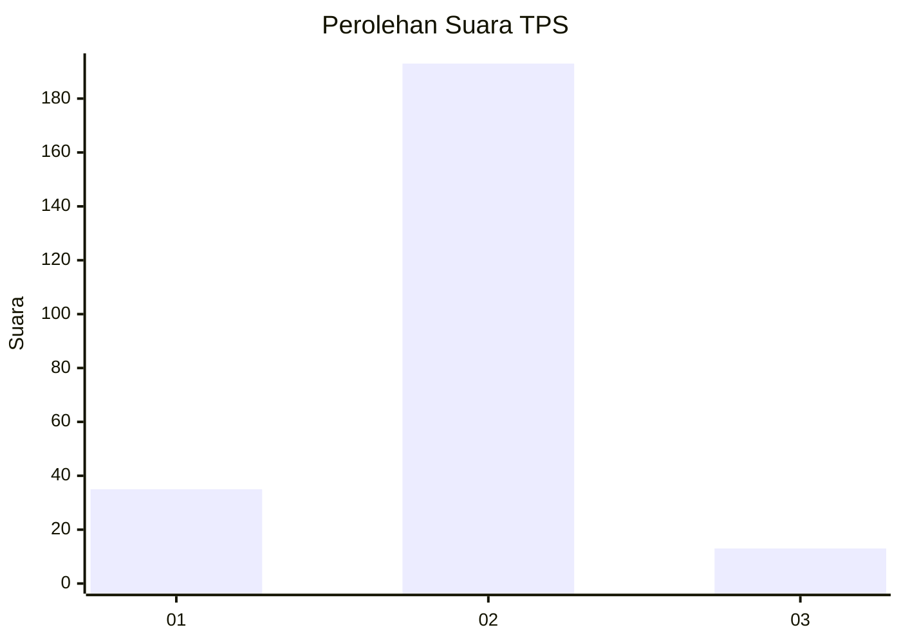
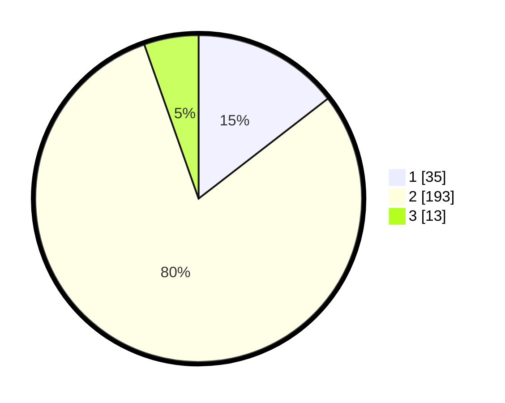

# Hasil

## Grafik

## Tabel

| No. | Nama Paslon    | Suara | Suara (raw) | Persentase |
|:--- |:-------------- | -----:| -----------:| ----------:|
| 1   | ANIES MUHAIMIN | 35    | [35][p-1]   | 14,52      |
| 2   | PRABOWO GIBRAN | 193   | [193][p-2]  | 80,08      |
| 3   | GANJAR MAHFUD  | 13    | [13][p-3]   | 5,39       |

[p-1]: https://github.com/gigit-pemilu/pemilu-2024/blob/main/pilpres/hitung-suara/sub/35-jawa-timur/sub/13-probolinggo/sub/11-kotaanyar/sub/2011-sukorejo/sub/001-tps/sub/paslon-1.txt
[p-2]: https://github.com/gigit-pemilu/pemilu-2024/blob/main/pilpres/hitung-suara/sub/35-jawa-timur/sub/13-probolinggo/sub/11-kotaanyar/sub/2011-sukorejo/sub/001-tps/sub/paslon-2.txt
[p-3]: https://github.com/gigit-pemilu/pemilu-2024/blob/main/pilpres/hitung-suara/sub/35-jawa-timur/sub/13-probolinggo/sub/11-kotaanyar/sub/2011-sukorejo/sub/001-tps/sub/paslon-3.txt

## Foto C Plano

https://sirekap-obj-formc.kpu.go.id/a460/pemilu/ppwp/35/13/11/20/11/3513112011001-20240214-210255--2502209f-2dd3-4fb5-81e2-bf9ef188c5be.jpg

https://sirekap-obj-formc.kpu.go.id/a460/pemilu/ppwp/35/13/11/20/11/3513112011001-20240214-215942--a1a981d5-5765-4a4f-a2f8-2ec317091eb3.jpg

https://sirekap-obj-formc.kpu.go.id/a460/pemilu/ppwp/35/13/11/20/11/3513112011001-20240214-215709--e15f0ad1-2911-4683-9363-8a138bde7ebd.jpg

## Metadata

| Key        | Value               |
| ---------- | ------------------- |
| Time Stamp | 2024-02-22 11:00:00 |

