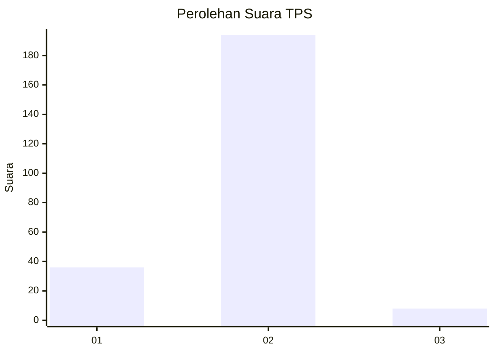
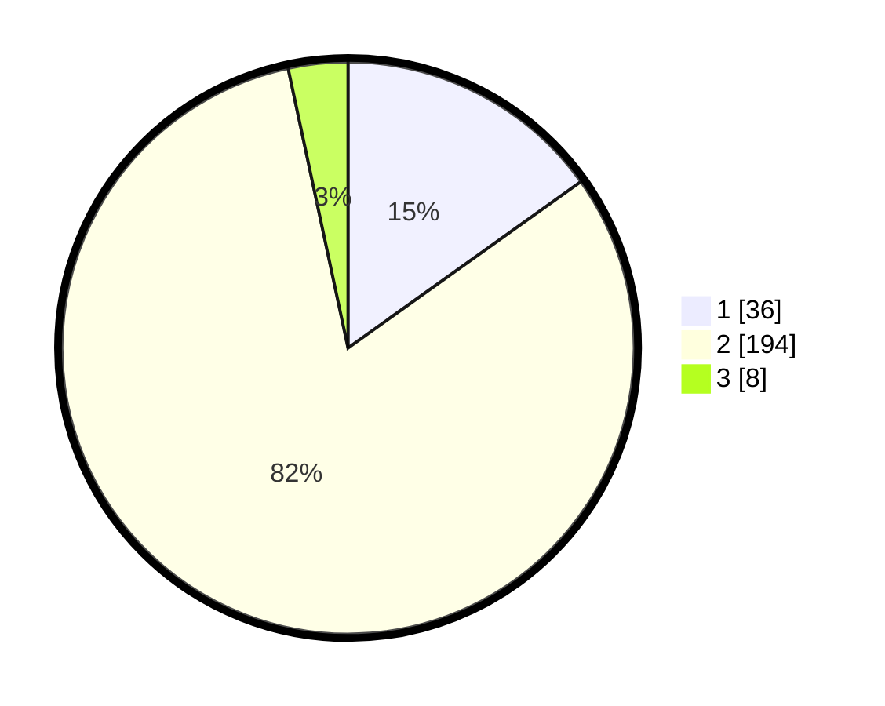

# Hasil

## Grafik

## Tabel

| No. | Nama Paslon    | Suara | Suara (raw) | Persentase |
|:--- |:-------------- | -----:| -----------:| ----------:|
| 1   | ANIES MUHAIMIN | 36    | [36][p-1]   | 15,13      |
| 2   | PRABOWO GIBRAN | 194   | [194][p-2]  | 81,51      |
| 3   | GANJAR MAHFUD  | 8     | [8][p-3]    | 3,36       |

[p-1]: https://github.com/gigit-pemilu/pemilu-2024/blob/main/pilpres/hitung-suara/sub/35-jawa-timur/sub/13-probolinggo/sub/11-kotaanyar/sub/2011-sukorejo/sub/006-tps/sub/paslon-1.txt
[p-2]: https://github.com/gigit-pemilu/pemilu-2024/blob/main/pilpres/hitung-suara/sub/35-jawa-timur/sub/13-probolinggo/sub/11-kotaanyar/sub/2011-sukorejo/sub/006-tps/sub/paslon-2.txt
[p-3]: https://github.com/gigit-pemilu/pemilu-2024/blob/main/pilpres/hitung-suara/sub/35-jawa-timur/sub/13-probolinggo/sub/11-kotaanyar/sub/2011-sukorejo/sub/006-tps/sub/paslon-3.txt

## Foto C Plano

https://sirekap-obj-formc.kpu.go.id/fe36/pemilu/ppwp/35/13/11/20/11/3513112011006-20240214-230742--2c7a0024-79f1-4e5e-a9a6-15cfc143b7a2.jpg

https://sirekap-obj-formc.kpu.go.id/fe36/pemilu/ppwp/35/13/11/20/11/3513112011006-20240214-231440--dc0df6b2-4597-4d2a-8268-cddd9f275580.jpg

https://sirekap-obj-formc.kpu.go.id/fe36/pemilu/ppwp/35/13/11/20/11/3513112011006-20240214-231635--8f1ca2cb-1548-46e1-aae8-5c42cc6e14da.jpg

## Metadata

| Key        | Value               |
| ---------- | ------------------- |
| Time Stamp | 2024-02-22 22:00:00 |

