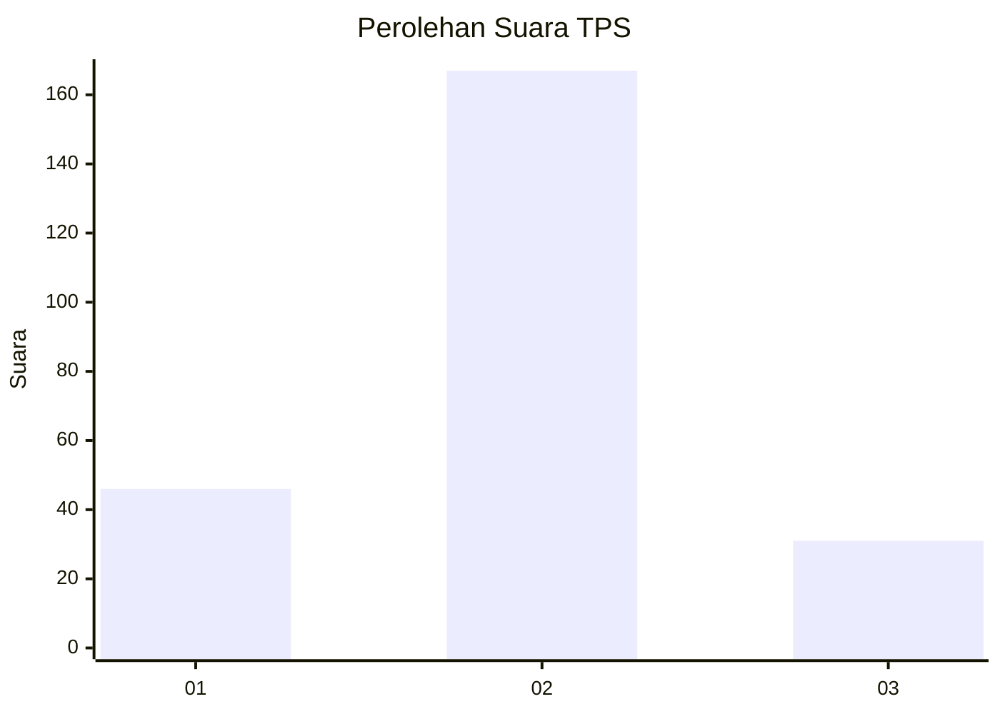
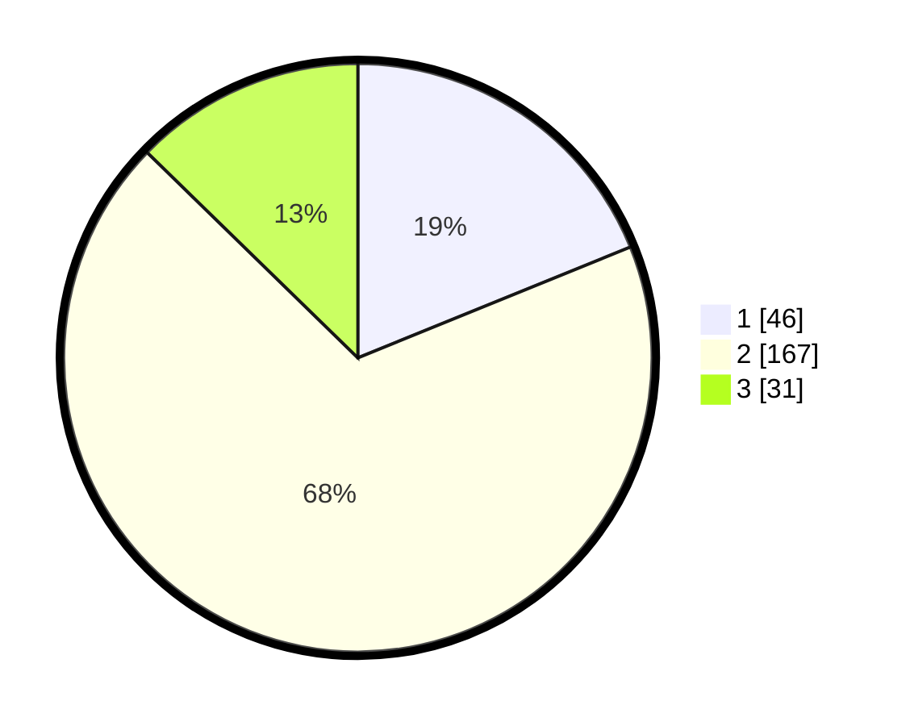

# Hasil

## Grafik

## Tabel

| No. | Nama Paslon    | Suara | Suara (raw) | Persentase |
|:--- |:-------------- | -----:| -----------:| ----------:|
| 1   | ANIES MUHAIMIN | 46    | [46][p-1]   | 18,85      |
| 2   | PRABOWO GIBRAN | 167   | [167][p-2]  | 68,44      |
| 3   | GANJAR MAHFUD  | 31    | [31][p-3]   | 12,70      |

[p-1]: https://github.com/gigit-pemilu/pemilu-2024-35-jawa-timur/blob/main/pilpres/hitung-suara/sub/35-jawa-timur/sub/13-probolinggo/sub/11-kotaanyar/sub/2013-kotaanyar/sub/003-tps/sub/paslon-1.txt
[p-2]: https://github.com/gigit-pemilu/pemilu-2024-35-jawa-timur/blob/main/pilpres/hitung-suara/sub/35-jawa-timur/sub/13-probolinggo/sub/11-kotaanyar/sub/2013-kotaanyar/sub/003-tps/sub/paslon-2.txt
[p-3]: https://github.com/gigit-pemilu/pemilu-2024-35-jawa-timur/blob/main/pilpres/hitung-suara/sub/35-jawa-timur/sub/13-probolinggo/sub/11-kotaanyar/sub/2013-kotaanyar/sub/003-tps/sub/paslon-3.txt

## Foto C Plano

https://sirekap-obj-formc.kpu.go.id/2525/pemilu/ppwp/35/13/11/20/13/3513112013003-20240215-063526--bf76e299-bcc3-4cd0-8416-fb8dd989ac06.jpg

https://sirekap-obj-formc.kpu.go.id/2525/pemilu/ppwp/35/13/11/20/13/3513112013003-20240215-063721--26a520ff-ace6-442e-99a1-2bde055844bf.jpg

https://sirekap-obj-formc.kpu.go.id/2525/pemilu/ppwp/35/13/11/20/13/3513112013003-20240215-063759--3aaaeed0-7ed9-42e9-bd54-ebaa98bb41b2.jpg

## Metadata

| Key        | Value               |
| ---------- | ------------------- |
| Time Stamp | 2024-02-22 22:00:00 |

