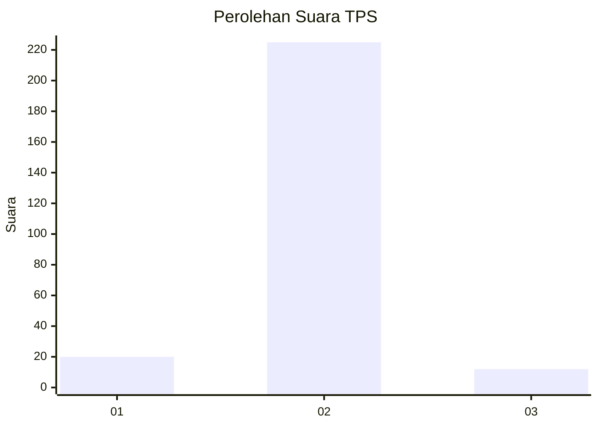
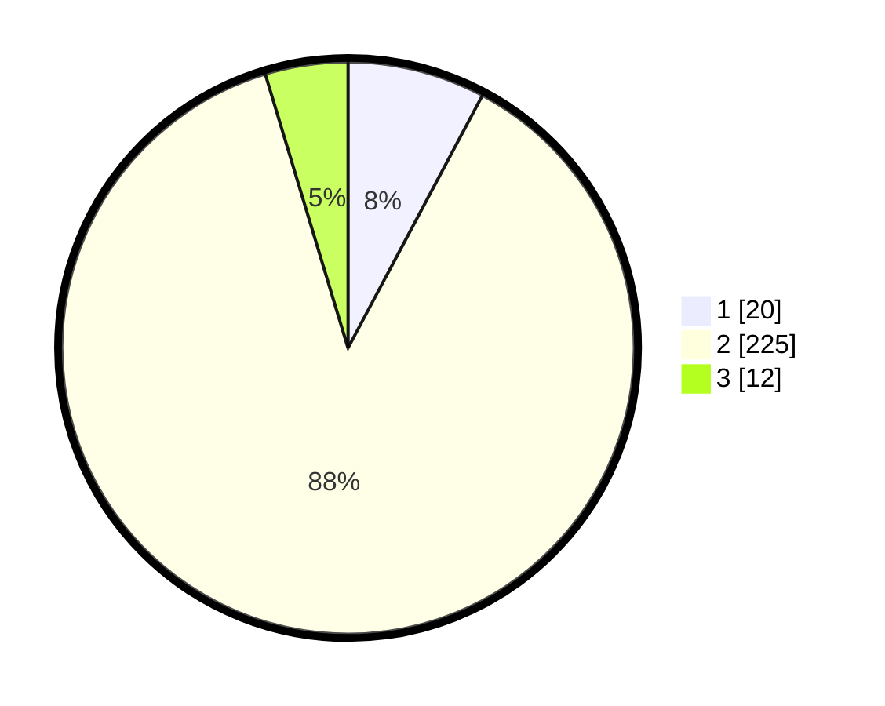

# Hasil

## Grafik

## Tabel

| No. | Nama Paslon    | Suara | Suara (raw) | Persentase |
|:--- |:-------------- | -----:| -----------:| ----------:|
| 1   | ANIES MUHAIMIN | 20    | [20][p-1]   | 7,78       |
| 2   | PRABOWO GIBRAN | 225   | [225][p-2]  | 87,55      |
| 3   | GANJAR MAHFUD  | 12    | [12][p-3]   | 4,67       |

[p-1]: https://github.com/gigit-pemilu/pemilu-2024/blob/main/pilpres/hitung-suara/sub/35-jawa-timur/sub/13-probolinggo/sub/11-kotaanyar/sub/2013-kotaanyar/sub/012-tps/sub/paslon-1.txt
[p-2]: https://github.com/gigit-pemilu/pemilu-2024/blob/main/pilpres/hitung-suara/sub/35-jawa-timur/sub/13-probolinggo/sub/11-kotaanyar/sub/2013-kotaanyar/sub/012-tps/sub/paslon-2.txt
[p-3]: https://github.com/gigit-pemilu/pemilu-2024/blob/main/pilpres/hitung-suara/sub/35-jawa-timur/sub/13-probolinggo/sub/11-kotaanyar/sub/2013-kotaanyar/sub/012-tps/sub/paslon-3.txt

## Foto C Plano

https://sirekap-obj-formc.kpu.go.id/2538/pemilu/ppwp/35/13/11/20/13/3513112013012-20240215-015946--80a74b7f-def2-4682-9966-f4727b6f0ecf.jpg

https://sirekap-obj-formc.kpu.go.id/2538/pemilu/ppwp/35/13/11/20/13/3513112013012-20240215-020309--ce22ebcf-3102-4876-9647-c97f4d937802.jpg

https://sirekap-obj-formc.kpu.go.id/2538/pemilu/ppwp/35/13/11/20/13/3513112013012-20240215-020415--82dd7019-32c9-4ed8-9c65-772097ebe27b.jpg

## Metadata

| Key        | Value               |
| ---------- | ------------------- |
| Time Stamp | 2024-02-22 11:00:00 |

