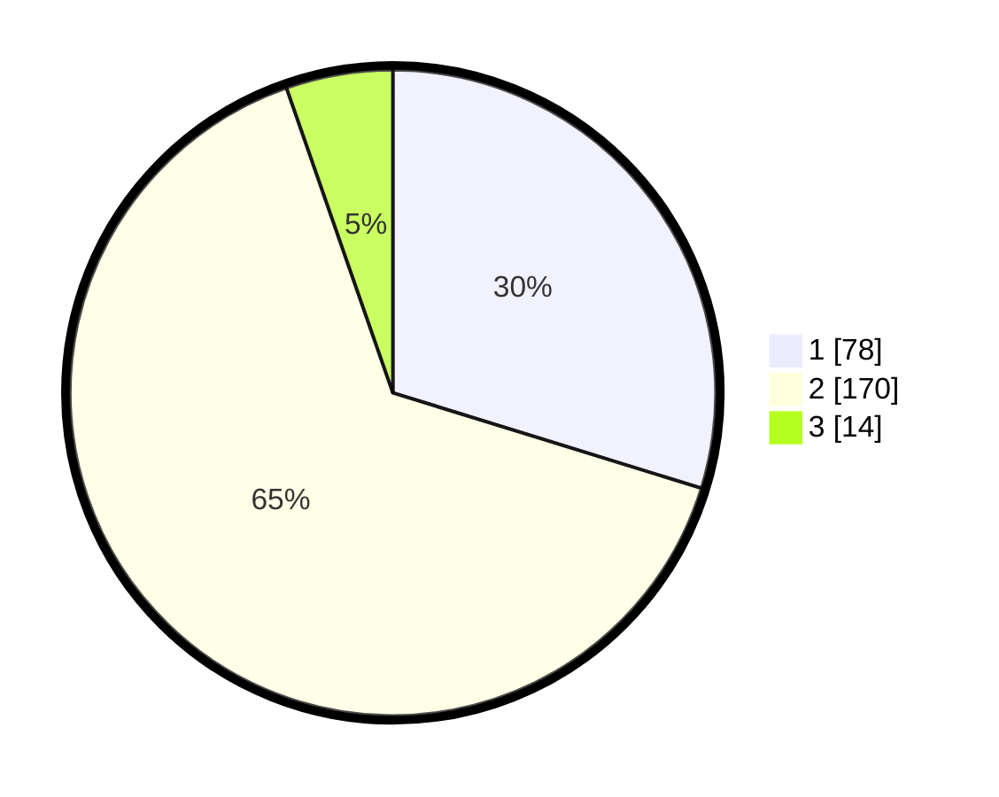

# Hasil

## Grafik

## Tabel

| No. | Nama Paslon    | Suara | Suara (raw) | Persentase |
|:--- |:-------------- | -----:| -----------:| ----------:|
| 1   | ANIES MUHAIMIN | 78    | [78][p-1]   | 29,77      |
| 2   | PRABOWO GIBRAN | 170   | [170][p-2]  | 64,89      |
| 3   | GANJAR MAHFUD  | 14    | [14][p-3]   | 5,34       |

[p-1]: https://github.com/gigit-pemilu/pemilu-2024-35-jawa-timur/blob/main/pilpres/hitung-suara/sub/35-jawa-timur/sub/13-probolinggo/sub/12-paiton/sub/2002-jabungcandi/sub/004-tps/sub/paslon-1.txt
[p-2]: https://github.com/gigit-pemilu/pemilu-2024-35-jawa-timur/blob/main/pilpres/hitung-suara/sub/35-jawa-timur/sub/13-probolinggo/sub/12-paiton/sub/2002-jabungcandi/sub/004-tps/sub/paslon-2.txt
[p-3]: https://github.com/gigit-pemilu/pemilu-2024-35-jawa-timur/blob/main/pilpres/hitung-suara/sub/35-jawa-timur/sub/13-probolinggo/sub/12-paiton/sub/2002-jabungcandi/sub/004-tps/sub/paslon-3.txt

## Foto C Plano

https://sirekap-obj-formc.kpu.go.id/67eb/pemilu/ppwp/35/13/12/20/02/3513122002004-20240217-161043--7535c65d-276c-409a-b53a-ea04f6ac91b8.jpg

https://sirekap-obj-formc.kpu.go.id/67eb/pemilu/ppwp/35/13/12/20/02/3513122002004-20240217-161454--040a5b7f-dd4c-420c-bfbb-05ed74e765c0.jpg

https://sirekap-obj-formc.kpu.go.id/67eb/pemilu/ppwp/35/13/12/20/02/3513122002004-20240216-232203--f796d0c8-c4ad-4ca3-9400-2ee63ea009eb.jpg

## Metadata

| Key        | Value               |
| ---------- | ------------------- |
| Time Stamp | 2024-02-24 22:31:28 |

