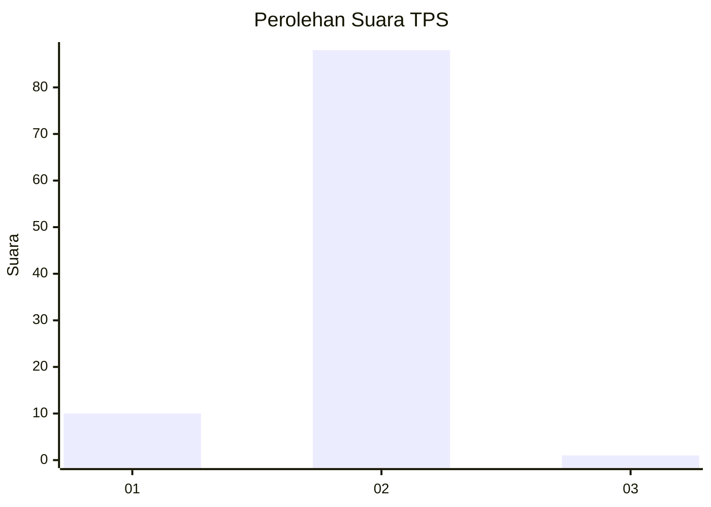
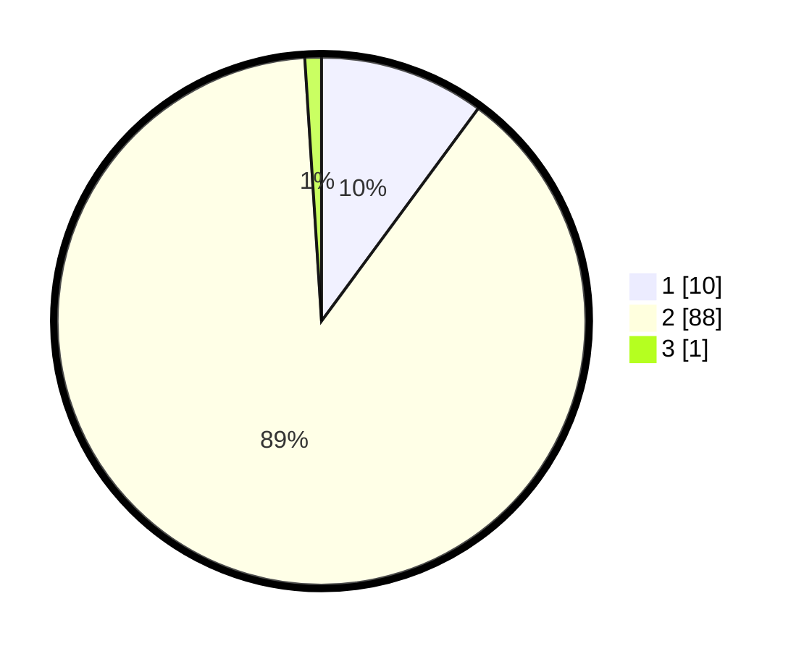

# Hasil

## Grafik

## Tabel

| No. | Nama Paslon    | Suara | Suara (raw) | Persentase |
|:--- |:-------------- | -----:| -----------:| ----------:|
| 1   | ANIES MUHAIMIN | 10    | [10][p-1]   | 10,10      |
| 2   | PRABOWO GIBRAN | 88    | [88][p-2]   | 88,89      |
| 3   | GANJAR MAHFUD  | 1     | [1][p-3]    | 1,01       |

[p-1]: https://github.com/gigit-pemilu/pemilu-2024/blob/main/pilpres/hitung-suara/sub/35-jawa-timur/sub/13-probolinggo/sub/12-paiton/sub/2004-kalikajar-kulon/sub/901-tps/sub/paslon-1.txt
[p-2]: https://github.com/gigit-pemilu/pemilu-2024/blob/main/pilpres/hitung-suara/sub/35-jawa-timur/sub/13-probolinggo/sub/12-paiton/sub/2004-kalikajar-kulon/sub/901-tps/sub/paslon-2.txt
[p-3]: https://github.com/gigit-pemilu/pemilu-2024/blob/main/pilpres/hitung-suara/sub/35-jawa-timur/sub/13-probolinggo/sub/12-paiton/sub/2004-kalikajar-kulon/sub/901-tps/sub/paslon-3.txt

## Foto C Plano

https://sirekap-obj-formc.kpu.go.id/fc03/pemilu/ppwp/35/13/12/20/04/3513122004901-20240216-150129--6349a551-f43b-47ab-962a-d4a7ab9a55d6.jpg

https://sirekap-obj-formc.kpu.go.id/fc03/pemilu/ppwp/35/13/12/20/04/3513122004901-20240216-150130--19f51228-6acf-487c-8573-7ee824c2cc2d.jpg

https://sirekap-obj-formc.kpu.go.id/fc03/pemilu/ppwp/35/13/12/20/04/3513122004901-20240216-150130--96b24c08-3fa0-46f4-8eab-c43b4848094f.jpg

## Metadata

| Key        | Value               |
| ---------- | ------------------- |
| Time Stamp | 2024-02-17 16:00:02 |

## DATA PEMILIH TETAP

Jumlah pemilih dalam DPT: **173**.
 * L: **74**.
 * P: **99**.

## DATA PENGGUNA HAK PILIH

Jumlah pengguna hak pilih dalam DPT: **50**.
 * L: **15**.
 * P: **35**.

Jumlah pengguna hak pilih dalam DPTb: **49**.
 * L: **28**.
 * P: **21**.

Jumlah pengguna hak pilih dalam DPK: **0**.
 * L: **0**.
 * P: **0**.

Jumlah pengguna hak pilih: **99**.
 * L: **43**.
 * P: **56**.

## JUMLAH SUARA SAH DAN TIDAK SAH

JUMLAH SELURUH SUARA SAH: **99**.

JUMLAH SUARA TIDAK SAH: **0**.

JUMLAH SELURUH SUARA SAH DAN SUARA TIDAK SAH: **99**.

