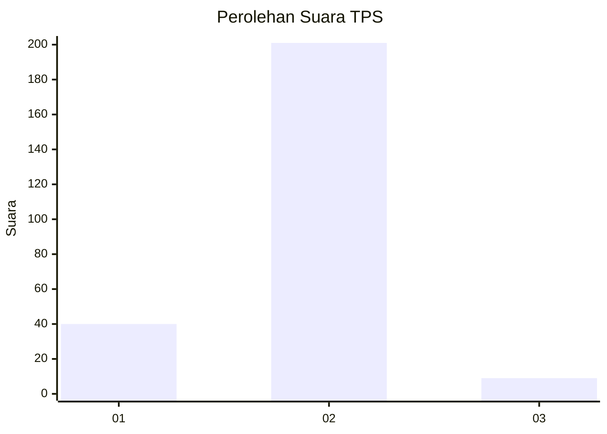
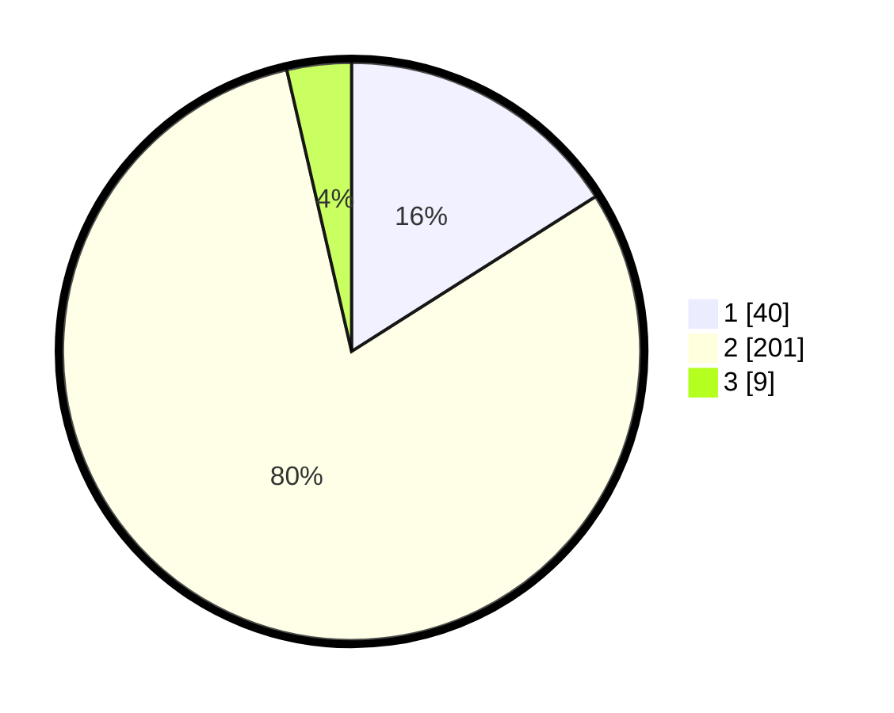

# Hasil

## Grafik

## Tabel

| No. | Nama Paslon    | Suara | Suara (raw) | Persentase |
|:--- |:-------------- | -----:| -----------:| ----------:|
| 1   | ANIES MUHAIMIN | 40    | [40][p-1]   | 16,00      |
| 2   | PRABOWO GIBRAN | 201   | [201][p-2]  | 80,40      |
| 3   | GANJAR MAHFUD  | 9     | [9][p-3]    | 3,60       |

[p-1]: https://github.com/gigit-pemilu/pemilu-2024/blob/main/pilpres/hitung-suara/sub/35-jawa-timur/sub/13-probolinggo/sub/12-paiton/sub/2019-sumberejo/sub/008-tps/sub/paslon-1.txt
[p-2]: https://github.com/gigit-pemilu/pemilu-2024/blob/main/pilpres/hitung-suara/sub/35-jawa-timur/sub/13-probolinggo/sub/12-paiton/sub/2019-sumberejo/sub/008-tps/sub/paslon-2.txt
[p-3]: https://github.com/gigit-pemilu/pemilu-2024/blob/main/pilpres/hitung-suara/sub/35-jawa-timur/sub/13-probolinggo/sub/12-paiton/sub/2019-sumberejo/sub/008-tps/sub/paslon-3.txt

## Foto C Plano

https://sirekap-obj-formc.kpu.go.id/1c90/pemilu/ppwp/35/13/12/20/19/3513122019008-20240219-102223--ec509f90-9002-49bf-9a07-10f0e79ba3ed.jpg

https://sirekap-obj-formc.kpu.go.id/1c90/pemilu/ppwp/35/13/12/20/19/3513122019008-20240219-101540--ab515888-16ff-4df9-8321-c4b5785db63e.jpg

https://sirekap-obj-formc.kpu.go.id/1c90/pemilu/ppwp/35/13/12/20/19/3513122019008-20240219-101827--4f0d1eab-dc99-432f-bb3d-b8961c6a9d49.jpg

## Metadata

| Key        | Value               |
| ---------- | ------------------- |
| Time Stamp | 2024-02-25 15:00:00 |

