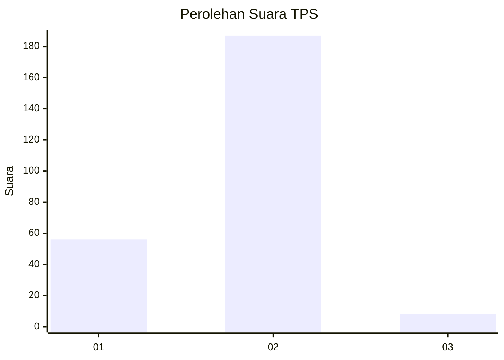

# Hasil

## Grafik

## Tabel

| No. | Nama Paslon    | Suara | Suara (raw) | Persentase |
|:--- |:-------------- | -----:| -----------:| ----------:|
| 1   | ANIES MUHAIMIN | 56    | [56][p-1]   | 22,31      |
| 2   | PRABOWO GIBRAN | 187   | [187][p-2]  | 74,50      |
| 3   | GANJAR MAHFUD  | 8     | [8][p-3]    | 3,19       |

[p-1]: https://github.com/gigit-pemilu/pemilu-2024-35-jawa-timur/blob/main/pilpres/hitung-suara/sub/35-jawa-timur/sub/13-probolinggo/sub/13-besuk/sub/2001-bago/sub/003-tps/sub/paslon-1.txt
[p-2]: https://github.com/gigit-pemilu/pemilu-2024-35-jawa-timur/blob/main/pilpres/hitung-suara/sub/35-jawa-timur/sub/13-probolinggo/sub/13-besuk/sub/2001-bago/sub/003-tps/sub/paslon-2.txt
[p-3]: https://github.com/gigit-pemilu/pemilu-2024-35-jawa-timur/blob/main/pilpres/hitung-suara/sub/35-jawa-timur/sub/13-probolinggo/sub/13-besuk/sub/2001-bago/sub/003-tps/sub/paslon-3.txt

## Foto C Plano

https://sirekap-obj-formc.kpu.go.id/863f/pemilu/ppwp/35/13/13/20/01/3513132001003-20240214-155119--db68f2d8-34be-497d-aad6-c7b3dfa9997a.jpg

https://sirekap-obj-formc.kpu.go.id/863f/pemilu/ppwp/35/13/13/20/01/3513132001003-20240214-155200--f3a7bf9d-68f3-4a74-ab10-666b5aa9c701.jpg

https://sirekap-obj-formc.kpu.go.id/863f/pemilu/ppwp/35/13/13/20/01/3513132001003-20240214-155240--37aa61fd-0d09-4346-9cbc-82cb0dfdbb82.jpg

## Metadata

| Key        | Value               |
| ---------- | ------------------- |
| Time Stamp | 2024-02-15 21:01:18 |

## DATA PEMILIH TETAP

Jumlah pemilih dalam DPT: **774**.
 * L: **120**.
 * P: **154**.

## DATA PENGGUNA HAK PILIH

Jumlah pengguna hak pilih dalam DPT: **254**.
 * L: **109**.
 * P: **145**.

Jumlah pengguna hak pilih dalam DPTb: **0**.
 * L: **800**.
 * P: **0**.

Jumlah pengguna hak pilih dalam DPK: **0**.
 * L: **0**.
 * P: **0**.

Jumlah pengguna hak pilih: **254**.
 * L: **109**.
 * P: **145**.

## JUMLAH SUARA SAH DAN TIDAK SAH

JUMLAH SELURUH SUARA SAH: **251**.

JUMLAH SUARA TIDAK SAH: **3**.

JUMLAH SELURUH SUARA SAH DAN SUARA TIDAK SAH: **254**.

