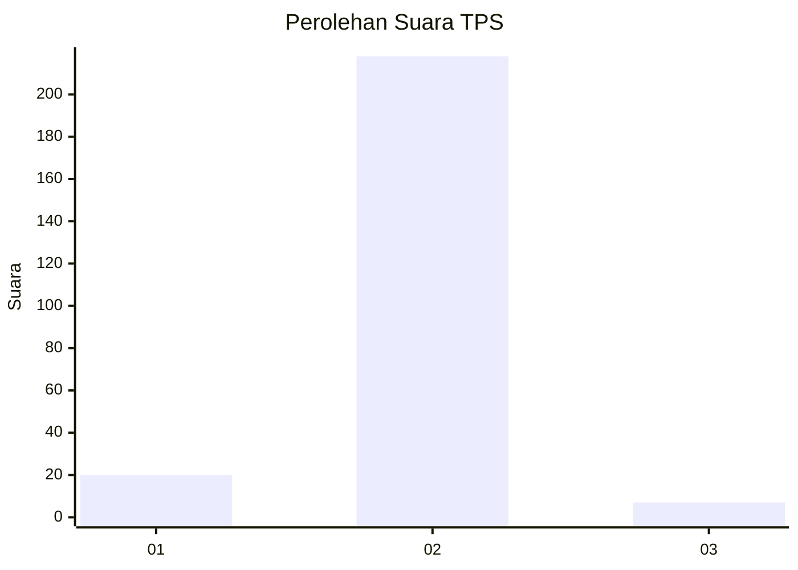
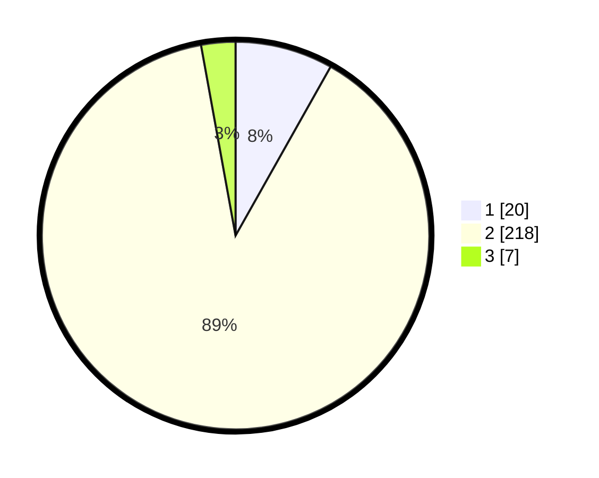

# Hasil

## Grafik

## Tabel

| No. | Nama Paslon    | Suara | Suara (raw) | Persentase |
|:--- |:-------------- | -----:| -----------:| ----------:|
| 1   | ANIES MUHAIMIN | 20    | [20][p-1]   | 8,16       |
| 2   | PRABOWO GIBRAN | 218   | [218][p-2]  | 88,98      |
| 3   | GANJAR MAHFUD  | 7     | [7][p-3]    | 2,86       |

[p-1]: https://github.com/gigit-pemilu/pemilu-2024-35-jawa-timur/blob/main/pilpres/hitung-suara/sub/35-jawa-timur/sub/13-probolinggo/sub/13-besuk/sub/2009-besukagung/sub/005-tps/sub/paslon-1.txt
[p-2]: https://github.com/gigit-pemilu/pemilu-2024-35-jawa-timur/blob/main/pilpres/hitung-suara/sub/35-jawa-timur/sub/13-probolinggo/sub/13-besuk/sub/2009-besukagung/sub/005-tps/sub/paslon-2.txt
[p-3]: https://github.com/gigit-pemilu/pemilu-2024-35-jawa-timur/blob/main/pilpres/hitung-suara/sub/35-jawa-timur/sub/13-probolinggo/sub/13-besuk/sub/2009-besukagung/sub/005-tps/sub/paslon-3.txt

## Foto C Plano

https://sirekap-obj-formc.kpu.go.id/d28c/pemilu/ppwp/35/13/13/20/09/3513132009005-20240215-112241--78823140-462d-467c-b7a9-7adfe0b3b4cd.jpg

https://sirekap-obj-formc.kpu.go.id/d28c/pemilu/ppwp/35/13/13/20/09/3513132009005-20240215-113537--a033ab6c-b1a8-47b2-92ea-05453934037c.jpg

https://sirekap-obj-formc.kpu.go.id/d28c/pemilu/ppwp/35/13/13/20/09/3513132009005-20240215-132940--8b16de8e-f439-423d-a525-4c88cd6ca5c0.jpg

## Metadata

| Key        | Value               |
| ---------- | ------------------- |
| Time Stamp | 2024-02-24 22:31:28 |

