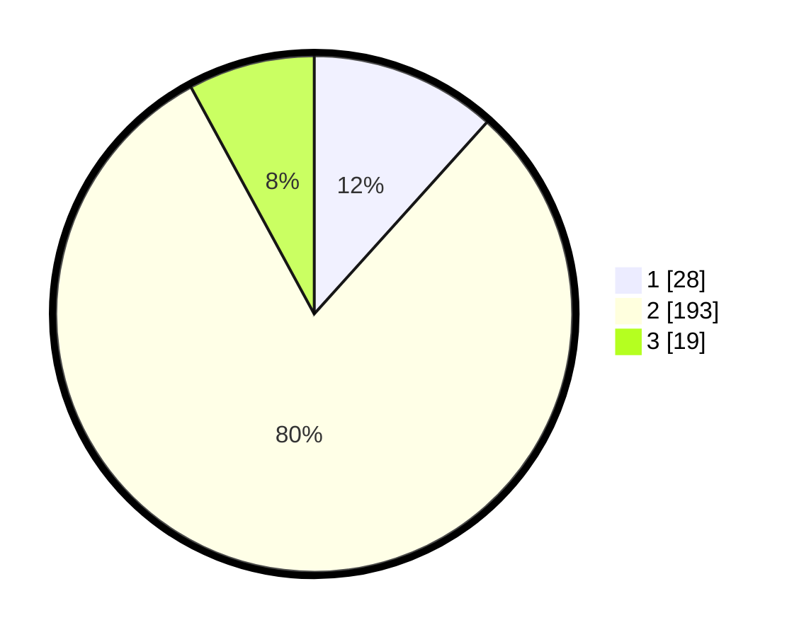

# Hasil

## Grafik

## Tabel

| No. | Nama Paslon    | Suara | Suara (raw) | Persentase |
|:--- |:-------------- | -----:| -----------:| ----------:|
| 1   | ANIES MUHAIMIN | 28    | [28][p-1]   | 11,67      |
| 2   | PRABOWO GIBRAN | 193   | [193][p-2]  | 80,42      |
| 3   | GANJAR MAHFUD  | 19    | [19][p-3]   | 7,92       |

[p-1]: https://github.com/gigit-pemilu/pemilu-2024-35-jawa-timur/blob/main/pilpres/hitung-suara/sub/35-jawa-timur/sub/13-probolinggo/sub/13-besuk/sub/2010-besukkidul/sub/003-tps/sub/paslon-1.txt
[p-2]: https://github.com/gigit-pemilu/pemilu-2024-35-jawa-timur/blob/main/pilpres/hitung-suara/sub/35-jawa-timur/sub/13-probolinggo/sub/13-besuk/sub/2010-besukkidul/sub/003-tps/sub/paslon-2.txt
[p-3]: https://github.com/gigit-pemilu/pemilu-2024-35-jawa-timur/blob/main/pilpres/hitung-suara/sub/35-jawa-timur/sub/13-probolinggo/sub/13-besuk/sub/2010-besukkidul/sub/003-tps/sub/paslon-3.txt

## Foto C Plano

https://sirekap-obj-formc.kpu.go.id/6cd6/pemilu/ppwp/35/13/13/20/10/3513132010003-20240216-134822--06f403e6-67c4-48e3-a166-d36b2b40c664.jpg

https://sirekap-obj-formc.kpu.go.id/6cd6/pemilu/ppwp/35/13/13/20/10/3513132010003-20240216-134823--d76e8ec8-50e2-4d28-8b27-f3dc52baa0a2.jpg

https://sirekap-obj-formc.kpu.go.id/6cd6/pemilu/ppwp/35/13/13/20/10/3513132010003-20240216-134823--2f7b1cbd-3dd1-4019-a202-9ac9a24e61cf.jpg

## Metadata

| Key        | Value               |
| ---------- | ------------------- |
| Time Stamp | 2024-02-17 14:45:18 |

## DATA PEMILIH TETAP

Jumlah pemilih dalam DPT: **286**.
 * L: **141**.
 * P: **145**.

## DATA PENGGUNA HAK PILIH

Jumlah pengguna hak pilih dalam DPT: **247**.
 * L: **122**.
 * P: **126**.

Jumlah pengguna hak pilih dalam DPTb: **247**.
 * L: **122**.
 * P: **125**.

Jumlah pengguna hak pilih dalam DPK: **0**.
 * L: **0**.
 * P: **0**.

Jumlah pengguna hak pilih: **247**.
 * L: **122**.
 * P: **125**.

## JUMLAH SUARA SAH DAN TIDAK SAH

JUMLAH SELURUH SUARA SAH: **247**.

JUMLAH SUARA TIDAK SAH: **7**.

JUMLAH SELURUH SUARA SAH DAN SUARA TIDAK SAH: **254**.

