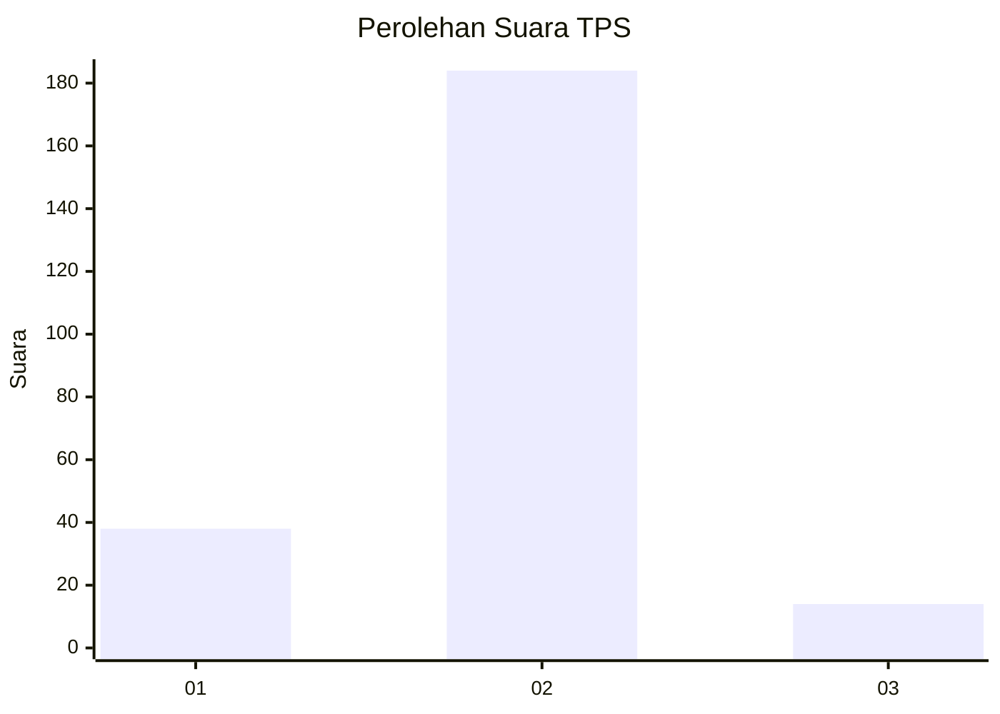
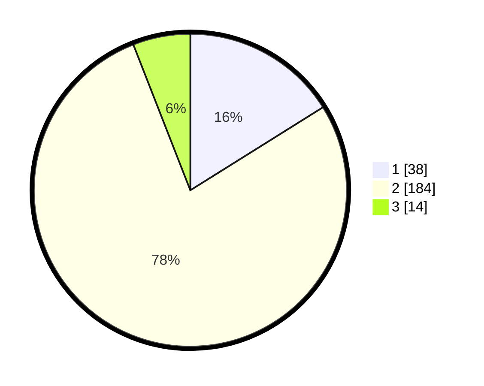

# Hasil

## Grafik

## Tabel

| No. | Nama Paslon    | Suara | Suara (raw) | Persentase |
|:--- |:-------------- | -----:| -----------:| ----------:|
| 1   | ANIES MUHAIMIN | 38    | [38][p-1]   | 16,10      |
| 2   | PRABOWO GIBRAN | 184   | [184][p-2]  | 77,97      |
| 3   | GANJAR MAHFUD  | 14    | [14][p-3]   | 5,93       |

[p-1]: https://github.com/gigit-pemilu/pemilu-2024/blob/main/pilpres/hitung-suara/sub/35-jawa-timur/sub/13-probolinggo/sub/13-besuk/sub/2017-sumberan/sub/004-tps/sub/paslon-1.txt
[p-2]: https://github.com/gigit-pemilu/pemilu-2024/blob/main/pilpres/hitung-suara/sub/35-jawa-timur/sub/13-probolinggo/sub/13-besuk/sub/2017-sumberan/sub/004-tps/sub/paslon-2.txt
[p-3]: https://github.com/gigit-pemilu/pemilu-2024/blob/main/pilpres/hitung-suara/sub/35-jawa-timur/sub/13-probolinggo/sub/13-besuk/sub/2017-sumberan/sub/004-tps/sub/paslon-3.txt

## Foto C Plano

https://sirekap-obj-formc.kpu.go.id/2509/pemilu/ppwp/35/13/13/20/17/3513132017004-20240214-220821--6bb3b7d8-7fa8-4187-9585-b21525ffe8ad.jpg

https://sirekap-obj-formc.kpu.go.id/2509/pemilu/ppwp/35/13/13/20/17/3513132017004-20240214-214358--aaa0607d-26b5-4f6f-a8fc-f6167e8567c9.jpg

https://sirekap-obj-formc.kpu.go.id/2509/pemilu/ppwp/35/13/13/20/17/3513132017004-20240214-214455--530b345d-c47e-48ac-9446-d5b86b9b9347.jpg

## Metadata

| Key        | Value               |
| ---------- | ------------------- |
| Time Stamp | 2024-02-25 15:00:00 |

