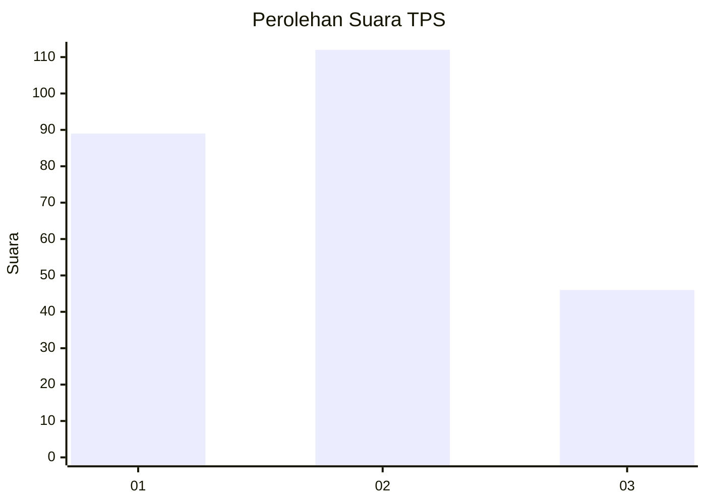
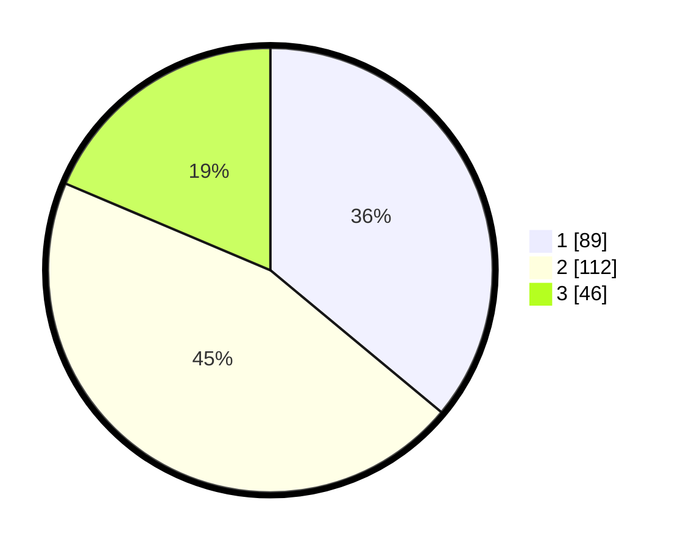

# Hasil

## Grafik

## Tabel

| No. | Nama Paslon    | Suara | Suara (raw) | Persentase |
|:--- |:-------------- | -----:| -----------:| ----------:|
| 1   | ANIES MUHAIMIN | 89    | [89][p-1]   | 36,03      |
| 2   | PRABOWO GIBRAN | 112   | [112][p-2]  | 45,34      |
| 3   | GANJAR MAHFUD  | 46    | [46][p-3]   | 18,62      |

[p-1]: https://github.com/gigit-pemilu/pemilu-2024-35-jawa-timur/blob/main/pilpres/hitung-suara/sub/35-jawa-timur/sub/13-probolinggo/sub/14-kraksaan/sub/1017-patokan/sub/007-tps/sub/paslon-1.txt
[p-2]: https://github.com/gigit-pemilu/pemilu-2024-35-jawa-timur/blob/main/pilpres/hitung-suara/sub/35-jawa-timur/sub/13-probolinggo/sub/14-kraksaan/sub/1017-patokan/sub/007-tps/sub/paslon-2.txt
[p-3]: https://github.com/gigit-pemilu/pemilu-2024-35-jawa-timur/blob/main/pilpres/hitung-suara/sub/35-jawa-timur/sub/13-probolinggo/sub/14-kraksaan/sub/1017-patokan/sub/007-tps/sub/paslon-3.txt

## Foto C Plano

https://sirekap-obj-formc.kpu.go.id/2eec/pemilu/ppwp/35/13/14/10/17/3513141017007-20240217-215334--f4b477f4-cd69-47b7-8331-f8b4c4cbd65a.jpg

https://sirekap-obj-formc.kpu.go.id/2eec/pemilu/ppwp/35/13/14/10/17/3513141017007-20240217-205634--7fe0857c-795c-4d9e-953e-3d06a16e5f6d.jpg

https://sirekap-obj-formc.kpu.go.id/2eec/pemilu/ppwp/35/13/14/10/17/3513141017007-20240217-205509--4279ba8c-0cc3-4566-ab05-37d4b2f13492.jpg

## Metadata

| Key        | Value               |
| ---------- | ------------------- |
| Time Stamp | 2024-02-19 06:16:00 |

