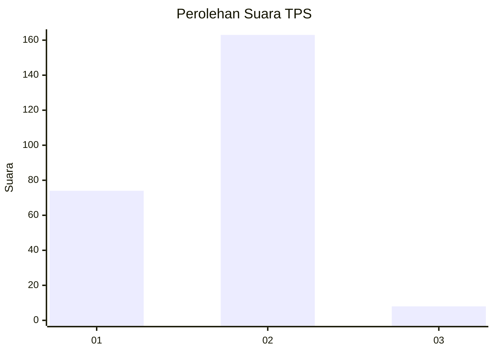
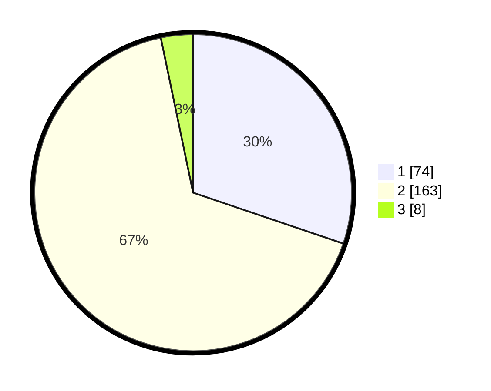

# Hasil

## Grafik

## Tabel

| No. | Nama Paslon    | Suara | Suara (raw) | Persentase |
|:--- |:-------------- | -----:| -----------:| ----------:|
| 1   | ANIES MUHAIMIN | 74    | [74][p-1]   | 30,20      |
| 2   | PRABOWO GIBRAN | 163   | [163][p-2]  | 66,53      |
| 3   | GANJAR MAHFUD  | 8     | [8][p-3]    | 3,27       |

[p-1]: https://github.com/gigit-pemilu/pemilu-2024-35-jawa-timur/blob/main/pilpres/hitung-suara/sub/35-jawa-timur/sub/13-probolinggo/sub/14-kraksaan/sub/2004-bulu/sub/002-tps/sub/paslon-1.txt
[p-2]: https://github.com/gigit-pemilu/pemilu-2024-35-jawa-timur/blob/main/pilpres/hitung-suara/sub/35-jawa-timur/sub/13-probolinggo/sub/14-kraksaan/sub/2004-bulu/sub/002-tps/sub/paslon-2.txt
[p-3]: https://github.com/gigit-pemilu/pemilu-2024-35-jawa-timur/blob/main/pilpres/hitung-suara/sub/35-jawa-timur/sub/13-probolinggo/sub/14-kraksaan/sub/2004-bulu/sub/002-tps/sub/paslon-3.txt

## Foto C Plano

https://sirekap-obj-formc.kpu.go.id/05a4/pemilu/ppwp/35/13/14/20/04/3513142004002-20240217-130950--ed207c36-e3a3-4632-9dab-9b0b970d5e3e.jpg

https://sirekap-obj-formc.kpu.go.id/05a4/pemilu/ppwp/35/13/14/20/04/3513142004002-20240214-225818--9c47c51c-d764-42f3-9525-194adedc76b8.jpg

https://sirekap-obj-formc.kpu.go.id/05a4/pemilu/ppwp/35/13/14/20/04/3513142004002-20240214-225856--6033c8d0-556b-4a8d-becc-f40346c186b4.jpg

## Metadata

| Key        | Value               |
| ---------- | ------------------- |
| Time Stamp | 2024-02-19 06:16:00 |

