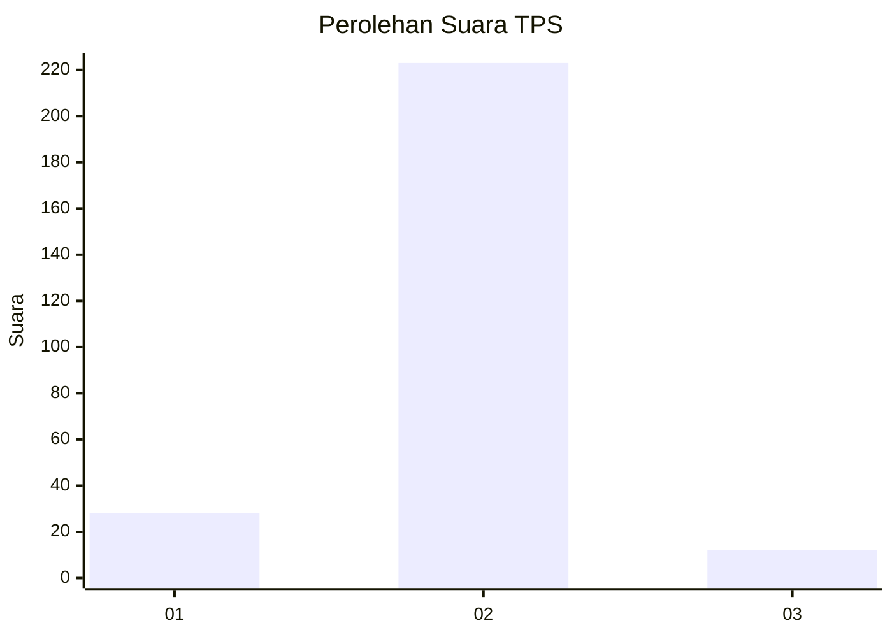
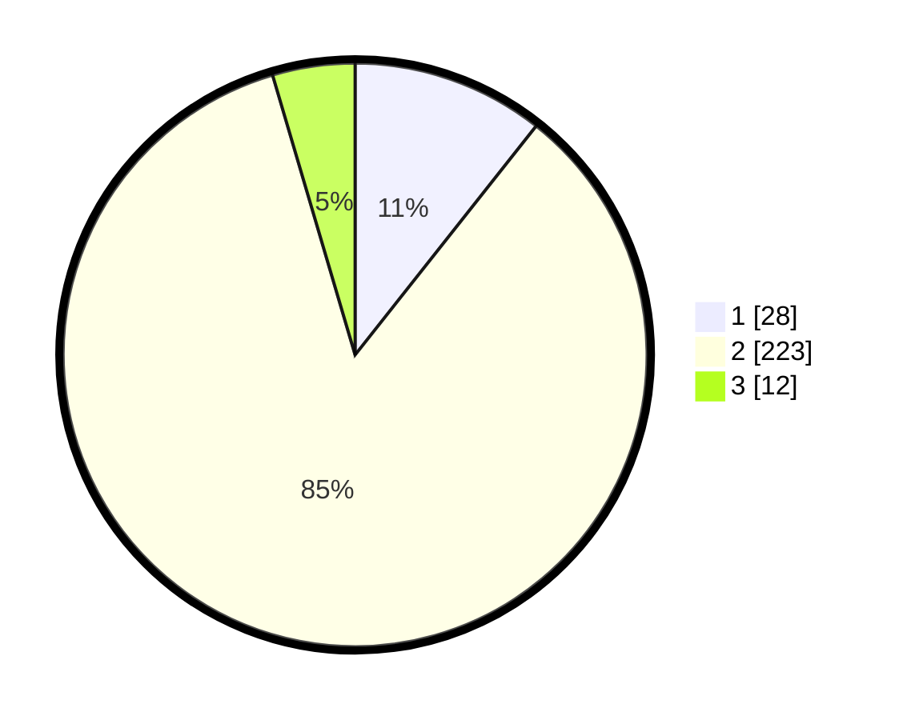

# Hasil

## Grafik

## Tabel

| No. | Nama Paslon    | Suara | Suara (raw) | Persentase |
|:--- |:-------------- | -----:| -----------:| ----------:|
| 1   | ANIES MUHAIMIN | 28    | [28][p-1]   | 10,65      |
| 2   | PRABOWO GIBRAN | 223   | [223][p-2]  | 84,79      |
| 3   | GANJAR MAHFUD  | 12    | [12][p-3]   | 4,56       |

[p-1]: https://github.com/gigit-pemilu/pemilu-2024-35-jawa-timur/blob/main/pilpres/hitung-suara/sub/35-jawa-timur/sub/13-probolinggo/sub/14-kraksaan/sub/2012-tamansari/sub/001-tps/sub/paslon-1.txt
[p-2]: https://github.com/gigit-pemilu/pemilu-2024-35-jawa-timur/blob/main/pilpres/hitung-suara/sub/35-jawa-timur/sub/13-probolinggo/sub/14-kraksaan/sub/2012-tamansari/sub/001-tps/sub/paslon-2.txt
[p-3]: https://github.com/gigit-pemilu/pemilu-2024-35-jawa-timur/blob/main/pilpres/hitung-suara/sub/35-jawa-timur/sub/13-probolinggo/sub/14-kraksaan/sub/2012-tamansari/sub/001-tps/sub/paslon-3.txt

## Foto C Plano

https://sirekap-obj-formc.kpu.go.id/11ce/pemilu/ppwp/35/13/14/20/12/3513142012001-20240215-010147--b7778625-6672-4401-8bd0-a23583264aab.jpg

https://sirekap-obj-formc.kpu.go.id/11ce/pemilu/ppwp/35/13/14/20/12/3513142012001-20240215-012245--d5dfd46c-26cf-444c-b3bb-5d01b4856991.jpg

https://sirekap-obj-formc.kpu.go.id/11ce/pemilu/ppwp/35/13/14/20/12/3513142012001-20240215-005712--4c3d1637-9b5d-4054-ba9c-5a51498bf0e8.jpg

## Metadata

| Key        | Value               |
| ---------- | ------------------- |
| Time Stamp | 2024-02-19 06:16:00 |

