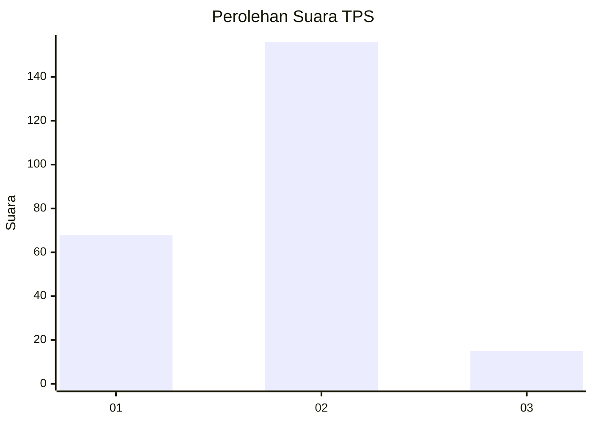
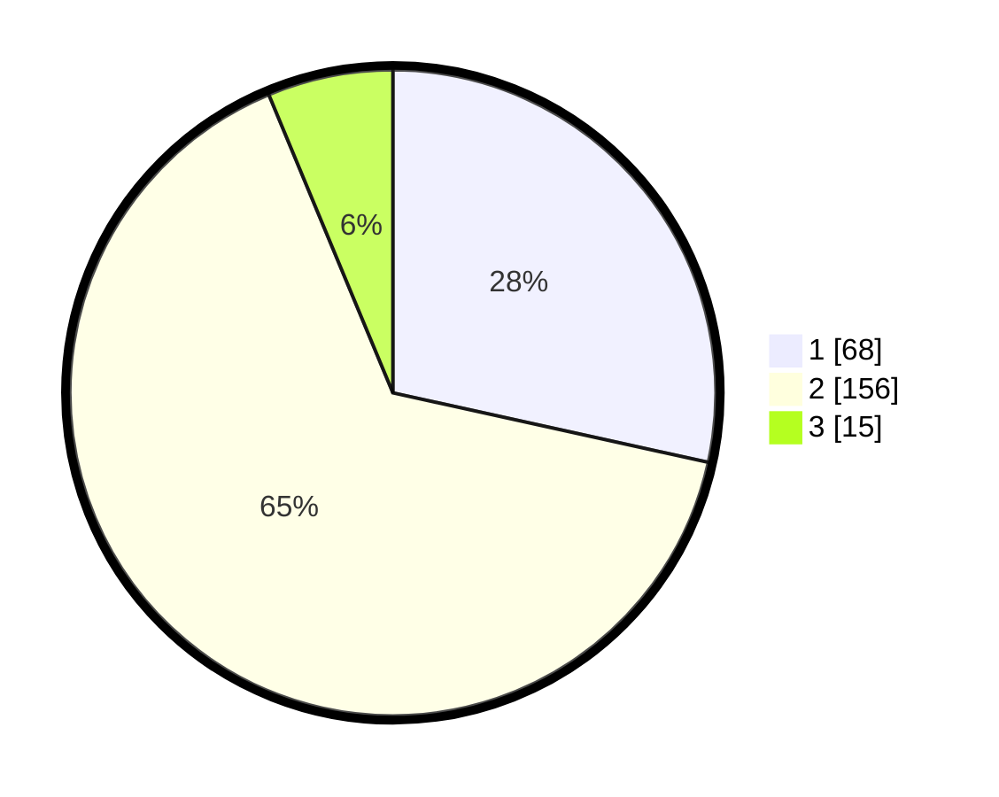

# Hasil

## Grafik

## Tabel

| No. | Nama Paslon    | Suara | Suara (raw) | Persentase |
|:--- |:-------------- | -----:| -----------:| ----------:|
| 1   | ANIES MUHAIMIN | 68    | [68][p-1]   | 28,45      |
| 2   | PRABOWO GIBRAN | 156   | [156][p-2]  | 65,27      |
| 3   | GANJAR MAHFUD  | 15    | [15][p-3]   | 6,28       |

[p-1]: https://github.com/gigit-pemilu/pemilu-2024-35-jawa-timur/blob/main/pilpres/hitung-suara/sub/35-jawa-timur/sub/13-probolinggo/sub/14-kraksaan/sub/2014-kebonagung/sub/004-tps/sub/paslon-1.txt
[p-2]: https://github.com/gigit-pemilu/pemilu-2024-35-jawa-timur/blob/main/pilpres/hitung-suara/sub/35-jawa-timur/sub/13-probolinggo/sub/14-kraksaan/sub/2014-kebonagung/sub/004-tps/sub/paslon-2.txt
[p-3]: https://github.com/gigit-pemilu/pemilu-2024-35-jawa-timur/blob/main/pilpres/hitung-suara/sub/35-jawa-timur/sub/13-probolinggo/sub/14-kraksaan/sub/2014-kebonagung/sub/004-tps/sub/paslon-3.txt

## Foto C Plano

https://sirekap-obj-formc.kpu.go.id/0c9c/pemilu/ppwp/35/13/14/20/14/3513142014004-20240215-002715--33132293-eb8a-4de0-b675-18344f37e496.jpg

https://sirekap-obj-formc.kpu.go.id/0c9c/pemilu/ppwp/35/13/14/20/14/3513142014004-20240215-002836--a4b787ad-cc02-4b0c-9d05-240bcff9db99.jpg

https://sirekap-obj-formc.kpu.go.id/0c9c/pemilu/ppwp/35/13/14/20/14/3513142014004-20240214-214830--f0d9b086-b2f0-41a4-a1b3-762188b61a83.jpg

## Metadata

| Key        | Value               |
| ---------- | ------------------- |
| Time Stamp | 2024-02-17 14:45:18 |

