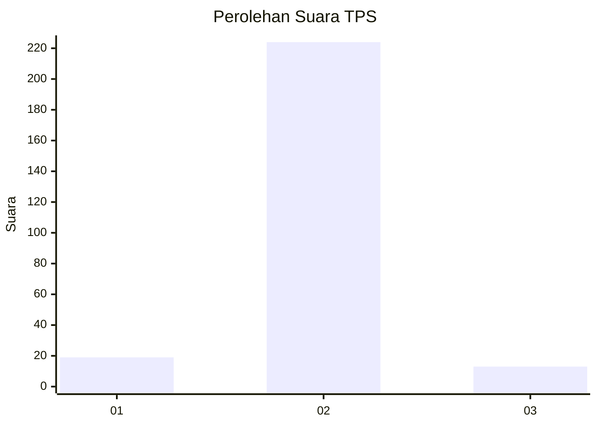
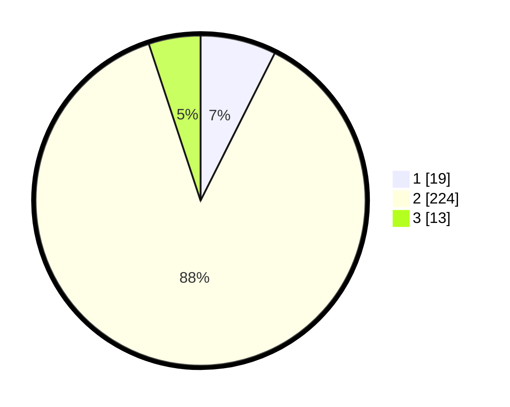

# Hasil

## Grafik

## Tabel

| No. | Nama Paslon    | Suara | Suara (raw) | Persentase |
|:--- |:-------------- | -----:| -----------:| ----------:|
| 1   | ANIES MUHAIMIN | 19    | [19][p-1]   | 7,42       |
| 2   | PRABOWO GIBRAN | 224   | [224][p-2]  | 87,50      |
| 3   | GANJAR MAHFUD  | 13    | [13][p-3]   | 5,08       |

[p-1]: https://github.com/gigit-pemilu/pemilu-2024/blob/main/pilpres/hitung-suara/sub/35-jawa-timur/sub/13-probolinggo/sub/15-krejengan/sub/2004-opo-opo/sub/009-tps/sub/paslon-1.txt
[p-2]: https://github.com/gigit-pemilu/pemilu-2024/blob/main/pilpres/hitung-suara/sub/35-jawa-timur/sub/13-probolinggo/sub/15-krejengan/sub/2004-opo-opo/sub/009-tps/sub/paslon-2.txt
[p-3]: https://github.com/gigit-pemilu/pemilu-2024/blob/main/pilpres/hitung-suara/sub/35-jawa-timur/sub/13-probolinggo/sub/15-krejengan/sub/2004-opo-opo/sub/009-tps/sub/paslon-3.txt

## Foto C Plano

https://sirekap-obj-formc.kpu.go.id/2d1a/pemilu/ppwp/35/13/15/20/04/3513152004009-20240214-223045--954d16c7-abcb-48d0-a23e-73ed26386fe8.jpg

https://sirekap-obj-formc.kpu.go.id/2d1a/pemilu/ppwp/35/13/15/20/04/3513152004009-20240214-223159--96817dcd-261f-49b2-bae2-8927f14bb011.jpg

https://sirekap-obj-formc.kpu.go.id/2d1a/pemilu/ppwp/35/13/15/20/04/3513152004009-20240214-223424--234aace0-66b9-47d0-acfe-902141246d44.jpg

## Metadata

| Key        | Value               |
| ---------- | ------------------- |
| Time Stamp | 2024-02-24 22:31:28 |

