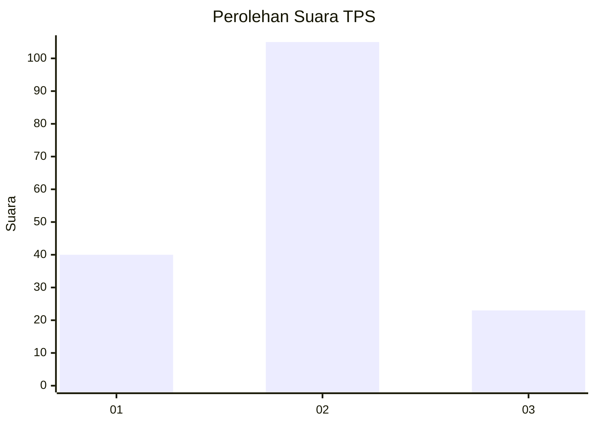
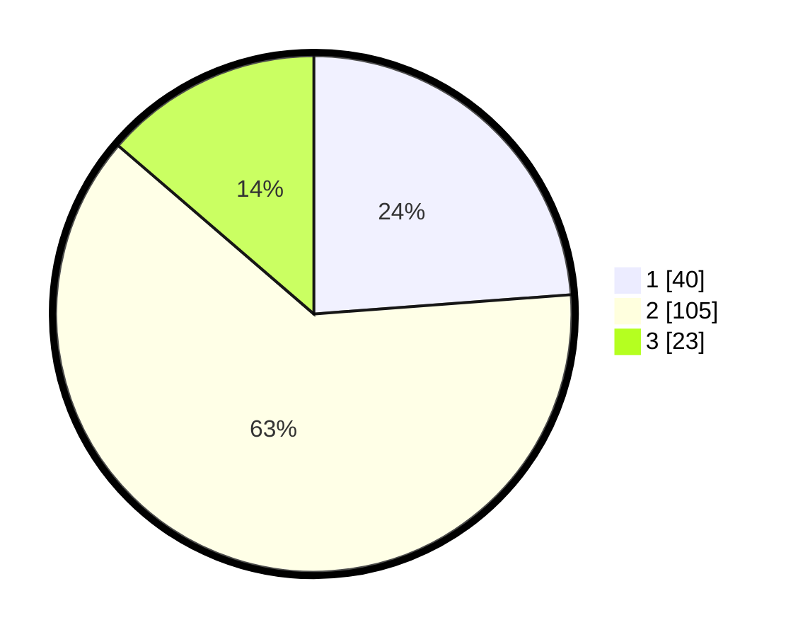

# Hasil

## Grafik

## Tabel

| No. | Nama Paslon    | Suara | Suara (raw) | Persentase |
|:--- |:-------------- | -----:| -----------:| ----------:|
| 1   | ANIES MUHAIMIN | 40    | [40][p-1]   | 23,81      |
| 2   | PRABOWO GIBRAN | 105   | [105][p-2]  | 62,50      |
| 3   | GANJAR MAHFUD  | 23    | [23][p-3]   | 13,69      |

[p-1]: https://github.com/gigit-pemilu/pemilu-2024-35-jawa-timur/blob/main/pilpres/hitung-suara/sub/35-jawa-timur/sub/13-probolinggo/sub/15-krejengan/sub/2004-opo-opo/sub/011-tps/sub/paslon-1.txt
[p-2]: https://github.com/gigit-pemilu/pemilu-2024-35-jawa-timur/blob/main/pilpres/hitung-suara/sub/35-jawa-timur/sub/13-probolinggo/sub/15-krejengan/sub/2004-opo-opo/sub/011-tps/sub/paslon-2.txt
[p-3]: https://github.com/gigit-pemilu/pemilu-2024-35-jawa-timur/blob/main/pilpres/hitung-suara/sub/35-jawa-timur/sub/13-probolinggo/sub/15-krejengan/sub/2004-opo-opo/sub/011-tps/sub/paslon-3.txt

## Foto C Plano

https://sirekap-obj-formc.kpu.go.id/0359/pemilu/ppwp/35/13/15/20/04/3513152004011-20240214-231831--8b3a6a0c-0171-4d1f-bf75-2ec6554c070e.jpg

https://sirekap-obj-formc.kpu.go.id/0359/pemilu/ppwp/35/13/15/20/04/3513152004011-20240214-210837--d8fec96b-cb62-4fb7-a2f4-068a6e0379da.jpg

https://sirekap-obj-formc.kpu.go.id/0359/pemilu/ppwp/35/13/15/20/04/3513152004011-20240214-210905--310b4b5a-ade2-42ec-8581-609447f19a56.jpg

## Metadata

| Key        | Value               |
| ---------- | ------------------- |
| Time Stamp | 2024-02-15 20:00:44 |

